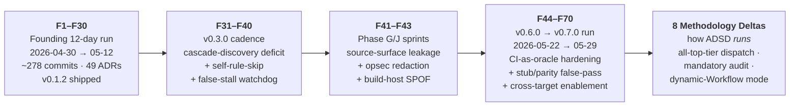

# Agent-Driven Software Development (ADSD)

> Methodology distilled from running a multi-agent Rust compiler project
> where AI agents wrote ≥ 70% of the code under human strategic direction.
> The founding distillation snapshot is a 12-day intensive run; the source
> project kept running well past that window, and the failure-mode catalogue
> grew with it — from the original F1–F30 to F1–F70 across three later
> corroboration batches, plus 8 methodology deltas.

[](#license)
[](#how-the-methodology-has-evolved)
[](#how-the-methodology-has-evolved)
[](#how-the-methodology-has-evolved)
[](#status)

## What this is

ADSD is **not a framework**. It's a documented working style that survived
contact with reality. The founding window — a 12-day intensive run
(2026-04-30 → 2026-05-12) — produced ~278 commits, ~2,611 tests, 49 ADRs
(0001..0048 + 0047a), 27 findings, the original **F1–F30** failure-mode
catalogue, and 2 P0 codegen bugs caught via organic stress test, shipping
through `v0.1.2` stable publicly.

That was the *distillation snapshot*, not the finish line. The source project
kept running well past the 12-day window, and every new failure mode it hit
got back-ported here. The catalogue grew from the original **F1–F30** to
**F1–F70** across three later corroboration batches (`cobrust-f31-f39` /
`cobrust-f41-f43` / `cobrust-f44-f70`, with an F45a sub-form; F52/F57 are
intentional gaps in the source project's local numbering), plus **8
methodology deltas** that refine how ADSD *runs* the multi-agent process.

ADSD codifies the discipline that kept the project coherent across all of it:
ADRs as decision capture, findings as negative-result memory, bilingual docs
by default, wave-based delivery, an all-top-tier sub-agent dispatch rule, an
**8-dimension pre-release audit topology** (4 internal lenses + 3 user personas
+ deep-source-read), mandatory independent post-author audit, and
release-readiness verification before any public-facing change.

## When to use ADSD

- You're managing a software project where AI agents do most of the coding
  (≥ 70% of LOC produced by agents)
- You run **3+ parallel sub-agents** and need a way to prevent sediment /
  drift / silent regressions
- You're doing **stateful project management** (multi-week / multi-sprint),
  not one-shot tasks
- The project has external stakeholders (release notes, public roadmap,
  contributors) that need an honest narrative

ADSD is **overkill** for one-shot prompt → answer flows, single-developer
IDE-loop coding (Cursor / Claude Code already handle), and < 3-agent
simple workflows.

## How the methodology has evolved

ADSD wasn't designed up front — it accreted from successive runs of the source
project, each era adding failure modes and dispatch refinements. The catalogue
grew in four batches; reading them in order shows the methodology hardening
against problems it didn't know it had yet.



The arc, in one line each:

- **F1–F30 (the distillation snapshot)** — the founding catalogue: snapshot
  sediment, silent miscompile, strategic blindness, the F1 "declared-rule ≠
  enforced" sediment family. Distilled from the 12-day intensive run.
- **F31–F40** — corroborated on the `v0.3.0` cadence: cascade-discovery deficit
  (a predicate flip leaves latent consumers), agents skipping rules they just
  wrote, commit-message-vs-diff scope drift, the 600s stream-watchdog false-stall
  signal.
- **F41–F43** — Phase G/J: a codegen-internal primitive leaking into the source
  surface (LLM-first training-data-overlap violation), device-name opsec leakage
  into git history, and the single-point-of-failure heavy-build host.
- **F44–F70** — the largest later batch: CI-cache stale-green, backend stubs
  silently shipped, type-conditional codegen emitting wrong output, fresh-workspace
  identity leak, and a whole cross-target-enablement family (the source project
  added new compile targets, and each enablement seam surfaced a failure mode).
- **8 Methodology Deltas** — not failure modes but refinements to how ADSD
  *dispatches and audits*: all-top-tier sub-agents (the tier matrix is retired),
  dispatcher-as-context-custodian, mandatory independent post-author audit,
  lockfile-staging in the atomic commit, chain-generality verified against the
  diff, a CI-infra-hardening playbook, honest-signal discipline, and the newest —
  **dynamic-Workflow orchestration** (deterministic fan-out → synthesis → impl →
  audit scripts, with a socket-resilience refinement after a transient agent death
  poisoned a downstream audit verdict).

The **8-dimension audit topology** also matured across these eras: 4 internal
lenses (security / doc-consistency / public-readiness / code-quality) + 3 user
personas (target user / skeptic expert / evaluator) + a dimension-free
deep-source-read pass that reads source line-by-line with no lens. See
[`SKILL.md`](./plugins/adsd/skills/agent-driven-development/SKILL.md) Part 1 for
the full topology and its empirical leverage table.

Full evidence (per-finding Cobrust commit SHAs + the methodology-deltas doc)
lives under
[`reference/`](./plugins/adsd/skills/agent-driven-development/reference/) — see
[Repository layout](#repository-layout).

## Install

### As a Claude Code plugin (recommended)

```
/plugin marketplace add Cobrust-lang/agent-driven-development
/plugin install adsd@adsd
```

After install, invoke via `/agent-driven-development` or let Claude pick it
automatically based on context — the description-triggered activation fires
for multi-agent dispatch planning, ADR drafting, F1–F70 failure-mode triage,
pre-release audit team design, and similar prompts.

### As a personal skill (fallback, no plugin system)

If you can't or don't want to use `/plugin install`:

```sh
mkdir -p ~/.claude/skills
git clone --depth 1 https://github.com/Cobrust-lang/agent-driven-development.git /tmp/adsd-src
cp -r /tmp/adsd-src/plugins/adsd/skills/agent-driven-development ~/.claude/skills/
rm -rf /tmp/adsd-src
```

### Read-only (no install)

The methodology is plain markdown. Just read
[`plugins/adsd/skills/agent-driven-development/SKILL.md`](./plugins/adsd/skills/agent-driven-development/SKILL.md)
top-to-bottom (~30 min read). Install matters only if you want Claude to
invoke it automatically based on conversation context.

## Repository layout

```
agent-driven-development/
├── .claude-plugin/
│   └── marketplace.json                       # Self-hosted single-plugin marketplace catalog
├── plugins/
│   └── adsd/                                  # Plugin root (matches marketplace.json source)
│       ├── .claude-plugin/
│       │   └── plugin.json                    # Plugin manifest
│       └── skills/
│           └── agent-driven-development/      # Skill — auto-discovered by Claude Code
│               ├── SKILL.md                   # Main methodology document (~30 min read)
│               ├── reference/
│               │   ├── failure-modes-catalogue.md  # F1-F30 anti-patterns with empirical evidence
│               │   ├── cobrust-f31-f39/        # F31-F40 corroboration batch (v0.3.0 cadence)
│               │   ├── cobrust-f41-f43/        # F41-F43 corroboration batch (Phase G/J)
│               │   ├── cobrust-f44-f70/        # F44-F70 batch + 2 pattern docs + methodology-deltas.md
│               │   ├── evals-first-development.md       # Cross-pollination (v1.2.0)
│               │   ├── context-window-strategy.md       # Long-session context tiers
│               │   ├── cross-session-memory-architecture.md  # 4-layer memory model
│               │   ├── prompt-engineering-patterns.md   # Role priming, anti-hallucination
│               │   └── cost-monitoring-discipline.md    # Cost as a diagnostic signal
│               ├── case-study/
│               │   ├── cobrust-multi-agent-experience.md   # The founding case study (N=1)
│               │   └── cobrust-studio-experience.md        # N=2 dogfood (M0-M7 cycle)
│               └── templates/
│                   ├── adr-template.md        # Architecture Decision Record
│                   ├── finding-template.md    # Negative result / failure capture
│                   ├── dispatch-prompt-p9.md  # Tech Lead sub-agent dispatch
│                   ├── dispatch-prompt-p7.md  # Senior Engineer sub-agent dispatch
│                   ├── handoff-cover-letter.md  # Cross-session handoff
│                   └── snapshot-template.md   # Project state snapshot
├── CONTRIBUTING.md
├── LICENSE-APACHE
├── LICENSE-MIT
└── README.md                                  # this file
```

## Quick start (after install)

1. Read [`SKILL.md`](./plugins/adsd/skills/agent-driven-development/SKILL.md) for the full methodology (~30 min read).
2. Read [`reference/failure-modes-catalogue.md`](./plugins/adsd/skills/agent-driven-development/reference/failure-modes-catalogue.md) for the founding **F1–F30** anti-patterns you'll likely hit. Don't re-derive them.
3. Skim the corroboration batches under [`reference/`](./plugins/adsd/skills/agent-driven-development/reference/) — [`cobrust-f31-f39/`](./plugins/adsd/skills/agent-driven-development/reference/cobrust-f31-f39/), [`cobrust-f41-f43/`](./plugins/adsd/skills/agent-driven-development/reference/cobrust-f41-f43/), and [`cobrust-f44-f70/`](./plugins/adsd/skills/agent-driven-development/reference/cobrust-f44-f70/) (which also carries the [`methodology-deltas.md`](./plugins/adsd/skills/agent-driven-development/reference/cobrust-f44-f70/methodology-deltas.md) — read this if you're choosing a dispatch/audit topology).
4. Read [`case-study/cobrust-multi-agent-experience.md`](./plugins/adsd/skills/agent-driven-development/case-study/cobrust-multi-agent-experience.md) to see ADSD applied in practice (warts and all).
5. Copy the relevant template from [`templates/`](./plugins/adsd/skills/agent-driven-development/templates/) into your project's `docs/agent/` tree.
6. Start writing ADRs as decisions actually happen — not speculatively.

## Documentation

User-facing docs are in [`docs/human/`](./docs/human/) (zh + en parallel per ADSD §3 bilingual mandate). Agent-facing meta-conventions for this repo are in [`docs/agent/`](./docs/agent/).

### Bilingual user docs

| Topic | 中文 | English |
|---|---|---|
| Getting started — 30-min onboarding | [`docs/human/zh/getting-started.md`](./docs/human/zh/getting-started.md) | [`docs/human/en/getting-started.md`](./docs/human/en/getting-started.md) |
| Concept map — mermaid diagrams + narrative | [`docs/human/zh/concept-map.md`](./docs/human/zh/concept-map.md) | [`docs/human/en/concept-map.md`](./docs/human/en/concept-map.md) |

### Agent-facing meta-conventions

- [`docs/agent/conventions.md`](./docs/agent/conventions.md) — repo structure, frontmatter contracts, bilingual mandate enforcement, commit message format, identity hygiene (F21)

### Doc coverage gate

`scripts/doc-coverage.sh` enforces ADSD §3 bilingual mandate on this repo itself: every `docs/human/zh/*.md` MUST have a parallel `docs/human/en/*.md`. Run locally before commits:

```sh
bash scripts/doc-coverage.sh
```

The script also verifies reference files have YAML frontmatter and ADR files are zero-padded monotonic. This closes ADSD §3 mandate as F20 systemic prevention applied to ADSD itself.

## Origin

ADSD was extracted from the [Cobrust](https://github.com/Cobrust-lang/cobrust)
project, a Rust-implemented Python successor with an AI-native compiler.
The **distillation snapshot** is the founding intensive run: first commit
2026-04-30 → `0.1.0-beta` tag 2026-05-10 → `0.1.0` stable 2026-05-11, with
`v0.1.2` + α Phase F.2 following — ~278 commits over 12 wall-clock days,
coordinated by multiple parallel Claude agents (Opus 4.7 and Sonnet 4.6) via
the methodology you'll find in
[`SKILL.md`](./plugins/adsd/skills/agent-driven-development/SKILL.md).

The project **did not stop there.** It kept running well past the 12-day
window, and the
[`reference/`](./plugins/adsd/skills/agent-driven-development/reference/)
batches (F31–F40, F41–F43, F44–F70 + 8 methodology deltas) back-port every new
failure mode and dispatch refinement that continued run produced — taking the
catalogue from the original F1–F30 to **F1–F70**. The 49-ADR / 27-finding /
12-day figures describe the founding window; treat them as a **floor**, not the
current total. (The origin project's later product milestones live in the
separate [Cobrust](https://github.com/Cobrust-lang/cobrust) repo and are not
re-measured here.)

The case study at [`case-study/cobrust-multi-agent-experience.md`](./plugins/adsd/skills/agent-driven-development/case-study/cobrust-multi-agent-experience.md)
documents both what worked and what broke. The failure modes catalogue
(now F1–F70) captures lessons we'd rather not re-learn.

## Status

**Validation N = 2**: Cobrust (this methodology's birthplace, sustained from
the founding 12-day run through every later corroboration batch) plus a
second-project dogfood, Cobrust Studio (M0–M7 cycle), captured in
[`case-study/cobrust-studio-experience.md`](./plugins/adsd/skills/agent-driven-development/case-study/cobrust-studio-experience.md).
The bulk of the empirical evidence is still single-lineage, so treat the
methodology as well-tested-in-context rather than universally proven.

We are still looking for design partners willing to apply ADSD to an
unrelated third project so the methodology can be tested further outside its
founding context. File an issue describing your project if interested.

ADSD is **battle-tested but not orthodoxy**. Adapt it. The catalogue already
runs **F1–F70**; if you find a failure mode none of those cover, propose the
next slot via a PR — add a finding file under the appropriate
[`reference/`](./plugins/adsd/skills/agent-driven-development/reference/) batch
(or open a new batch dir) following the same Symptoms / Root-cause / Recovery /
Evidence format, and cite a real commit as the ground-truth anchor.

## Contributing

See [`CONTRIBUTING.md`](./CONTRIBUTING.md). We use ADSD to evolve ADSD —
contributions follow the same ADR + finding + dispatch discipline the
methodology itself describes.

## License

Licensed under either of

- Apache License, Version 2.0 ([LICENSE-APACHE](./LICENSE-APACHE) or
  http://www.apache.org/licenses/LICENSE-2.0)
- MIT license ([LICENSE-MIT](./LICENSE-MIT) or
  http://opensource.org/licenses/MIT)

at your option.

### Contribution

Unless you explicitly state otherwise, any contribution intentionally
submitted for inclusion in the work by you, as defined in the Apache-2.0
license, shall be dual licensed as above, without any additional terms or
conditions.

## Acknowledgements

The methodology is shaped by patterns from:

- [Linear Method](https://linear.app/method) — calm-tech + cycles
- [TigerBeetle Way](https://tigerstyle.dev) — assertion discipline + deterministic simulation testing
- [Stripe internal playbook](https://stripe.com/blog) — memos over meetings
- [Basecamp Shape Up](https://basecamp.com/shapeup) — appetite-based scoping
- [OpenTelemetry semantic conventions](https://opentelemetry.io) — observability vocabulary
- [SLSA v1.1](https://slsa.dev) — provenance attestation
- [Astral's `uv` / `ruff`](https://astral.sh) — single-tool wedge UX

None of these tools or organizations endorse ADSD; the methodology
borrows ideas, not affiliation.
