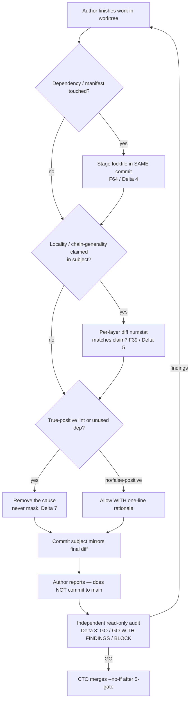
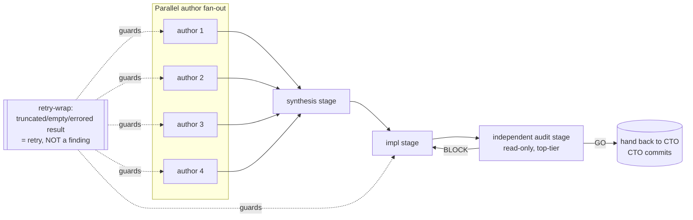

# ADSD repo conventions

> ADSD is a methodology for managing AI-agent software projects. This repo IS such a project. Therefore, **ADSD applies to ADSD**. This file captures the meta-conventions specific to this repo's contributors (humans and AI agents).
>
> These conventions are themselves **battle-tested, not orthodoxy**: most of them
> are F-family failure modes (see `reference/failure-modes-catalogue.md` + the
> per-batch dirs) hardened into rules after we hit them. When a convention here
> disagrees with reality, reality wins — open a finding and reconcile. The newest
> additions (lockfile-staging, chain-generality-verification, honest-signal, the
> Workflow-script authoring rules) were forced by the Cobrust F44-F70 batch; see
> `reference/EVOLUTION.md` for the arc.

## Repo structure (binding)

```
agent-driven-development/
├── .claude-plugin/marketplace.json     # Plugin marketplace catalog
├── plugins/
│   └── adsd/
│       └── skills/
│           └── agent-driven-development/   # The skill — auto-loaded by Claude Code
│               ├── SKILL.md                # Main methodology (~50 KB, ~1015 lines)
│               ├── reference/              # Deep-dive references
│               │   ├── failure-modes-catalogue.md   # F1-F30 (~129 KB)
│               │   ├── EVOLUTION.md                 # methodology growth arc / changelog
│               │   ├── cobrust-f31-f39/             # F31-F40 batch (v0.3.0 era)
│               │   ├── cobrust-f41-f43/             # F41-F43 batch
│               │   ├── cobrust-f44-f70/             # F44-F70 + 2 patterns + methodology-deltas.md
│               │   └── {evals,context-window,...}.md  # cross-pollination refs
│               ├── case-study/            # Founding case studies (Cobrust N=1 + Cobrust Studio N=2)
│               └── templates/             # 6 templates: ADR / finding / snapshot / dispatch-{p7,p9} / handoff
├── docs/
│   ├── human/
│   │   ├── zh/                             # Chinese user docs — 与 en 一一对应
│   │   └── en/                             # English user docs — 1:1 parity with zh
│   └── agent/
│       ├── conventions.md                  # This file
│       ├── adr/                            # Meta-ADRs for ADSD itself (reserved; schema below)
│       └── findings/                       # Findings about ADSD's evolution (reserved; schema below)
├── scripts/
│   └── doc-coverage.sh                     # Enforces zh+en parity per ADSD §3 mandate
├── CONTRIBUTING.md                         # Human-facing contribution guide
├── LICENSE-APACHE / LICENSE-MIT
└── README.md                               # Entry point
```

**Binding constraints**:

1. Every file in `docs/human/zh/` MUST have a parallel file at `docs/human/en/` with the same filename. Enforced by `scripts/doc-coverage.sh`.
2. Every reference under `plugins/adsd/skills/agent-driven-development/reference/` MUST have YAML frontmatter (`name`, `description`, `type`, `version`, `date`, `status`, `relates_to`).
3. The SKILL.md `description` field is the auto-activation trigger — keep it keyword-dense and specific.
4. ADRs in `docs/agent/adr/` are zero-padded sequential (`0001-*.md`, `0002-*.md`, ...). Once accepted, an ADR is immutable; supersede via a new ADR.

## Frontmatter contracts

Every persistent artifact carries YAML frontmatter with a **stable ID**, a
**status / lifecycle field**, and (where it makes a claim about the repo) a
**verification anchor** (`last_verified_commit` or `cobrust_sha`). The anchor is
what makes a doc falsifiable: a returning agent can `git log` the SHA and decide
whether the doc is current or stale. This is the SKILL.md §"Last verified commit"
discipline, dogfooded.

### Reference files (in `plugins/adsd/skills/agent-driven-development/reference/`)

```yaml
---
name: <Reference title>
description: <One-line trigger / summary>
type: reference
version: <semver>
date: <ISO date of last substantive edit>
status: active | deprecated | candidate
relates_to: [skill:SKILL.md §section, reference:other-file.md, ...]
---
```

### Meta-ADRs (in `docs/agent/adr/`)

```yaml
---
doc_kind: adr
adr_id: <NNNN, zero-padded>
title: <ADR title>
status: proposed | accepted | superseded | deprecated
date: <YYYY-MM-DD>
last_verified_commit: <SHA or TBD>
supersedes: [<adr_id>, ...]
superseded_by: [<adr_id>, ...]
relates_to: [<adr_id>, <finding-slug>, ...]
---
```

### Findings (in `docs/agent/findings/`)

```yaml
---
doc_kind: finding
finding_id: <slug>
last_verified_commit: <SHA>
status: open | closed | partial
discovered_by: <agent role + session ID>
dependencies: [adr:<NNNN>, finding:<slug>, ...]
---
```

### Snapshot / stateful state docs (schema_invariant is mandatory)

A snapshot is the **canonical current-state document**; READMEs and runbooks are
projection layers that lose to it on conflict (SKILL.md §"Snapshot-first
close-out"; failure mode F30). Any stateful state doc MUST carry a
`schema_invariant` block — a machine-checkable contract that prevents F1.0
sediment ("重写忘删" — write the new section, forget to delete the old):

```yaml
---
doc_kind: snapshot
last_verified_commit: <SHA>
date: <YYYY-MM-DD>
schema_invariant: |
  HEAD field reconciles with `git log -1 --format=%H`.
  Every ADR mentioned in any section appears EXACTLY ONCE in §"ADR roster".
  Every finding mentioned in any section appears in §"Findings ledger".
  The binary / gate verification list appears EXACTLY ONCE.
---
```

> A declared `schema_invariant` without a CI lint that *runs* it is documentation,
> not enforcement (F1.1). When you add an invariant, in the same commit add (or
> extend) the script that checks it — otherwise mark it `ASPIRATIONAL`, never
> `REQUIRED`. This is the §"Generalized prevention" P0 SOP from the catalogue.

### Catalogue / per-batch finding schemas (honest divergence)

The empirical-corroboration batches under `reference/cobrust-f31-f39/`,
`reference/cobrust-f41-f43/`, and `reference/cobrust-f44-f70/` use **batch-local
schemas keyed to the originating project's commit SHAs**, not the
`docs/agent/findings/` schema above. Two conventions coexist by author cohort
(documented in the F44-F70 README §"Frontmatter-schema note" rather than papered
over — itself an F1 honest-signal move):

```yaml
# F44-F65 cohort
---
catalogue_id: F<NN>
family: <F37-SilentRot | F35-ClaimDrift | F1-Sediment | F-Codegen | F4-Cross-Target>
cobrust_local_id: F<NN>
cobrust_sha: <SHA or SHA-range>
status: candidate | ratified | resolved | open
---

# F66-F70 cohort
---
doc_kind: finding
finding_id: F<NN>-<slug>
family: <...>
cobrust_sha: <SHA>
status: candidate | ratified | open
---

# pattern docs
---
doc_kind: pattern
pattern_id: <slug>
evidence_shas: [<SHA>, ...]
---

# methodology-deltas.md
---
doc_kind: methodology-deltas
batch_id: cobrust-f44-f70
status: methodology-evolution
---
```

All four carry a stable ID + a family/era tag + SHA evidence, so cross-referencing
is unambiguous. A future normalization pass could unify the `catalogue_id` /
`finding_id` keys; per the F1 honest-signal rule it is *recorded* as known
divergence, not silently reconciled.

## Bilingual docs mandate (ADSD §3 dogfood)

The skill's SKILL.md §3 mandates that every public item gets entries in:

- `docs/human/zh/<topic>.md`
- `docs/human/en/<topic>.md` (1:1 parity)
- Agent-facing schema (in this repo: SKILL.md + reference/)

This rule applies to ADSD itself. `scripts/doc-coverage.sh` enforces zh+en parity.

**Operative checks** (run by `doc-coverage.sh`):

1. Every `docs/human/zh/*.md` has a parallel `docs/human/en/*.md`
2. Every `docs/human/en/*.md` has a parallel `docs/human/zh/*.md`
3. Parallel files have identical filenames (case-sensitive)
4. (Future) Section headers are 1:1 between zh and en

CI fails if any check fails.

## When to add a new ADR vs amend SKILL.md vs add a finding

| Change type | Where | Trigger |
|---|---|---|
| New methodology rule | `docs/agent/adr/NNNN-<slug>.md` | The rule affects ≥2 reference files, templates, or SKILL.md sections |
| Refine existing reference | edit the reference file directly + note in commit | Single-file refinement |
| Document an ADSD evolution event | `docs/agent/findings/<slug>.md` | Real-world ADSD use surfaced a gap or worked unexpectedly well |
| Update SKILL.md | edit SKILL.md + cross-reference an ADR if it's a binding rule | Adds a new "Part N" or modifies an existing one |
| New cross-pollination ref (Anthropic / OpenAI / other) | `plugins/.../reference/<slug>.md` | New industry pattern worth adopting |
| Per-era empirical corroboration of failure modes | `plugins/.../reference/cobrust-<range>/F<NN>-<slug>.md` + batch `README.md` | A downstream project hit a catalogue pattern (or a new one) with citable SHAs |
| Refinement to ADSD's own dispatch/audit process | `plugins/.../reference/cobrust-<range>/methodology-deltas.md` | "Change how we *run* the process" (NOT "the system did X wrong" — that's a finding) + record the empirical trigger + how to apply |

## When NOT to add an ADR

- Bug fix in a reference doc (typo, broken link)
- Updating frontmatter date / last_verified
- Adding an example to an existing section
- Re-organizing within a single file
- Translation update (zh ⟵→ en sync)

Per ADSD §"ADR vs Finding distinction": ADRs are forward-looking decisions; small refinements don't need them.

## Commit message format

Conventional commits, present tense, **mandatory scope tag** identifying the
crate / module / doc-tree touched (SKILL.md §"Conventional commits + scope tags"):

```
<type>(<scope>): <short description> [vX.Y.Z]
```

- `<type>`: `feat`, `docs`, `fix`, `refactor`, `chore`, `test`
- `<scope>`: `skill`, `reference`, `case-study`, `templates`, `docs-zh`, `docs-en`, `meta`
- Include `[vX.Y.Z]` semver if the change is release-worthy

Examples:

```
feat(reference): add evals-first-development.md (v1.2.0)
docs(zh): translate getting-started.md to match en parity
fix(skill): correct cross-reference path after plugin layout migration
chore(meta): bump SKILL.md description for trigger keyword coverage
```

### Commit subject mirrors the FINAL diff, not the original spec (F35-sibling / Delta 5)

A re-scoped sprint must rename its commit subject to describe the **diff that
actually landed**, not the framing it was dispatched with. The original intent
goes in the body or an ADR note. This is the chain-generality / commit-message-vs-
diff-drift discipline (catalogue F39; methodology Delta 5):

> Before committing, the integrator computes a per-layer diff stat over the range
> and confirms it matches any locality claim in the subject (e.g. a `feat(...)`
> subject over a doc+test-only diff is the F39 smell). If scope narrowed mid-
> sprint, **rewrite the subject**.

Real Cobrust incidents that forced this: `7100849` (`feat(...cb-mirror)` over a
doc+test-ignore diff) and `d29470f` (`fix(cli/build)` over a test-only diff with
`build.rs` untouched), both surfaced by the F44–F70 batch retro-audit.

### Co-Authored-By trailer (transparency + identity hygiene, F21)

AI-generated commits carry a session-stamped `Co-Authored-By` trailer
(transparency), with the **current** model + a session discriminator:

```
Co-Authored-By: Claude Opus 4.8 (session XYZ) <noreply@anthropic.com>
```

(Historical commits in this repo cite the model that was current at the time —
e.g. `Claude Opus 4.7`; do not rewrite history to a newer model. New commits use
the current model.)

## Identity hygiene (F21 + F49 closure)

Per F21 codification (cross-session identity overload):

- Do NOT sign as bare "review-claude" or "ADSD-author" in commits or files
- Use session-stamped attribution: `review-claude (session 4bb35f43)` or `ADSD-author (session XYZ)`
- Reserve plain handles for the abstract role in narrative prose only

Per F49 (fresh-workspace identity fallback leak — Cobrust SHA `6491614`, leak
window `cbc1e0e→cd2fe04`): a fresh clone with **no local git identity** falls back
to the OS account + device hostname, leaking a real name into permanent public
commit metadata. Defense-in-depth:

- Set a **neutral global git identity** on any machine that will commit.
- **Per-dispatch identity pre-flight**: every dispatch prompt that may commit runs
  `git config user.name && git config user.email` as its first action and fails
  loud if it resolves to a personal name / device hostname.
- The audit scope **follows the actual mutation surface** — when a sprint rewrites
  history or touches commit metadata, the audit reads the metadata, not only the
  tree (the carve-out that forced methodology Delta 1's reasoning).

## Pre-commit disciplines (the F44-F70 deltas that became conventions)

These are the F44-F70-era disciplines promoted from reactive findings to standing
pre-commit checklist items. Each is cheap to verify and reliably forgotten under
sprint tempo — so each is **demanded explicitly in the dispatch prompt**, never
assumed (the F1-Sediment lesson: a discipline that lives only as prose drifts).



### Lockfile / pin-file staging (F64 → Delta 4)

A dependency change stages its generated pin file (lockfile, resolved-dependency
snapshot) **in the same commit as the manifest edit**. The local build silently
regenerates the lockfile; a missed `git add` then fans-out-fails the entire locked
CI gate cluster (build + lint + test) with an opaque lockfile-mismatch error that
points at the lock, not at the missing stage.

- **Hard pre-commit check**, pasted into any dependency-touching dispatch: after
  any build invocation, run a lockfile status check; if the pin file changed and
  the commit does not include it, stage it before committing.
- Generalizes beyond one ecosystem: any generated-from-manifest pin file belongs
  in the same commit. CI runs `--locked`; the author must too.
- Evidence: Cobrust F64 remediation `73aa3bb` (one-line lockfile entry for a dev-
  dependency added in `1b05ae3`).

### Chain-generality verification (F39 → Delta 5)

Covered in §"Commit subject mirrors the FINAL diff" above — the per-layer numstat
check is run **proactively** before trusting any "touched only layer X" claim, not
just after a suspected regression. Keep an instances ledger; accumulating
recurrences are the case for promoting the manual check to a CI guard.

### Honest-signal discipline (Delta 7 — the F44 stale-green failure mode in reverse)

A **true-positive** quality signal (a genuinely-unused dependency, a real lint) is
resolved by **removing the cause**, never by silencing the gate with an
ignore/allow directive. Masking a true positive trains the eye (human and agent)
to treat that gate's output as noise — so the next real hit is also waved through.

- Unused dependency / dead code flagged by a true-positive lint → **delete it**.
- Reach for ignore/allow only when the signal is demonstrably a **false** positive,
  and pair it with a one-line rationale at the directive site.
- An accepted-debt `#[ignore]` (or equivalent) MUST name a specific reason **and a
  deferral target**, never a bare suppression — otherwise it is silent rot (F37).
- Add the corresponding detection gate so the class can't silently regress.
- Evidence: Cobrust dead-dep *removed* in `e21f728` (+ a 7-crate unused-dep cleanup
  `1914d32`) rather than allow-listed; the unused-dep CI gate shipped alongside F44.

## Workflow-script authoring convention (dynamic orchestration — Delta 8)

When a multi-step sprint is run by a **deterministic orchestration script** (a
Claude Code dynamic Workflow that encodes fan-out → synthesis → impl → audit as
code) rather than by the lead hand-managing each dispatch, the script is itself an
authored artifact and obeys these rules. This is methodology Delta 8 — recorded as
an **experiment arm**, not yet a ratified default; bend it freely.



Three binding authoring rules:

1. **Retry-wrap every failure-prone agent stage.** A bare agent whose process dies
   (socket close / 529 / stream-watchdog) returns a truncated or errored result. A
   downstream stage that consumes it produces a misleading verdict on a *non-failure*.
   Wrap each stage so a truncated / unparseable / empty result is **detected and
   re-dispatched** before any downstream stage consumes it (retry-with-backoff;
   treat empty as a retry trigger, not a finding). The impl→audit edge in particular
   must not let a network-killed impl poison the audit. This is the one *new* surface
   deterministic orchestration introduces — hand-managed dispatch gets transient-
   failure recovery for free (the lead just re-dispatches a died agent); a script
   must encode it once. (Same infra-failure class as `F40-stream-watchdog-false-
   stall-signal`; corrected by human review of the 2026-05-29 run's impl transcript —
   the gap was a socket close, not a reasoning/quality gap.)

2. **Agents write but do NOT commit.** Author and impl stages produce files /
   working-tree edits and report; **the CTO commits after the independent audit
   returns GO** (Delta 3). A script that auto-commits author output skips the
   pre-merge audit gate — structurally the same mistake as self-review.

3. **The orchestration script is code → it gets audited like any other artifact.**
   An un-audited orchestrator is a new single point of failure. Subject the script
   itself to Delta 3 (independent read-only audit). Log any case where a fixed
   topology forced a worse decomposition than a human lead would have chosen — a
   rigid pipeline cannot mid-run re-scope the way a lead can; that constraint is the
   open question Delta 8 is measuring.

Full rationale + the post-run empirical result (attribution-corrected): see
`reference/cobrust-f44-f70/methodology-deltas.md` §"Delta 8".

## Versioning policy

- **v1.0.x** — initial release, plugin migration
- **v1.1.x** — F19/F20/F21 codification
- **v1.2.x** — cross-pollination references (Anthropic + OpenAI)
- **v1.3.x** — bilingual docs (`docs/human/{zh,en}/`) + remaining G3/G5/G6/G8/G9/G10/G12 gaps
- **F31-F70 batches** — per-era Cobrust empirical-corroboration batches landed as
  `reference/cobrust-{f31-f39,f41-f43,f44-f70}/` + 8 methodology deltas; these
  refresh conventions (lockfile-staging, chain-generality, honest-signal, Workflow
  authoring) without a skill-format bump. See `reference/EVOLUTION.md`.

Semver bumps follow SemVer 2.0:

- MAJOR: breaking change to skill format, plugin layout, or canonical paths
- MINOR: new reference file, new template, new ADR, new per-batch corroboration dir
- PATCH: refinement, typo, frontmatter update, translation sync

## Cross-references

- `reference/EVOLUTION.md` — the methodology's growth arc (F1-F30 → F31-F40 → F41-F43 → F44-F70 + 8 deltas); read this to see "what changed since I last read"
- `reference/cobrust-f44-f70/methodology-deltas.md` — the 8 dispatch/audit deltas, several of which became the pre-commit conventions above
- `CONTRIBUTING.md` — human-facing contribution flow
- `plugins/adsd/skills/agent-driven-development/SKILL.md` §"Documentation Discipline" — methodology origin of these rules
- `plugins/adsd/skills/agent-driven-development/reference/failure-modes-catalogue.md` F1 family + F19 + F20 + F21 — the failure modes these conventions prevent; F31-F70 live in the per-batch dirs alongside it
- `scripts/doc-coverage.sh` — machine enforcement of zh+en parity
