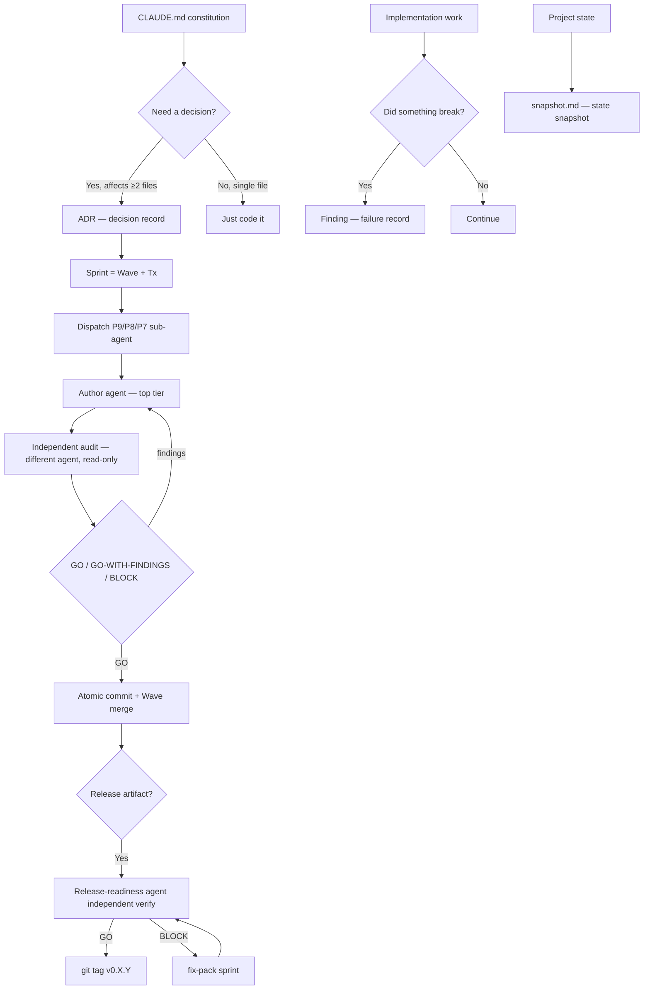
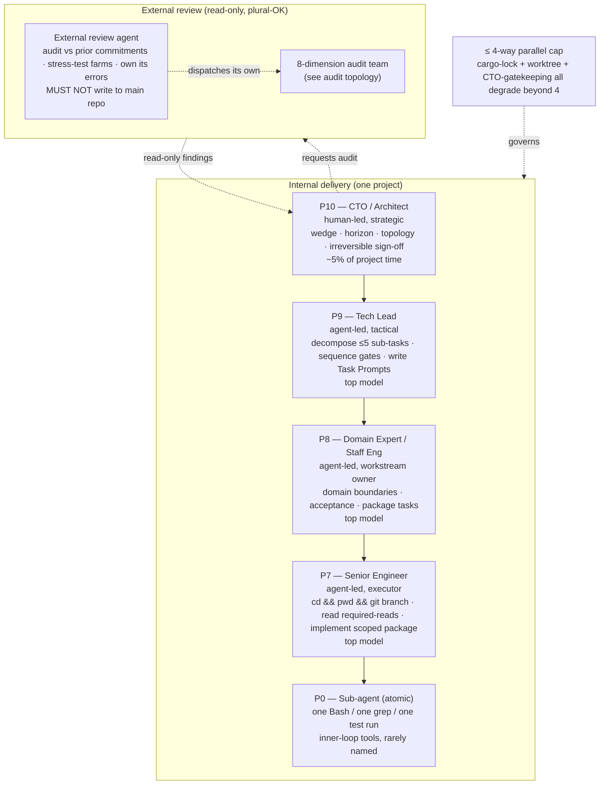
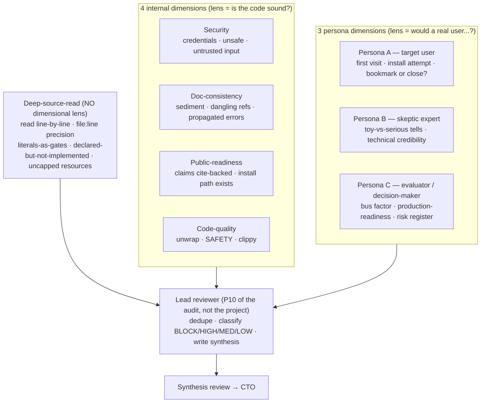
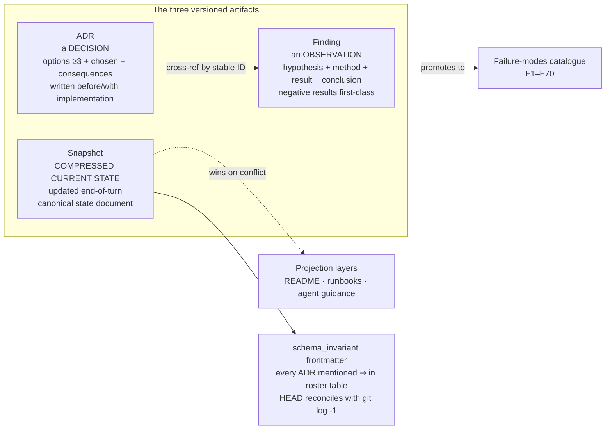
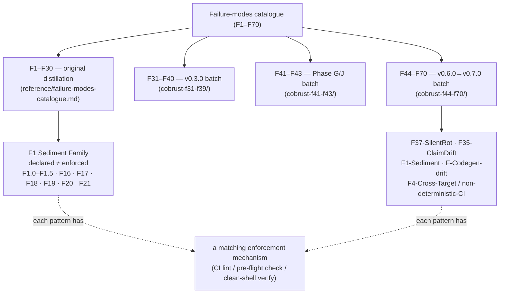
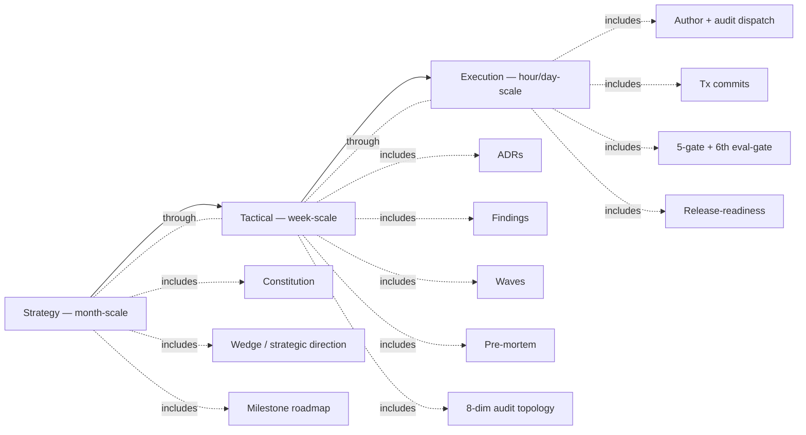
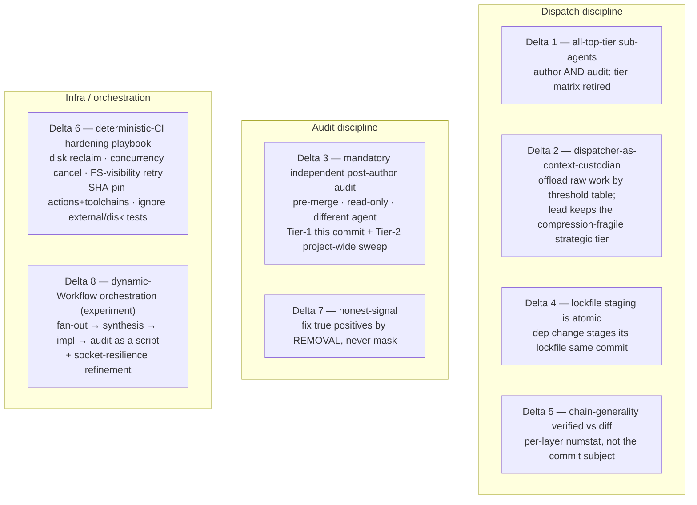
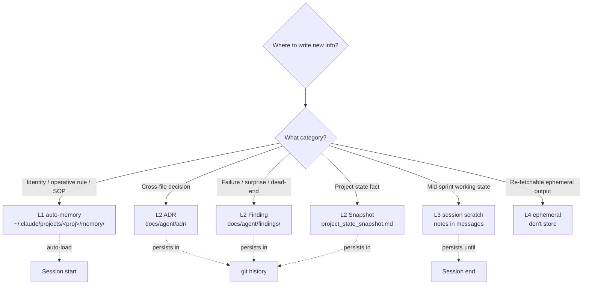
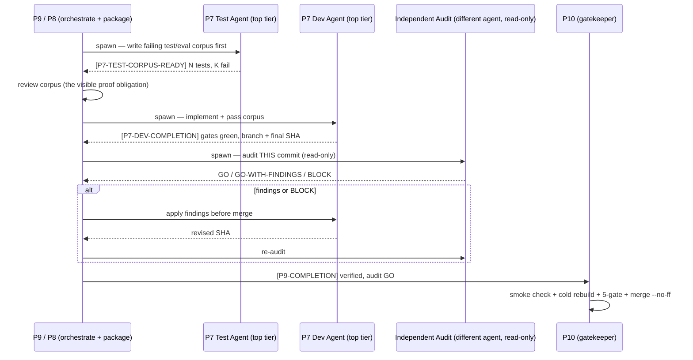
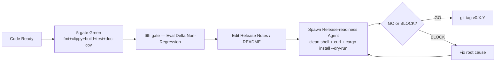

# ADSD concept map

> Mermaid diagrams + short prose to unpack the full ADSD concept landscape at once.
>
> This is the "how the pieces fit" doc. It's battle-tested, not orthodoxy —
> bend it when your project shape demands (see SKILL.md §"When to bend ADSD").
> Every quantitative claim here cites a real on-disk source; ADSD dogfoods its
> own §4 benchmark-cite discipline on its own docs.

## Top-level view

Two structural shifts from early ADSD are baked into this diagram and explained
below: **every author dispatch pairs with an independent audit before merge**
(methodology Delta 3), and **every sub-agent — author and audit — runs on the
top model tier** (Delta 1, which retired the old "sonnet for mechanical tasks"
branch). The 8 methodology deltas live in
`reference/cobrust-f44-f70/methodology-deltas.md`.

## Role topology (5 tiers + external review)

ADSD maps work onto a **5-tier role hierarchy plus an external review track**.
Tiers map to model size + autonomy budget, not to humans. One CTO per project
(a deliberate bottleneck); review is plural-OK.

- **P10 CTO**: defines the wedge, sets falsifiable 6-month/1-year/5-year horizons,
  makes topology decisions, signs off irreversible calls (license, public release,
  breaking changes). **Does not** write code or review every PR. ~5% of project time.
- **P9 Tech Lead**: takes the CTO anchor, decomposes into ≤ 5 sub-tasks, sequences
  workstreams + gates, writes Task Prompts, runs the multi-phase dispatch SOP,
  verifies completions and merges. Reasoning-heavy → top model.
- **P8 Domain Expert** became a first-class role once projects grew beyond one
  work stream: P9 was overloaded when it simultaneously did milestone decomposition,
  cross-workstream coordination, domain-boundary design, and close-out policing.
  P8 owns **domain-boundary refinement + acceptance inside one workstream** so P7
  packages arrive fully specified. 1–3 P8 workstreams sit under one P9.
- **P7 Senior Engineer**: executes one bounded package. First action is
  `cd && pwd && git branch` (working-dir discipline); reads its required-reads list
  before coding; starts with tests/evals when the package touches a public behavior.
- **P0**: the atomic inner-loop worker — a single command, grep, or test run. Rarely
  named explicitly; P7 dispatches these.
- **External review**: read-only against main (this boundary is what makes review
  trustworthy — it can't damage what it audits). Runs stress-test farms the internal
  team won't think of, drafts strategic plans, and **owns its own errors publicly**.

> **Tier rule (Delta 1, supersedes the old tier matrix).** Every dispatched
> sub-agent — author *and* audit — uses the top model. The earlier "top model for
> hard tasks, mid model for mechanical" branch is retired: a single day's mid-tier
> run produced a correlated-regression cluster (a stale version string copied into
> two PR bodies, an identity leak from an unconfigured fresh workspace, an
> author/audit race where the slower author finished after the audit's polling
> window). The only carve-out is *not a tier choice* — truly mechanical 1–2-line
> edits the lead can do directly (Delta 2's sub-threshold band) need no sub-agent
> at all. Source: `reference/cobrust-f44-f70/methodology-deltas.md` Delta 1.

## Audit topology (8 dimensions = 4 internal + 3 persona + deep-source-read)

When stakes are high (pre-tag, pre-public-release, pre-major-milestone), the
external review agent **dispatches its own audit team** instead of single-window
review. The team grew empirically to **8 dimensions**, run in two waves under the
4-parallel cap.

The three layers are **orthogonal coverage**, demonstrated empirically:

| Audit layer | What it catches | What it structurally misses | Empirical yield (Cobrust) |
|---|---|---|---|
| 4 internal (single-window baseline) | code soundness, sediment | "would a stranger trust this?" | single-window ~3 → 4-agent team **~25** findings, **~8×** leverage, ~50 min parallel vs ~5 h sequential |
| 3 persona | UX / positioning / "would I install this?" | line-level source defects | persona team **17 findings**, mostly UX/positioning |
| deep-source-read | `file:line` precision defects no lens reaches | UX, positioning | deep-source-read team **33 findings, all file:line**, including **8 P0 BLOCK** that would have shipped to a stable tag |

Source: SKILL.md §"Self-applied multi-agent audit", §"LLM-simulated user persona",
§"Deep-source-read (the 8th audit dimension)". The headline lesson is **F1-class**:
declared coverage ("we audited public readiness") is not actual coverage ("we
tested with simulated public users"). A self-named "public-readiness" internal
audit still concludes "claims are defensible"; a *Mei persona* notices "the install
command assumes I already know what `cargo` is — I'm a Python user." Deep-source-read
adds the third axis: none of the lens-driven agents read
`cranelift_backend.rs:1422` to confirm `BinOp::Mod` lowers correctly.

**When to run the full 8**: pre-tag, pre-major-release, pre-funding-pitch,
pre-customer-demo. **When not to**: in-sprint tactical review (single-window
suffices), exploratory phase (over-discipline), throwaway projects.

## The artifact triad — ADR / Finding / Snapshot

Every decision and every observation lands in a versioned document so a future
agent loaded at compaction-time-zero can reconstruct context. Three artifact kinds:

- **ADR** — a *decision*. Options (≥ 3) + chosen + consequences. Stable
  `adr_id` + `last_verified_commit` frontmatter.
- **Finding** — an *observation*. Hypothesis + method + result (paste raw evidence)
  + conclusion. Negative results are first-class deliverables (constitution §5.2:
  *"Negative results are documented under findings/, not hidden"*). When a finding
  recurs across projects it graduates into the **F1–F70 catalogue**.
- **Snapshot** — the *canonical state document*. README, runbooks, and agent-guidance
  files are **projection layers**; when they disagree, snapshot wins until the
  projections are synced. A repo whose README is more current than its snapshot is
  upside down.

The `schema_invariant` frontmatter is what stops the most common failure (F1.0
"重写忘删" — write new section, forget to delete the old one). But a declared
invariant is documentation, not enforcement: F1.1 says it must compile to a script
assertion (`scripts/snapshot-lint.sh`) run in CI, or it goes stale within 1–3 turns.

## The failure-modes catalogue — F1–F70

The catalogue is the project's accumulated scar tissue. It currently runs **F1–F70**:
F1–F30 from the original 12-day distillation run, then three empirical-corroboration
batches from Cobrust's continued life (F31–F40, F41–F43, F44–F70, with F45a as a
sub-form and F52/F57 deliberately skipped in local numbering).

The single most common systemic failure is the **F1 Sediment Family**
(declared-without-enforcement): a rule is written *somewhere* (constitution, schema
frontmatter, KPI card, attribution policy, auto-memory), no automated mechanism
verifies it, and it's violated within 1–3 turns invisibly until an auditor checks.
Sub-forms span snapshot sediment (F1.0), declared-invariant-without-CI-lint (F1.1),
partial-scope enforcement (F1.2), local-vs-CI gate drift (F1.3), README-vs-tag drift
(F1.4), post-compaction identity drift (F16), KPI self-report fidelity gaps (F17),
and attribution-policy scope leaks (F18).

**The core lesson, generalized to a P0 SOP**: *any project-level rule without an
automated check is security theater.* When you write a rule, in the same commit add
the script that enforces it — or mark it "ASPIRATIONAL", not "REQUIRED". Source:
`reference/failure-modes-catalogue.md` §F1, §"Generalized prevention going forward".

## Three abstraction layers (slow → fast)

- **Strategy layer**: CLAUDE.md rarely changes; month-scale decisions. Changing it = major project pivot.
- **Tactical layer**: ADR + Finding added weekly; milestone checkpoints; audit-team design.
- **Execution layer**: daily sprints, author + independent-audit dispatch, gate enforcement, atomic commits.

## Methodology deltas — how ADSD refines *itself*

Findings say "the system did X wrong". **Methodology deltas** say "the way we *run*
the multi-agent process should change". Eight deltas accumulated during Cobrust's
v0.6.0 → v0.7.0 run, each empirically forced:

The two highest-leverage for the mental model:

- **Delta 2 — dispatcher-as-context-custodian** is *not* a token-cost optimization;
  it's a **context-density** one. The lead's context holds the load-bearing strategic
  state (design rationale, sprint sequencing, the accumulating failure-mode ledger).
  Near the auto-compaction threshold, raw prose and raw code compress *lossily* — the
  strategic detail is exactly what gets summarized away. So the lead dispatches raw
  work by an explicit threshold table (single-file edit ≥ 30 lines → dispatch; any
  source/impl edit → dispatch; ADR/findings/bilingual docs → dispatch) and keeps only
  dispatch ordering, report synthesis, audit-verdict evaluation, merge/tag, and user
  dialogue.
- **Delta 3 — mandatory independent post-author audit**: self-review by the author
  (or by the lead who framed the work) is *structurally insufficient* — their context
  is biased toward the verdict "this is done". The audit is read-only, top-tier, and a
  *different* agent. Two tiers: Tier-1 audits the specific commit just produced;
  Tier-2 is a periodic project-wide sweep (cross-ADR terminology drift,
  anchor-freshness, `#[ignore]` accumulation outside the documented honest-debt set,
  wiki-link integrity). Tier-1 by construction misses cross-cutting drift; Tier-2
  exists to catch it.

**Delta 8 — dynamic-Workflow orchestration** is the newest and is explicitly an
*experiment arm*, not a ratified practice: the fan-out → synthesis → impl → audit
topology encoded as a deterministic script rather than a lead hand-juggling each
dispatch. Its first real new surface, surfaced and attribution-corrected post-run, is
**no built-in resilience to transient agent failure** — a bare agent whose process
dies (socket close / 529 / watchdog) returns a truncated result a downstream stage
then consumes as if real, producing a misleading verdict on a non-failure. The
refinement: wrap failure-prone stages so a truncated/errored result is *re-dispatched*
before any downstream stage reads it (retry-with-backoff; treat an unparseable/empty
result as a retry trigger, not a finding). This is the same infra-failure class as
`F40-stream-watchdog-false-stall-signal`. Source:
`reference/cobrust-f44-f70/methodology-deltas.md` Delta 8.

## Four-layer storage model (memory decision)

When unsure, **default to L3 scratch**. Promotion to L1/L2 is a deliberate decision
at sprint-end, not in-flight. Identity / behavioral-role constraints in particular
must live in L1 auto-memory, not only in a skill description — F16 proved that any
sufficiently long CTO session drifts post-compaction unless the role anchor survives
in auto-memory.

## Dispatch + audit + integrate loop

This is the per-sprint operational heartbeat after the multi-phase SOP has produced a
packaged task. It replaces the old "dev/test pair → commit" picture with the
audit-gated form (Delta 3) on all-top-tier agents (Delta 1).

**Why a separate test agent + dev agent is mandatory**: a single agent writing impl +
test has confirmation bias — the test verifies what the agent intended, not what the
spec demands. **Why a separate audit agent on top of that**: the author's *and the
framer's* context is biased toward "done"; only an independent read-only agent catches
the drift they rationalize away (Delta 3). Findings are applied *before* merge —
retroactive audit must re-read merged content and diff it against intent, strictly
more work than gating up front.

A practical pre-flight that rides this loop (Delta 4): any dependency-touching commit
must stage its lockfile in the same commit. A missed lockfile line fan-out-fails the
entire locked-CI gate cluster (build + lint + test) with an opaque mismatch error —
so it's a hard pre-commit checklist item in the dispatch prompt, not an assumption.

## Release closure (with release-readiness)

**F19 closure key**: don't let the agent that wrote the docs self-verify the docs. An
**independent release-readiness agent in a clean shell** is the only robust F19
defense. Note the symmetry with Delta 3 — F19 is release-time independent verification,
Delta 3 is commit-time independent verification; both reject self-attestation. And a
version bump must be accompanied by a tag (F48): bumping the version string without
tagging creates a binary whose announced version has no matching artifact.

## Turning these diagrams into practice

Each diagram is a "practice script":

- Top-level view → follow this flow for a new project
- Role topology → assign tiers; respect the one-CTO bottleneck + 4-way cap; all-top-tier (Delta 1)
- Audit topology → at high-stakes gates, run the full 8 dimensions in two waves
- Artifact triad → consult before writing; snapshot wins on conflict
- Failure-modes catalogue → consult F1–F70 when you hit a wall; find the missing enforcement
- Three abstraction layers → team cadence, what to do daily/weekly/monthly
- Methodology deltas → how to *run* the process; dispatcher-as-context-custodian + mandatory-audit + honest-signal are the load-bearing three
- Storage four-layer → consult the decision tree before writing
- Dispatch + audit + integrate loop → P9/P8 follows this sequence per sprint
- Release closure → mandatory path before any tag

See [`getting-started.md`](./getting-started.md) 5-step practice section to map these
diagrams to concrete commands.
