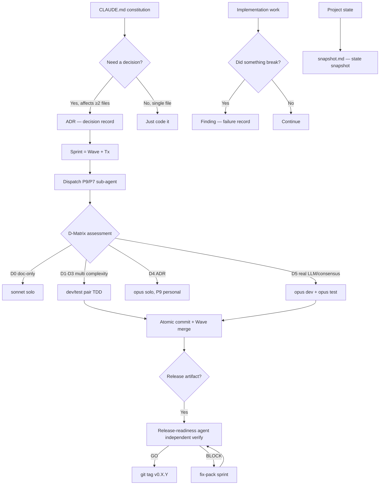
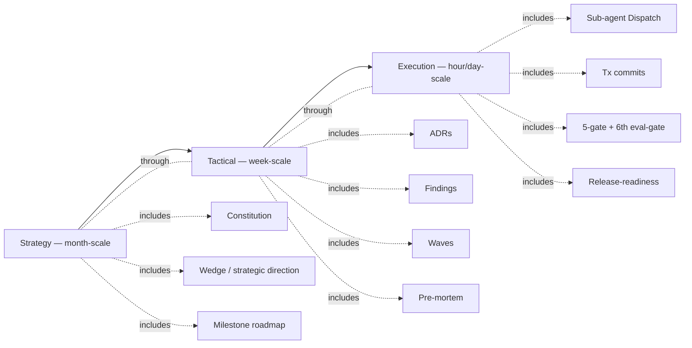
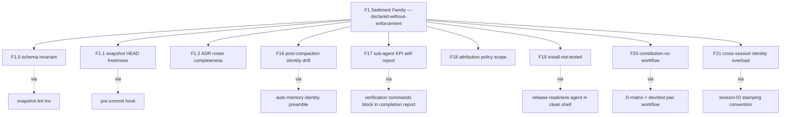
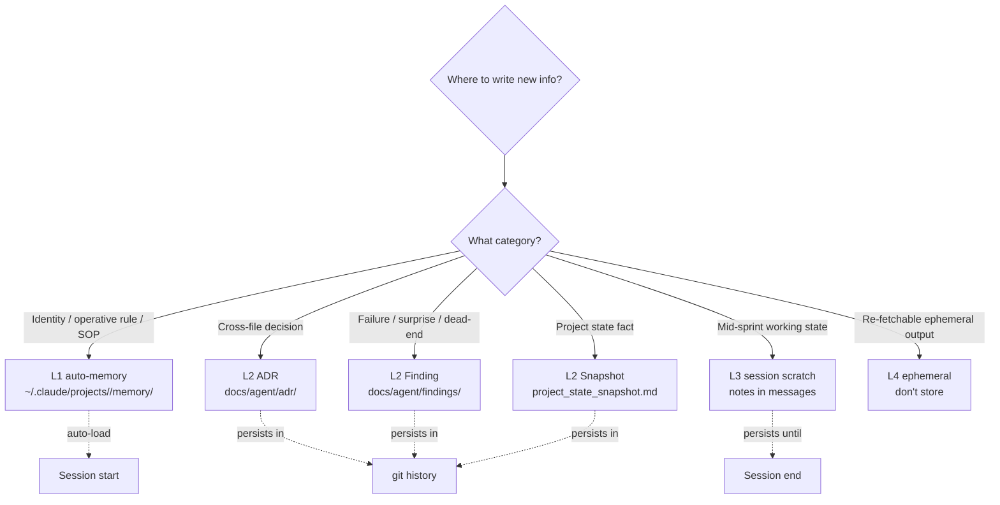
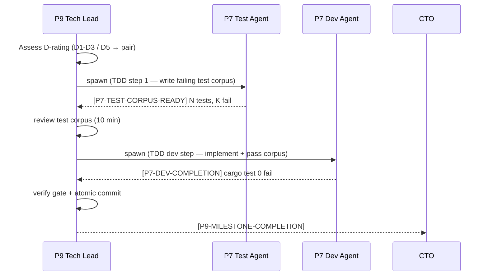
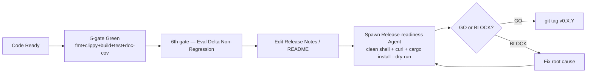

# ADSD concept map

> Mermaid diagrams + short prose to unpack the full ADSD concept landscape at once.

## Top-level view

## Three abstraction layers (slow → fast)

- **Strategy layer**: CLAUDE.md rarely changes; month-scale decisions. Changing it = major project pivot.
- **Tactical layer**: ADR + Finding added weekly; milestone checkpoints.
- **Execution layer**: daily sprints, sub-agent dispatch, gate enforcement, atomic commits.

## Failure modes (F1 Sediment Family) panorama

Each F-pattern has a corresponding enforcement mechanism. The F1 Family core lesson: **declaring rules isn't enough; you must have machine / workflow enforcement**.

## Four-layer storage model (memory decision)

When unsure, **default to L3 scratch**. Promotion to L1/L2 is a deliberate decision at sprint-end, not in-flight.

## Dispatch protocol (dev/test pair pattern)

**Why a separate test agent + dev agent is mandatory**: a single agent writing impl + test has confirmation bias — the test verifies what the agent intended, not what the spec demands. Separate test agent eliminates the bias.

## Release closure (with release-readiness)

**F19 closure key**: don't let the agent that wrote the docs self-verify the docs. **Independent release-readiness agent in a clean shell** is the only robust F19 defense.

## Turning these diagrams into practice

Each diagram is a "practice script":

- Top-level view → follow this flow for a new project
- Three abstraction layers → team cadence, what to do daily/weekly/monthly
- F1 Family → consult this when you hit a wall, find the missing enforcement
- Storage four-layer → consult the decision tree before writing
- Dispatch protocol → P9 follows this sequence when initiating a sprint
- Release closure → mandatory path before any tag

See [`getting-started.md`](./getting-started.md) 5-step practice section to map these diagrams to concrete commands.
