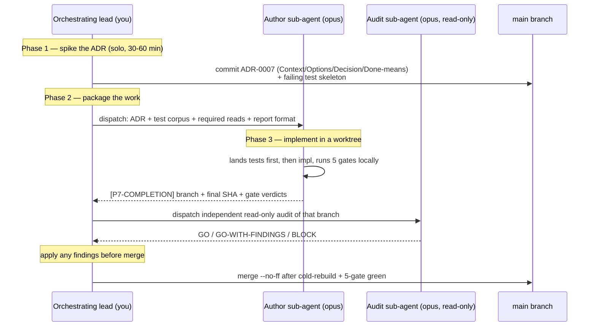

# Getting started

> **Goal**: in 30 minutes, an engineer unfamiliar with ADSD has the ADRs + findings + sub-agent dispatch discipline running on their own project.

## Who should read this

- You're managing a project with **multi-agent parallelism** (≥3 AI agents working concurrently)
- You want to avoid the multi-agent endemic ailments: sediment / drift / silent regression
- You already use Claude Code / Cursor / similar IDE-agent tools at a basic level
- You have a git project to apply this methodology to

If you're writing a single-agent small script, ADSD is overkill. Skip.

## 30-second overview

ADSD is the multi-agent working discipline distilled from the Cobrust project. The founding distillation snapshot is a 12-day intensive run (2026-04-30 → 2026-05-12, ~278 commits); the project then kept running well past that window and the catalogue grew with it — from the original F1–F30 to F1–F70 across three later corroboration batches. ADSD codifies:

1. **Decision capture** — every cross-file decision becomes an ADR (Architecture Decision Record)
2. **Failure capture** — every "this broke / surprised / dead-ended" becomes a Finding (negative result)
3. **Dispatch discipline** — difficulty self-rating + all-top-tier sub-agents + mandatory independent post-author audit

Plus **bilingual docs mandate** + **wave + Tx atomic commits** + the **F1–F70 anti-pattern catalogue** (founding F1–F30 + three corroboration batches) + **8 methodology deltas** + **release-readiness pre-publish independent verification**. That's the full picture.

Detailed architecture: [`concept-map.md`](./concept-map.md)

## Three install paths

### Method 1 (recommended) — Claude Code plugin

```
/plugin marketplace add Cobrust-lang/agent-driven-development
/plugin install adsd@adsd
```

Once installed, when a prompt mentions "multi-agent dispatch / ADR drafting / F1-F70 failure modes" etc., Claude auto-activates the ADSD skill.

### Method 2 — Personal skill directory (fallback)

```sh
mkdir -p ~/.claude/skills
git clone --depth 1 https://github.com/Cobrust-lang/agent-driven-development.git /tmp/adsd-src
cp -r /tmp/adsd-src/plugins/adsd/skills/agent-driven-development ~/.claude/skills/
rm -rf /tmp/adsd-src
```

### Method 3 — Read-only (no install, just markdown)

Read [`plugins/adsd/skills/agent-driven-development/SKILL.md`](https://github.com/Cobrust-lang/agent-driven-development/blob/main/plugins/adsd/skills/agent-driven-development/SKILL.md) top-to-bottom (~30 min) for the full methodology. No install required to learn.

## First real use — 5 steps

Assume you have a project at `~/my-project/` and want to start with ADSD.

### Step 1: Create the project `CLAUDE.md` (constitution)

Write a ~30-line project constitution at `~/my-project/CLAUDE.md` with at minimum:

- **Project identity** — one-line pitch (what + who uses it)
- **What you keep** (good properties borrowed from other tools / languages / workflows)
- **What you drop** (explicit anti-patterns)
- **Engineering standards** — Elegant / Scientific / Efficient with 3-5 concrete rules each
- **Milestone roadmap** — M0 (scaffold) → M1 → ... 6-12 months out

Reference: ADSD's own SKILL.md "Engineering standards" section is a template.

### Step 2: Create `docs/agent/` + `docs/human/{zh,en}/` skeleton

```sh
cd ~/my-project
mkdir -p docs/agent/adr docs/agent/findings docs/agent/modules
mkdir -p docs/human/zh docs/human/en
```

Copy ADSD's `templates/adr-template.md` to `docs/agent/adr/_template.md` as your ADR drafting template. Same for finding-template, snapshot-template.

### Step 3: Write ADR-0001 (license choice)

Every project's first ADR is typically the license choice (Apache+MIT dual, or BSL-1.1, or ...). This is **the start of mandatory ADR flow** — one cross-multifile decision running through the complete process: Context → Options → Decision → Consequences → Cross-references.

### Step 4: Build `MEMORY.md` index (Claude Code auto-memory)

If you use Claude Code, project-level memory lives in `~/.claude/projects/<project-dir>/memory/`. Create the `MEMORY.md` index with one-line hooks:

```
- [Project identity preamble](identity.md) — read first when resuming a session
- [Subagent dispatch rule](subagent_dispatch.md) — all-top-tier per ADSD Delta 1
- [CTO operations runbook](runbook.md) — dispatch + audit SOPs
```

See [`reference/cross-session-memory-architecture.md`](https://github.com/Cobrust-lang/agent-driven-development/blob/main/plugins/adsd/skills/agent-driven-development/reference/cross-session-memory-architecture.md).

### Step 5: First sub-agent dispatch (difficulty self-rating + top-tier model)

Use Claude Code's Agent tool to dispatch a concrete task. **The prompt MUST include a difficulty self-rating** so future you (and the audit) can reconstruct why this was scoped the way it was:

```
DIFFICULTY-RATING: D2 (multi-fn stdlib API new, single crate, ADR clear)
MODEL: opus            # all-top-tier — see methodology Delta 1
PAIR: yes              # an independent audit agent gates this before merge

MISSION: implement <feature> such that <test_corpus> all passes.

REQUIRED READS:
- /abs/path/to/ADR-0XXX.md
- /abs/path/to/test_corpus.rs
- see reference/prompt-engineering-patterns.md PT2 (few-shot output format)

REPORT FORMAT: [P7-COMPLETION] with verification block (paste raw cargo test output, no paraphrase)
```

> **Note on model tier.** Older ADSD material used a D0–D5 matrix that routed
> "simple/mechanical" tasks to a cheaper model. That tier matrix is **retired**
> per [methodology Delta 1](https://github.com/Cobrust-lang/agent-driven-development/blob/main/plugins/adsd/skills/agent-driven-development/reference/cobrust-f44-f70/methodology-deltas.md):
> every dispatched sub-agent — author *and* audit — uses the top model. The
> difficulty rating still matters (it shapes scope, required reads, and how
> hard the audit looks), but it no longer selects a cheaper tier. The only
> carve-out is truly mechanical edits the orchestrating lead can just do
> directly (a 1–2 line typo, a SHA stamp) — those need no sub-agent at all
> ([Delta 2](https://github.com/Cobrust-lang/agent-driven-development/blob/main/plugins/adsd/skills/agent-driven-development/reference/cobrust-f44-f70/methodology-deltas.md), dispatcher-as-context-custodian).

See [`reference/prompt-engineering-patterns.md`](https://github.com/Cobrust-lang/agent-driven-development/blob/main/plugins/adsd/skills/agent-driven-development/reference/prompt-engineering-patterns.md).

## Your first ADSD sprint — a worked walkthrough

The 5 steps above set up the scaffolding. This section shows the **core ADSD
loop end-to-end** on one concrete sprint, so you can see how the pieces connect:
**two-phase dispatch → implementation → independent audit → merge.**

Scenario: your project needs a new `parse_duration("1h30m") -> Result<Seconds>`
function. It's a cross-file decision (new public API + tests + docs), so it earns
the full loop.



**Phase 1 — spike the ADR yourself (the decision is strategic; don't outsource it).**
Write `docs/agent/adr/0007-parse-duration.md` with the four falsifiable sections:
Context (why we need it), Options considered (≥ 3: hand-roll / pull a crate /
generate from a grammar), Decision + why, and **Done means** (e.g. "all 12 cases
in `tests/duration_corpus.rs` pass; rejects `"abc"` with a typed error"). Because
this capability is user-visible, **also place the failing test skeleton now** —
that visible proof obligation is what stops the scope from drifting during
implementation. Commit both:
`docs(adr): land ADR-0007 — parse_duration (spike)`.

**Phase 2 — package the work for the author.** Decide the delivery gate ("12/12
corpus green + 5-gate") and write the dispatch prompt using the Step-5 template:
ADR path + test-corpus path + required reads + the exact `[P7-COMPLETION]` report
format. Keep this tight; an under-specified package is where authors start
improvising architecture under tempo.

**Phase 3 — the author implements (in its own worktree).** A top-tier author
agent reads the ADR + corpus, lands the tests first (they're already failing from
Phase 1), implements until green, runs all 5 gates locally, and reports
`[P7-COMPLETION]` with the branch name, final SHA, and **raw** gate output (no
paraphrase — paraphrased gate claims are a documented failure mode).

**The audit step — non-negotiable, and a *different* agent.** Before you merge,
dispatch an **independent, read-only audit** of that branch
([methodology Delta 3](https://github.com/Cobrust-lang/agent-driven-development/blob/main/plugins/adsd/skills/agent-driven-development/reference/cobrust-f44-f70/methodology-deltas.md)).
Self-review by the author — or by you, who framed the work — is structurally
insufficient: both contexts are biased toward "this is done." The audit returns a
verdict in the vocabulary **GO / GO-WITH-FINDINGS / BLOCK**; apply any findings
before merge. One thing to make the auditor check explicitly: the
**fixture-name-vs-behavior gate** — a test named `rejects_garbage` must actually
exercise the reject path, not silently test something else.

**Merge.** Only after a cold rebuild + 5-gate green do you `merge --no-ff`. The
commit is atomic: code + tests + zh/en docs + the ADR all land together.

That's the whole loop. Everything else in ADSD — personas, deep-source-read,
strategic reviews — is this loop plus more lenses at higher stakes.

## Running more than one sprint at once

Two operational rules govern parallelism:

- **≤ 4-way parallel cap.** Beyond 4 concurrent sub-agents, build-cache lock
  contention, worktree disk pressure, and your own gate-keeping capacity all
  degrade. Four is the empirically-measured sweet spot (on a 16 GB laptop). Each
  parallel sprint runs in its **own git worktree** (`git worktree add ../proj-<id>
  -b feature/<id> main`) so `target/` dirs don't collide and "kill this sprint" is
  a cheap `git worktree remove --force`.
- **Some sequencing is genuinely real even at agent velocity.** The ADR Phase-1
  spike must merge before Phase-2 dispatches; a worktree won't merge until 5-gate
  green; a persona re-test must run *after* its fix merges, not in parallel with
  it. Respect those edges; flatten everything else.

### When to graduate to dynamic-Workflow orchestration

Hand-managing 4 parallel dispatches is where a lead drops balls — stale
snapshots, an audit that polls a still-running author, a forgotten pre-flight
check. The newest ADSD option encodes the loop as code: a **deterministic
dynamic Workflow** (a Claude Code orchestration script) that runs **fan-out →
synthesis → impl → independent audit** as fixed stages rather than by hand
([methodology Delta 8](https://github.com/Cobrust-lang/agent-driven-development/blob/main/plugins/adsd/skills/agent-driven-development/reference/cobrust-f44-f70/methodology-deltas.md)).

Treat it as an **experiment arm**, not settled doctrine. It removes the
lead-juggling failure surface but introduces new ones: a fixed topology can't
re-scope mid-run the way a human can, and the orchestration script is itself
un-audited code (so it's subject to the same independent-audit rule). The one
hard refinement already learned: **wrap failure-prone stages with retry** — a
transient socket/network death mid-agent returns a truncated result, and a
downstream stage (e.g. the audit) will otherwise consume that truncation as if it
were a real deliverable and emit a misleading verdict. Detect-and-re-dispatch
before any downstream stage reads the result.

## Verify you installed correctly

Run these two checks:

```sh
# 1. Verify plugin activated
/plugin status adsd

# 2. In Claude Code, ask a question with ADSD keywords
"I need to plan a multi-agent dispatch with an independent post-author audit — what's the two-phase SOP?"
```

If Claude auto-references ADSD's `reference/` files, you installed correctly. If Claude answers from general knowledge, the skill didn't activate.

## Next steps

- Read [`concept-map.md`](./concept-map.md) for the complete ADSD concept diagram
- When you hit a wall, write a finding. Don't hide it. The founding F1–F30 catalogue is at [`reference/failure-modes-catalogue.md`](https://github.com/Cobrust-lang/agent-driven-development/blob/main/plugins/adsd/skills/agent-driven-development/reference/failure-modes-catalogue.md), and the F31–F70 corroboration batches sit alongside it under [`reference/`](https://github.com/Cobrust-lang/agent-driven-development/tree/main/plugins/adsd/skills/agent-driven-development/reference); you may have hit the same one
- Choosing a dispatch/audit topology? Read [`reference/cobrust-f44-f70/methodology-deltas.md`](https://github.com/Cobrust-lang/agent-driven-development/blob/main/plugins/adsd/skills/agent-driven-development/reference/cobrust-f44-f70/methodology-deltas.md) for the 8 deltas (all-top-tier dispatch, mandatory audit, dynamic-Workflow mode, …)

## FAQ

**Q: My project is small. Do I really need ADRs?**
A: Only for decisions affecting ≥2 files. Single-file modifications don't write ADRs. Bug fixes don't write ADRs (but do write findings).

**Q: Bilingual docs feel burdensome?**
A: ADSD mandates this because it addresses the real "Chinese teams are natively multilingual" problem. Single-language projects can relax this; but the README + getting-started bilingual pair is recommended.

**Q: The difficulty self-rating feels tedious — do I need it every time, and doesn't it just pick a model tier?**
A: Two parts. (1) It no longer picks a model tier — that D0–D5 → cheap-model routing was retired by [methodology Delta 1](https://github.com/Cobrust-lang/agent-driven-development/blob/main/plugins/adsd/skills/agent-driven-development/reference/cobrust-f44-f70/methodology-deltas.md); every sub-agent now uses the top model. (2) The rating still earns its keep: it shapes scope, the required-reads list, and how hard the independent audit should look. Manual the first 5 times, then muscle memory. Skipping it tends to ship under- or over-scoped packages (the F2-Scope family).

**Q: Why can't the author agent just review its own work? An extra audit dispatch doubles the cost.**
A: The author's context is biased toward the verdict "this is done" — it rationalizes away the exact drift the audit should catch. So is yours, if you framed the work. An *independent, read-only, different* agent ([Delta 3](https://github.com/Cobrust-lang/agent-driven-development/blob/main/plugins/adsd/skills/agent-driven-development/reference/cobrust-f44-f70/methodology-deltas.md)) is the cheapest reliable way to catch it pre-merge. Batch similar surfaces into one audit dispatch to keep the count down; a retroactive audit (after merge) is strictly more expensive because it must re-read merged content and diff it against original intent.

**Q: I use OpenAI not Anthropic?**
A: ADSD is LLM-agnostic. Difficulty self-rating / dev-test pair / evals-first / independent audit are all vendor-neutral. The Claude Code plugin is just a distribution channel; the methodology itself doesn't bind to Anthropic.
