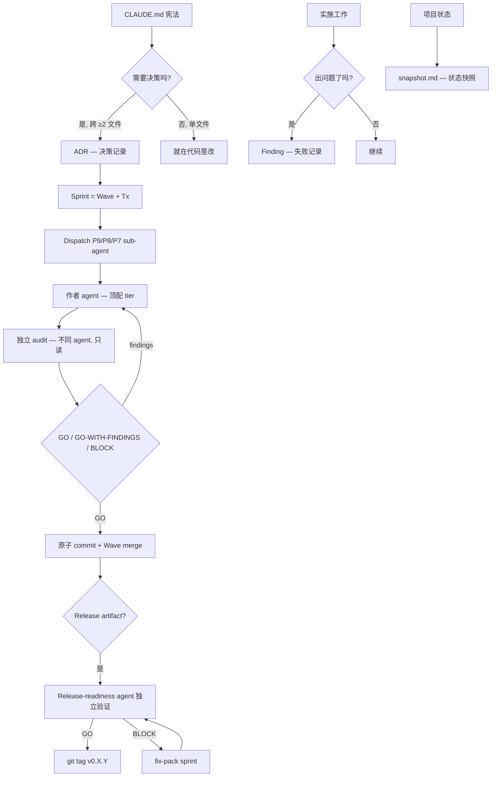
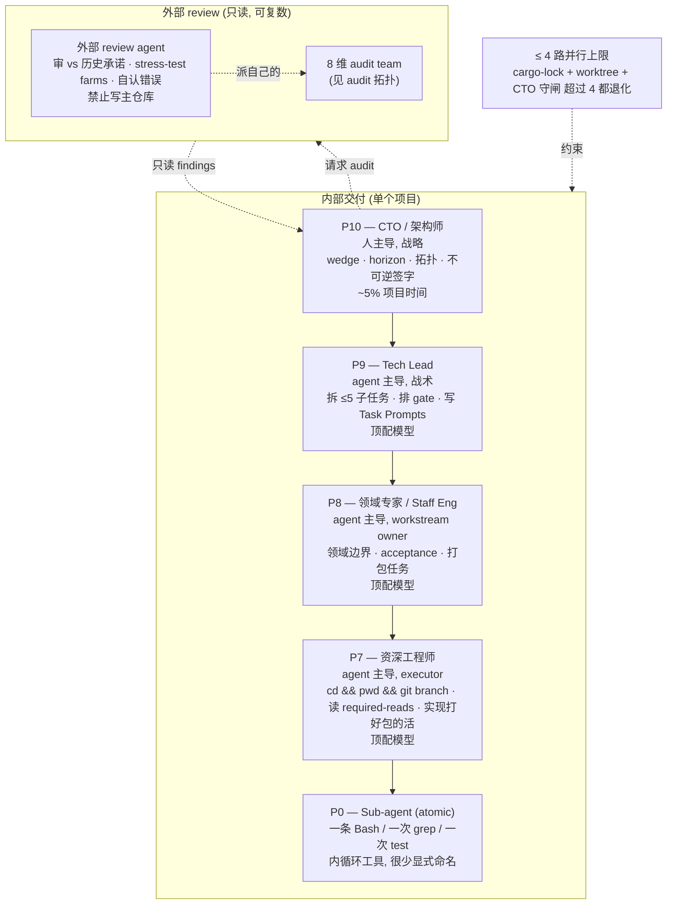
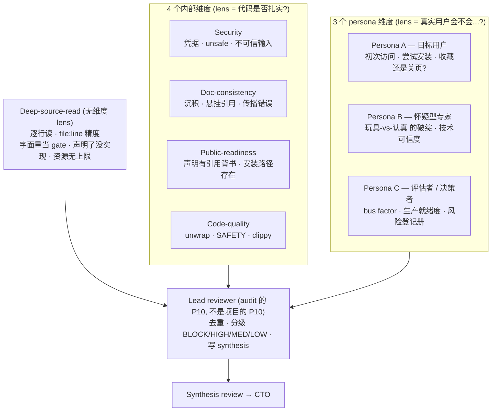
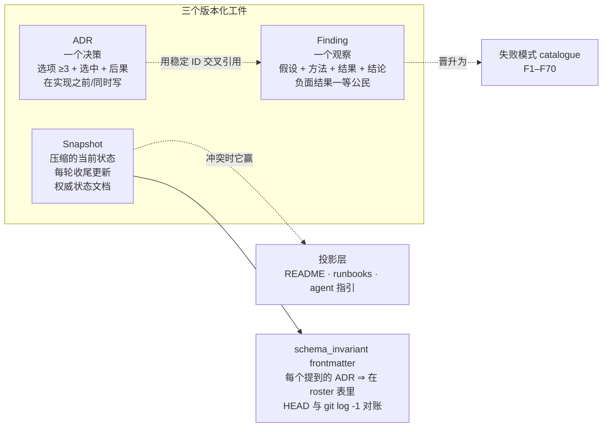
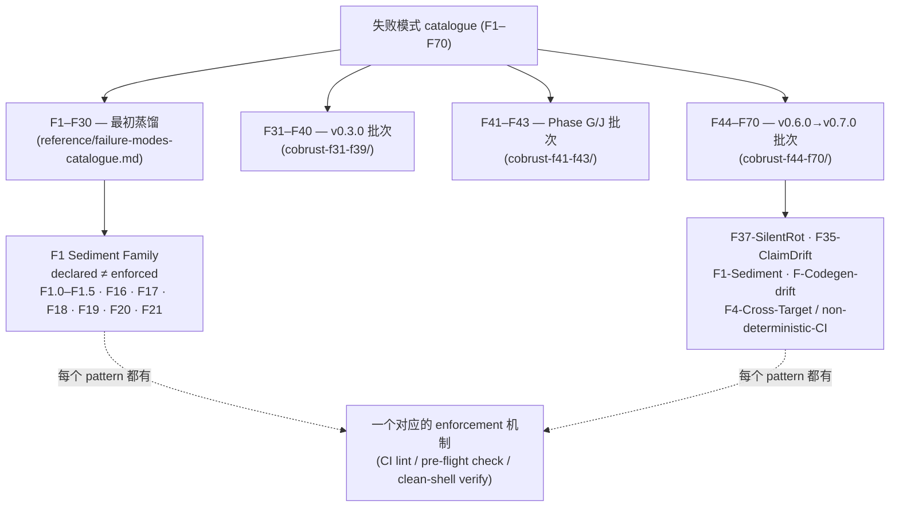
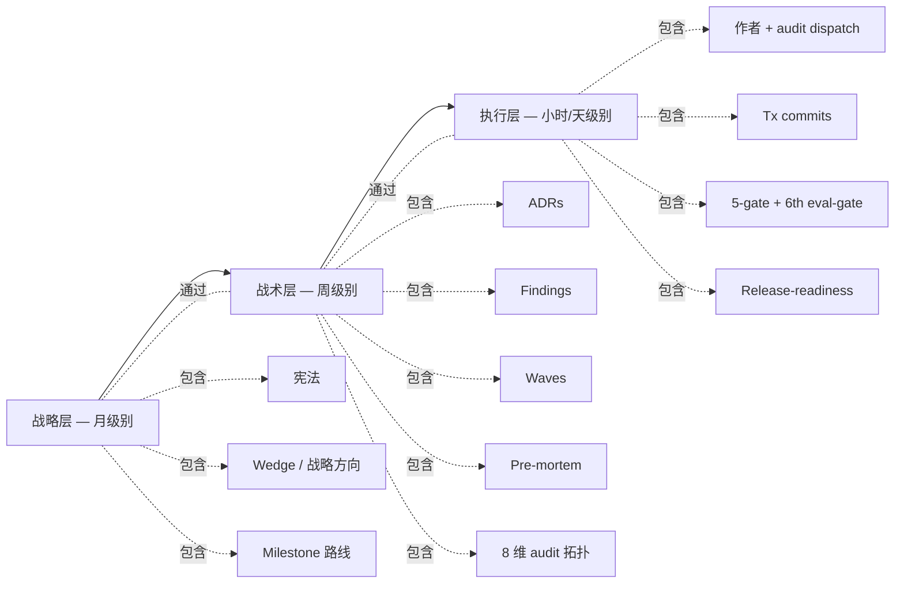
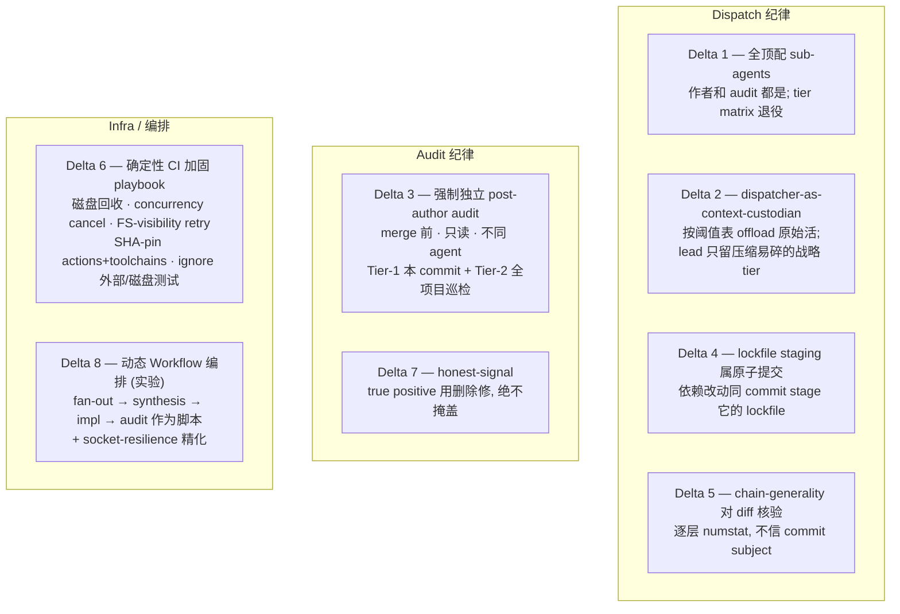
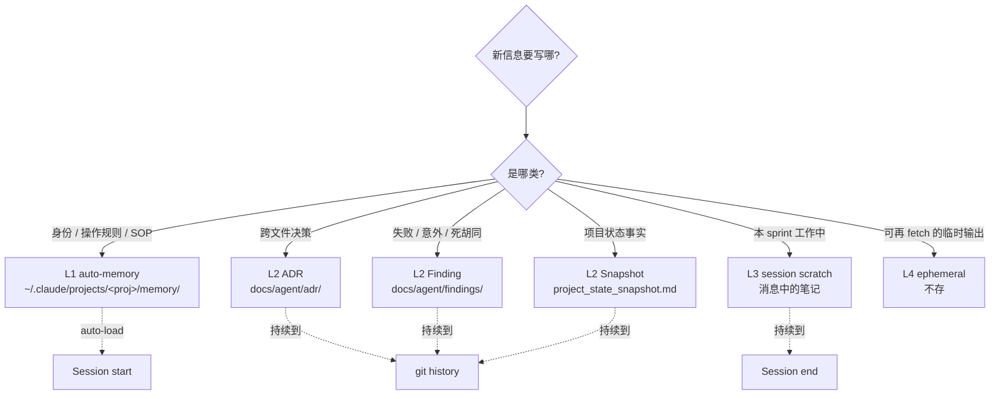
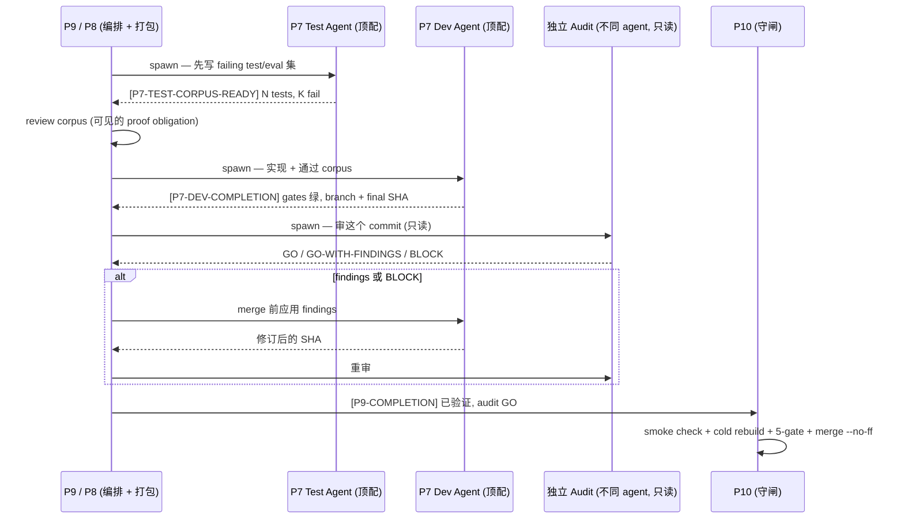
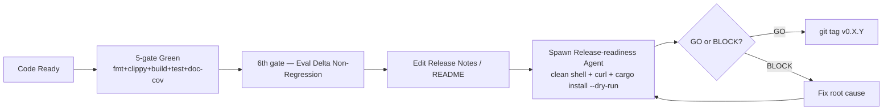

# ADSD 概念图

> 用 mermaid 图表 + 简短文字, 把 ADSD 全套概念一图打散.
>
> 这是"各部件怎么拼起来"的文档. 它是实战检验过的, 不是教条 —
> 当你的项目形态需要时就大胆调整 (见 SKILL.md §"When to bend ADSD").
> 这里每个量化声明都引用磁盘上真实的来源; ADSD 对自己的文档也照样
> dogfood 它自己 §4 的 benchmark-cite 纪律.

## 顶层视图

相对早期 ADSD, 这张图里固化了两处结构性转变, 下文展开: **每次作者派活都配
一个 merge 前的独立 audit** (方法论 Delta 3), 以及 **每个 sub-agent —
作者和 audit 都用顶配模型 tier** (Delta 1, 它把旧的"机械活用 sonnet"分支
退役了). 8 条方法论 deltas 在
`reference/cobrust-f44-f70/methodology-deltas.md`.

## 角色拓扑 (5 层 + 外部 review)

ADSD 把工作映射到 **5 层角色等级 + 一条外部 review 轨道**. 层级映射的是
模型大小 + autonomy 预算, 不是人. 每个项目恰好一个 CTO (故意设的瓶颈);
review 可以是复数.

- **P10 CTO**: 定义 wedge, 设可证伪的 6 个月/1 年/5 年 horizon, 做拓扑决策,
  对不可逆的事签字 (license, 公开发布, breaking changes). **不**写代码, **不**
  review 每个 PR. 占 ~5% 项目时间.
- **P9 Tech Lead**: 接 CTO 的战略锚点, 拆成 ≤ 5 子任务, 排 workstream + gate,
  写 Task Prompts, 跑多阶段 dispatch SOP, 验收完成并 merge. 推理重 → 顶配模型.
- **P8 领域专家** 在项目超过单一 work stream 后成为一等角色: 当 P9 同时做
  milestone 拆解, 跨 workstream 协调, 领域边界设计, 收尾巡检时它就过载了.
  P8 拥有 **单个 workstream 内的领域边界精化 + acceptance**, 让 P7 的活打包
  到位再交付. 一个 P9 下可挂 1–3 个 P8 workstream.
- **P7 资深工程师**: 执行一个有界的活. 第一动作是 `cd && pwd && git branch`
  (工作目录纪律); 写代码前读 required-reads 清单; 活一旦改公共行为就从测试/eval
  起手.
- **P0**: 原子内循环 worker — 一条命令/grep/test. 很少显式命名; 由 P7 派.
- **外部 review**: 对主仓库只读 (正是这条边界让 review 可信 — 它没法损坏自己
  正在审的东西). 跑内部团队想不到的 stress-test farms, 起草战略方案, 并且
  **公开认领自己的错误**.

> **Tier 规则 (Delta 1, 取代旧 tier matrix).** 每个派出去的 sub-agent —
> 作者**和** audit 都用顶配模型. 旧的"难活顶配, 机械活中配"分支退役了:
> 单天一次中配 run 产出一簇关联回归 (一个 stale 版本串被复制进两个 PR body,
> 一个未配置的全新 workspace 泄漏了身份, 一次作者/audit race — 慢的作者在 audit
> 的轮询窗口之后才完成). 唯一的豁免 *不是 tier 选择* — 真正机械的 1–2 行编辑,
> lead 可以直接做 (Delta 2 的 sub-threshold 带), 根本不用 sub-agent.
> 来源: `reference/cobrust-f44-f70/methodology-deltas.md` Delta 1.

## Audit 拓扑 (8 维 = 4 内部 + 3 persona + deep-source-read)

当 stakes 高 (pre-tag, pre-public-release, pre-major-milestone), 外部 review agent
**派出它自己的 audit team**, 而非单窗口 review. 这个 team 经验上长到了 **8 维**,
在 4 路并行上限下分两波跑.

这三层是**正交覆盖**, 经验上有数据:

| Audit 层 | 抓到什么 | 结构性漏掉什么 | 经验产出 (Cobrust) |
|---|---|---|---|
| 4 内部 (单窗口基线) | 代码扎实度, 沉积 | "陌生人会信任这个吗?" | 单窗口 ~3 → 4-agent team **~25** 条, **~8×** 杠杆, 并行 ~50 分钟 vs 串行 ~5 小时 |
| 3 persona | UX / 定位 / "我会装吗?" | 行级源码缺陷 | persona team **17 条**, 多为 UX/定位 |
| deep-source-read | 任何 lens 都够不着的 `file:line` 精度缺陷 | UX, 定位 | deep-source-read team **33 条, 全是 file:line**, 含 **8 条 P0 BLOCK** — 不抓会 ship 进 stable tag |

来源: SKILL.md §"Self-applied multi-agent audit", §"LLM-simulated user persona",
§"Deep-source-read (the 8th audit dimension)". 头号 lesson 是 **F1 级**: 声明的覆盖
("我们审了 public readiness")不等于实际的覆盖("我们用模拟的公众用户测了"). 一个
自命名为 "public-readiness" 的内部 audit 仍会得出"声明站得住脚"; 而一个 *Mei
persona* 会注意到"安装命令假设我已经知道 `cargo` 是什么 — 我是 Python 用户."
Deep-source-read 加上第三条轴: 没有一个 lens 驱动的 agent 会去读
`cranelift_backend.rs:1422` 确认 `BinOp::Mod` 是否正确 lower.

**何时跑满 8 维**: pre-tag, pre-major-release, pre-funding-pitch, pre-customer-demo.
**何时不跑**: in-sprint 战术 review (单窗口够), 探索期 (纪律过度), 一次性项目.

## 工件三件套 — ADR / Finding / Snapshot

每个决策和每个观察都落到一个版本化文档里, 这样一个在 compaction-time-zero 加载的
未来 agent 才能重建 context. 三种工件:

- **ADR** — 一个*决策*. 选项 (≥ 3) + 选中 + 后果. 稳定的 `adr_id` +
  `last_verified_commit` frontmatter.
- **Finding** — 一个*观察*. 假设 + 方法 + 结果 (贴原始证据) + 结论. 负面结果是
  一等交付物 (宪法 §5.2: *"Negative results are documented under findings/, not
  hidden"*). 一个 finding 跨项目复发时, 它就晋升进 **F1–F70 catalogue**.
- **Snapshot** — *权威状态文档*. README, runbooks, agent 指引文件都是**投影层**;
  它们与 snapshot 不一致时, snapshot 赢, 直到投影被同步. 一个 README 比 snapshot
  还新的仓库是头脚倒置的.

`schema_invariant` frontmatter 正是阻止最常见失败 (F1.0 "重写忘删" — 写新段忘删旧段)
的东西. 但一个声明的 invariant 是文档, 不是 enforcement: F1.1 说它必须编译成脚本断言
(`scripts/snapshot-lint.sh`) 在 CI 里跑, 否则 1–3 轮内就 stale.

## 失败模式 catalogue — F1–F70

Catalogue 是项目积累的伤疤组织. 它现在跑到 **F1–F70**: F1–F30 来自最初 12 天蒸馏
run, 然后是 Cobrust 续命期的三个经验佐证批次 (F31–F40, F41–F43, F44–F70, 其中
F45a 是子型, F52/F57 在本地编号里故意跳过).

最常见的系统性失败是 **F1 Sediment Family** (declared-without-enforcement): 规则写在
*某处* (宪法, schema frontmatter, KPI card, 归属策略, auto-memory), 没有自动机制
验证它, 然后 1–3 轮内被违反, 不可见, 直到 auditor 手查. 子型横跨 snapshot 沉积
(F1.0), 声明 invariant 没 CI lint (F1.1), partial-scope enforcement (F1.2),
local-vs-CI gate drift (F1.3), README-vs-tag drift (F1.4), post-compaction 身份 drift
(F16), KPI self-report 保真度缺口 (F17), 归属策略 scope 泄漏 (F18).

**核心 lesson, 上升为 P0 SOP**: *任何没有自动检查的项目级规则都是 security theater.*
你写规则的时候, 在同一个 commit 加上 enforce 它的脚本 — 否则标 "ASPIRATIONAL",
别标 "REQUIRED". 来源: `reference/failure-modes-catalogue.md` §F1,
§"Generalized prevention going forward".

## 三层抽象 (从慢到快)

- **战略层**: CLAUDE.md 不常改, 月级别决策. 改 = 项目重大转向.
- **战术层**: ADR + Finding 每周新增, milestone 检查点, audit-team 设计.
- **执行层**: 每日 sprint, 作者 + 独立 audit 派活, gate 通过, atomic commit.

## 方法论 deltas — ADSD 怎么精化*自己*

Findings 说"系统做错了 X". **方法论 deltas** 说"我们*运行*多 agent 流程的方式应该变".
Cobrust v0.6.0 → v0.7.0 run 期间积累了 8 条 delta, 每条都是经验逼出来的:

对心智模型最有杠杆的两条:

- **Delta 2 — dispatcher-as-context-custodian** *不是* token-cost 优化; 是
  **context-density** 优化. Lead 的 context 装着承重的战略状态 (设计 rationale,
  sprint 排序, 累积的失败模式 ledger). 临近 auto-compaction 阈值时, 原始 prose
  和原始代码会*有损*压缩 — 战略细节恰恰是被摘要掉的那部分. 所以 lead 按一张明确的
  阈值表 dispatch 原始活 (单文件编辑 ≥ 30 行 → dispatch; 任何源码/impl 编辑 →
  dispatch; ADR/findings/双语文档 → dispatch), 只留 dispatch 排序, 报告 synthesis,
  audit-verdict 评估, merge/tag, 和用户对话.
- **Delta 3 — 强制独立 post-author audit**: 作者自审 (或框定这活的 lead 自审)
  *结构上不足* — 他们的 context 偏向"做完了"这个 verdict. Audit 是只读, 顶配, 且是
  *不同*的 agent. 两个 tier: Tier-1 审刚产出的那个 commit; Tier-2 是周期性全项目巡检
  (跨 ADR 术语 drift, anchor 新鲜度, 文档化 honest-debt 集合之外的 `#[ignore]` 累积,
  wiki-link 完整性). Tier-1 按构造漏掉跨切面 drift; Tier-2 就是来抓它的.

**Delta 8 — 动态 Workflow 编排** 是最新的, 且明确是个*实验臂*, 不是已批准的实践:
把 fan-out → synthesis → impl → audit 拓扑编码成确定性脚本, 而非 lead 手动 juggle
每次 dispatch. 它第一个真正的新表面, run 后浮现并被归因纠正过, 是 **对 transient
agent 失败没有内建韧性** — 一个进程死掉 (socket close / 529 / watchdog) 的裸 agent
返回截断结果, 下游 stage 当成真交付物消费, 在一个非失败上给出误导性 verdict. 精化:
把易失败的 stage 包起来, 让截断/出错的结果在任何下游 stage 读之前被*重新派发*
(retry-with-backoff; 把无法解析/空结果当成 retry 触发器, 不当成 finding). 这跟
`F40-stream-watchdog-false-stall-signal` 是同一类 infra 失败. 来源:
`reference/cobrust-f44-f70/methodology-deltas.md` Delta 8.

## 四层 storage 模型 (memory 决策)

不确定就**默认 L3 scratch**. 升级到 L1/L2 是 sprint 收尾时**主动决策**, 不在过程中.
尤其是身份/行为角色约束必须住在 L1 auto-memory, 不能只在 skill description 里 —
F16 证明了任何足够长的 CTO session 都会 post-compaction drift, 除非角色锚点在
auto-memory 里活下来.

## Dispatch + audit + integrate 循环

这是多阶段 SOP 产出一个打好包的任务之后, 每 sprint 的操作心跳. 它把旧的
"dev/test pair → commit"图换成了 audit-gated 形式 (Delta 3), 跑在全顶配 agent 上
(Delta 1).

**为什么必须独立 test agent + dev agent**: 同一个 agent 写 impl + test 会有
confirmation bias — test 验证的是它自己想做的, 不是 spec 要求的. **为什么在这之上还要
独立 audit agent**: 作者*和框定这活的人*的 context 都偏向"做完了"; 只有一个独立只读
agent 才能抓到他们合理化掉的 drift (Delta 3). Findings 在 merge *之前*应用 —
retroactive audit 必须重读已 merge 内容并对照 intent diff, 严格比提前 gate 更费.

一个搭这个循环跑的实务 pre-flight (Delta 4): 任何碰依赖的 commit 必须在同一个 commit
里 stage 它的 lockfile. 漏一行 lockfile 会 fan-out 失败整个 locked-CI gate 簇
(build + lint + test), 报一个看不懂的 mismatch 错误 — 所以它是 dispatch prompt 里的
硬性 pre-commit checklist 项, 不是假设.

## Release 闭环 (含 release-readiness)

**F19 闭环关键**: 不让写文档的 agent 自验文档. **独立 release-readiness agent 在
clean shell 跑** 是 F19 唯一 robust 防御. 注意它和 Delta 3 的对称 — F19 是发布时的
独立验证, Delta 3 是提交时的独立验证; 两者都拒绝自证. 而版本 bump 必须配 tag (F48):
只 bump 版本串不打 tag 会造出一个宣称的版本没有对应 artifact 的二进制.

## 怎么把这些图变成实战

每张图都是一种"实战剧本":

- 顶层视图 → 起新项目时按这条流程
- 角色拓扑 → 分配 tier; 尊重单 CTO 瓶颈 + 4 路上限; 全顶配 (Delta 1)
- Audit 拓扑 → high-stakes gate 时分两波跑满 8 维
- 工件三件套 → 写之前对照; 冲突时 snapshot 赢
- 失败模式 catalogue → 撞坑时查 F1–F70; 找缺的那个 enforcement
- 三层抽象 → 团队节奏感, 每天/每周/每月各做什么
- 方法论 deltas → 怎么*运行*流程; dispatcher-as-context-custodian + mandatory-audit + honest-signal 是承重的三条
- Storage 四层 → 写东西前对照决策树
- Dispatch + audit + integrate 循环 → P9/P8 每 sprint 按此 sequence
- Release 闭环 → tag 前必走这条 path

参考 [`getting-started.md`](./getting-started.md) 的 5 步实战, 把这些图落到具体命令.
