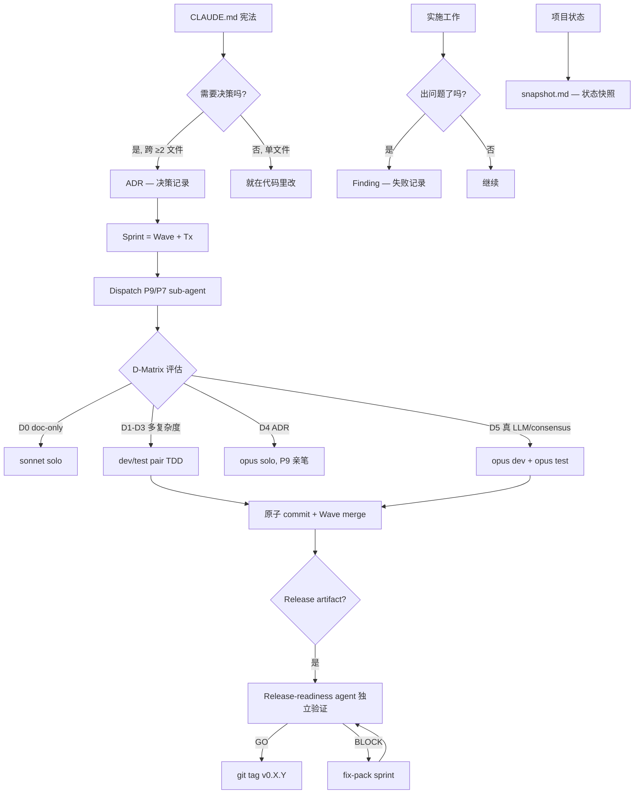
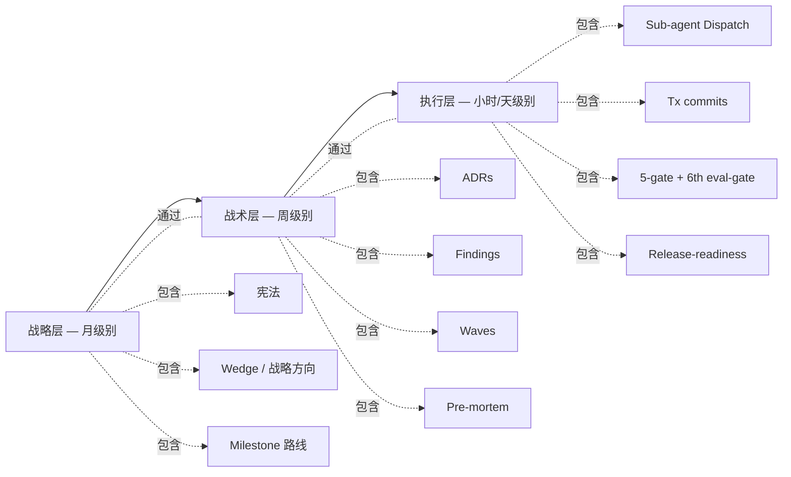
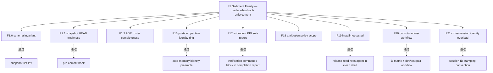
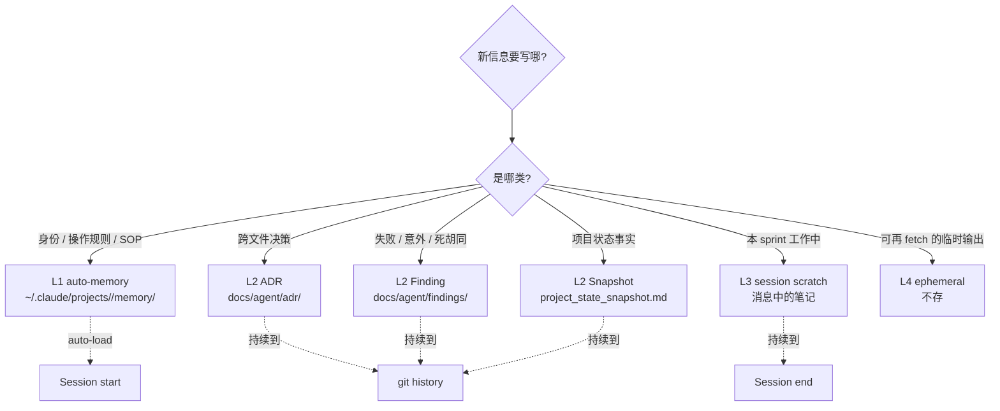
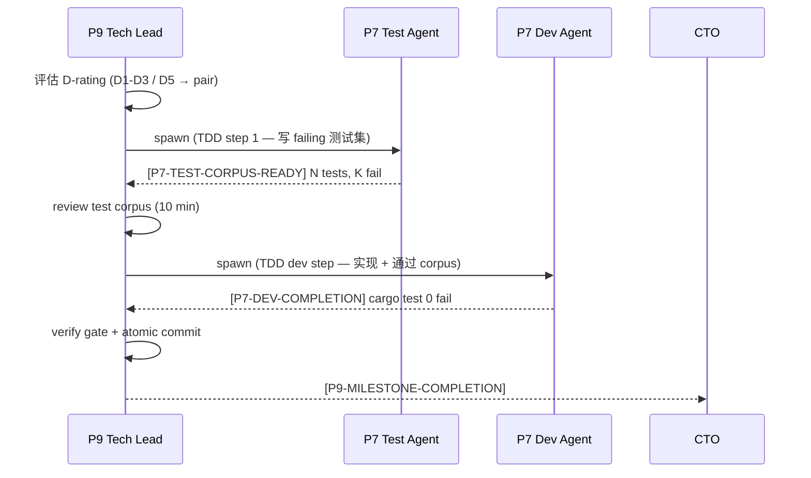
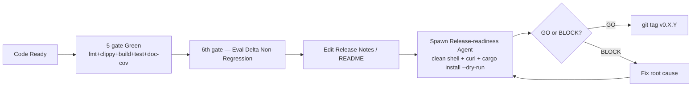

# ADSD 概念图

> 用 mermaid 图表 + 简短文字, 把 ADSD 全套概念一图打散.

## 顶层视图

## 三层抽象 (从慢到快)

- **战略层**: CLAUDE.md 不常改, 月级别决策. 改 = 项目重大转向.
- **战术层**: ADR + Finding 每周新增, milestone 检查点.
- **执行层**: 每日 sprint, sub-agent 派活, gate 通过, atomic commit.

## 失败模式 (F1 Sediment Family) 全景

每个 F-pattern 都有对应的 enforcement 机制. F1 Family 的核心 lesson: **声明规则不够, 必须有机器/工作流强制**.

## 四层 storage 模型 (memory 决策)

不确定就**默认 L3 scratch**. 升级到 L1/L2 是 sprint 收尾时**主动决策**, 不在过程中.

## Dispatch 协议 (dev/test pair pattern)

**为什么必须独立 test agent + dev agent**: 同一个 agent 写 impl + test 会有 confirmation bias — test 验证的是它自己想做的, 不是 spec 要求的. 独立 test agent 消除偏见.

## Release 闭环 (含 release-readiness)

**F19 闭环关键**: 不让写文档的 agent 自验文档. **独立 release-readiness agent 在 clean shell 跑** 是 F19 唯一 robust 防御.

## 怎么把这些图变成实战

每张图都是一种"实战剧本":

- 顶层视图 → 起新项目时按这条流程
- 三层抽象 → 团队节奏感, 每天/每周/每月各做什么
- F1 Family → 撞坑时查这张图, 哪个 enforcement 缺了
- Storage 四层 → 写东西前对照决策树
- Dispatch 协议 → P9 发起 sprint 时按此 sequence
- Release 闭环 → tag 前必走这条 path

参考 [`getting-started.md`](./getting-started.md) 的 5 步实战, 把这些图落到具体命令.
