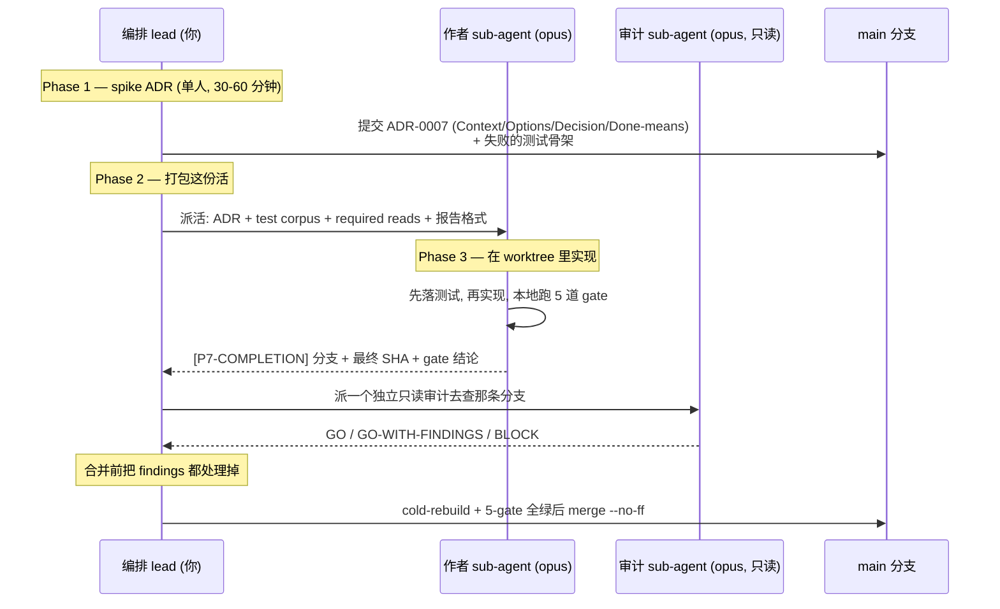

# 入门指南

> **目标**: 30 分钟内让一个不熟悉 ADSD 的工程师在自己项目里开始用 ADRs + findings + sub-agent 派活的规范.

## 谁该读这份文档

- 你正在管理一个**多 agent 并行**的软件项目 (≥3 个 AI agent 同时干活)
- 你想避免 sediment / drift / silent regression 这些**多 agent 顽疾**
- 你已经会用 Claude Code / Cursor / 类似 IDE-agent 工具的基本操作
- 你有一个 git 项目可以套这套方法论

如果你只是写一个单 agent 的小脚本, ADSD 是 overkill, 跳过.

## 30 秒概览

ADSD 是从 Cobrust 项目提炼的**多 agent 工作纪律**. 提炼快照是一段 12 天密集开发实战 (2026-04-30 → 2026-05-12, ~278 commits); 项目随后远不止于此, 持续推进, 目录也随之增长 — 从最初的 F1–F30 扩到 F1–F70, 跨三个后续佐证批次. ADSD 把以下三件事做硬:

1. **决策捕获** — 每个跨文件的决定都写 ADR (Architecture Decision Record)
2. **失败捕获** — 每次"翻车 / 意外 / 死胡同"都写 Finding (负向结果)
3. **派活有谱** — 难度自评 + 全部用顶配模型派 sub-agent + 强制独立的 post-author 审计

加上**双语文档强制** + **wave + Tx 原子提交** + **F1–F70 反模式目录** (奠基的 F1–F30 + 三个佐证批次) + **8 条 methodology delta** + **release-readiness 上线前独立验证**, 就是 ADSD 全貌.

详细架构: [`concept-map.md`](./concept-map.md)

## 三种安装方式

### 方式 1 (推荐) — Claude Code plugin

```
/plugin marketplace add Cobrust-lang/agent-driven-development
/plugin install adsd@adsd
```

装完后, 命中"multi-agent dispatch / ADR drafting / F1-F70 failure mode"等关键词时, Claude 会自动激活 ADSD skill.

### 方式 2 — 个人 skill 目录 (回退方案)

```sh
mkdir -p ~/.claude/skills
git clone --depth 1 https://github.com/Cobrust-lang/agent-driven-development.git /tmp/adsd-src
cp -r /tmp/adsd-src/plugins/adsd/skills/agent-driven-development ~/.claude/skills/
rm -rf /tmp/adsd-src
```

### 方式 3 — 只读 (不装, 看 markdown)

直接读 [`plugins/adsd/skills/agent-driven-development/SKILL.md`](https://github.com/Cobrust-lang/agent-driven-development/blob/main/plugins/adsd/skills/agent-driven-development/SKILL.md), 30 分钟读完核心方法论. 不装也能学.

## 第一次实战 — 5 步落地

假设你有一个项目 `~/my-project/`, 想开始用 ADSD.

### 步骤 1: 创建项目 `CLAUDE.md` (宪法)

在 `~/my-project/CLAUDE.md` 写下 30 行的项目宪法, 至少包含:

- **项目身份** — 一行 pitch (是什么 + 谁用)
- **要保留的东西** (从其他语言 / 工具 / 工作流借鉴的良性属性)
- **要丢弃的东西** (明确反模式)
- **工程标准** — Elegant / Scientific / Efficient 各 3-5 条具体规定
- **里程碑表** — M0 (脚手架) → M1 → ... 现在 + 未来 6-12 个月

参考: ADSD 自己的 SKILL.md "Engineering standards" 段是模板.

### 步骤 2: 创建 `docs/agent/` + `docs/human/{zh,en}/` 目录骨架

```sh
cd ~/my-project
mkdir -p docs/agent/adr docs/agent/findings docs/agent/modules
mkdir -p docs/human/zh docs/human/en
```

把 ADSD 的 `templates/adr-template.md` 复制到 `docs/agent/adr/_template.md` 作为 ADR 起草模板. 同理 finding-template, snapshot-template.

### 步骤 3: 写 ADR-0001 (license 选择)

每个项目第一个 ADR 通常是 license 选择 (Apache+MIT dual, 或 BSL-1.1, 或 ...). 这是**强制走 ADR 流程**的开始 — 一次跨多文件的决定, 走完整流程: Context → Options → Decision → Consequences → Cross-references.

### 步骤 4: 建立 `MEMORY.md` 索引 (Claude Code auto-memory)

如果你用 Claude Code, 项目级 memory 在 `~/.claude/projects/<project-dir>/memory/`. 创建 `MEMORY.md` 索引, 一行一条:

```
- [Project identity preamble](identity.md) — read first when resuming a session
- [Subagent dispatch rule](subagent_dispatch.md) — all-top-tier per ADSD Delta 1
- [CTO operations runbook](runbook.md) — dispatch + audit SOPs
```

详见 [`reference/cross-session-memory-architecture.md`](https://github.com/Cobrust-lang/agent-driven-development/blob/main/plugins/adsd/skills/agent-driven-development/reference/cross-session-memory-architecture.md).

### 步骤 5: 第一次 sub-agent 派活 (难度自评 + 顶配模型)

用 Claude Code 的 Agent tool 派一个具体任务. **prompt 必须含 difficulty self-rating** — 这样未来的你 (和审计) 能复原出当初为什么是这么 scope 的:

```
DIFFICULTY-RATING: D2 (multi-fn stdlib API new, single crate, ADR clear)
MODEL: opus            # 全部顶配 — 见 methodology Delta 1
PAIR: yes              # 合并前由一个独立审计 agent 把关

MISSION: 实现 <feature> 使得 <test_corpus> 全部通过.

REQUIRED READS:
- /abs/path/to/ADR-0XXX.md
- /abs/path/to/test_corpus.rs
- 见 reference/prompt-engineering-patterns.md PT2 (few-shot 输出格式)

REPORT FORMAT: [P7-COMPLETION] with verification block (paste raw cargo test output, no paraphrase)
```

> **关于模型档位.** 老版 ADSD 用 D0–D5 矩阵把"简单 / 机械"的任务路由到更便宜的模型.
> 那套档位矩阵已经按 [methodology Delta 1](https://github.com/Cobrust-lang/agent-driven-development/blob/main/plugins/adsd/skills/agent-driven-development/reference/cobrust-f44-f70/methodology-deltas.md)
> **废弃**: 每个派出去的 sub-agent — 作者 *和* 审计 — 都用顶配模型. 难度自评依然重要
> (它决定 scope、required reads、以及审计该看得多狠), 但它不再用来选更便宜的档位. 唯一的例外
> *不是* 档位选择 — 是那种真正机械的改动 (1–2 行 typo、盖个 SHA), 编排 lead 直接做掉即可, 根本
> 不用派 sub-agent ([Delta 2](https://github.com/Cobrust-lang/agent-driven-development/blob/main/plugins/adsd/skills/agent-driven-development/reference/cobrust-f44-f70/methodology-deltas.md), dispatcher-as-context-custodian).

详见 [`reference/prompt-engineering-patterns.md`](https://github.com/Cobrust-lang/agent-driven-development/blob/main/plugins/adsd/skills/agent-driven-development/reference/prompt-engineering-patterns.md).

## 你的第一个 ADSD sprint — 完整走一遍

上面 5 步搭好了脚手架. 这一节用一个具体 sprint 把 **ADSD 核心循环端到端**走一遍,
让你看清各部件怎么咬合: **two-phase dispatch → 实现 → 独立审计 → 合并.**

场景: 你的项目要加一个 `parse_duration("1h30m") -> Result<Seconds>` 函数. 它是跨文件的
决定 (新 public API + 测试 + 文档), 所以值得走完整循环.



**Phase 1 — 自己 spike ADR (决定是战略的, 别外包).**
写 `docs/agent/adr/0007-parse-duration.md`, 含四个可证伪的段落:
Context (为什么要它)、Options considered (≥ 3: 手写 / 引一个 crate / 从文法生成)、
Decision + 为什么、以及 **Done means** (比如 "`tests/duration_corpus.rs` 里 12 个用例全过;
`"abc"` 用 typed error 拒掉"). 因为这个能力是用户可见的, **现在就把失败的测试骨架放进去** —
这个可见的证明义务正是阻止 scope 在实现期间漂移的东西. 两个一起提交:
`docs(adr): land ADR-0007 — parse_duration (spike)`.

**Phase 2 — 给作者打包这份活.** 定好交付 gate ("12/12 corpus 绿 + 5-gate"), 用步骤 5 的
模板写派活 prompt: ADR 路径 + test-corpus 路径 + required reads + 精确的 `[P7-COMPLETION]`
报告格式. 这一步要写紧; 一个 under-specified 的包, 正是作者在 tempo 压力下开始即兴架构的地方.

**Phase 3 — 作者实现 (在自己的 worktree 里).** 一个顶配作者 agent 读 ADR + corpus, 先落测试
(Phase 1 起它们就已经在红), 实现到绿, 本地跑全部 5 道 gate, 然后报 `[P7-COMPLETION]`, 带上
分支名、最终 SHA、和 **原始** gate 输出 (不许转述 — 转述 gate 结论本身就是个有记录的失败模式).

**审计这一步 — 不可省, 而且必须是*不同的* agent.** 合并前, 派一个**独立、只读**的审计去查那条
分支 ([methodology Delta 3](https://github.com/Cobrust-lang/agent-driven-development/blob/main/plugins/adsd/skills/agent-driven-development/reference/cobrust-f44-f70/methodology-deltas.md)).
作者自审 — 或者你这个 framing 了这份活的人自审 — 在结构上不够: 两边的 context 都偏向"这事儿
做完了". 审计用 **GO / GO-WITH-FINDINGS / BLOCK** 这套词汇给结论; 合并前把 findings 都处理掉.
有一件事要让审计明确去查: **fixture-name-vs-behavior gate** — 一个叫 `rejects_garbage` 的测试
必须真的去走拒绝路径, 而不是偷偷在测别的东西.

**合并.** 只有在 cold rebuild + 5-gate 全绿之后才 `merge --no-ff`. 这个 commit 是原子的:
代码 + 测试 + zh/en 文档 + ADR 一起落地.

这就是整个循环. ADSD 里其他所有东西 — persona、deep-source-read、战略评审 — 都是这个循环
在更高 stakes 下加更多 lens.

## 同时跑多个 sprint

两条操作规则管住并行度:

- **≤ 4 路并行上限.** 超过 4 个并发 sub-agent, build-cache 锁竞争、worktree 磁盘压力、
  以及你自己守闸的能力都会劣化. 4 是实测的甜点 (16 GB 笔记本上). 每个并行 sprint 跑在自己的
  **独立 git worktree** 里 (`git worktree add ../proj-<id> -b feature/<id> main`), 这样
  `target/` 目录不打架, 而且 "杀掉这个 sprint" 只是一句廉价的 `git worktree remove --force`.
- **即使在 agent 速度下, 有些顺序是真的.** ADR 的 Phase-1 spike 必须先合并, Phase-2 才能派活;
  worktree 不到 5-gate 全绿不合并; persona 复测必须在它的 fix 合并*之后*跑, 而不是和 fix 并行.
  尊重这些边; 其余全部拍平.

### 什么时候升级到 dynamic-Workflow 编排

手工管 4 路并行派活, 正是 lead 容易掉球的地方 — 过期的 snapshot、一个还在 poll 仍在跑的作者的
审计、漏掉的 pre-flight 检查. ADSD 最新的选项把这个循环编码成代码: 一个**确定性的 dynamic
Workflow** (一段 Claude Code 编排脚本), 把 **fan-out → synthesis → impl → 独立审计**
作为固定 stage 跑, 而不是手工管
([methodology Delta 8](https://github.com/Cobrust-lang/agent-driven-development/blob/main/plugins/adsd/skills/agent-driven-development/reference/cobrust-f44-f70/methodology-deltas.md)).

把它当成一个**实验臂**, 而不是定论. 它去掉了 lead 手忙脚乱的失败面, 但引入了新的: 固定 topology
没法像人那样在 run 中途 re-scope, 而且编排脚本本身是*未经审计的*代码 (所以它也受同一条独立审计规则
约束). 已经学到的一条硬性 refinement: **给容易失败的 stage 包上 retry** — 一个 agent 中途的
瞬时 socket / 网络死亡会返回一个截断的结果, 而下游 stage (比如审计) 否则会把这个截断当成真的交付物
去消费, 然后吐出一个误导性的结论. 在任何下游 stage 读这个结果之前, 先 detect-and-re-dispatch.

## 验证你装对了

跑这两条命令:

```sh
# 1. 验证 plugin 已激活
/plugin status adsd

# 2. 在 Claude Code 里问个问题, 含 ADSD 关键词
"我需要 plan 一个带独立 post-author 审计的 multi-agent dispatch — two-phase SOP 是什么?"
```

如果 Claude 自动引到 ADSD 的 reference, 装对了. 如果 Claude 用通用知识回答, skill 没激活.

## 下一步

- 读 [`concept-map.md`](./concept-map.md) 看 ADSD 完整概念图
- 撞坑了写 finding, 不要藏起来. 奠基的 F1–F30 catalogue 在 [`reference/failure-modes-catalogue.md`](https://github.com/Cobrust-lang/agent-driven-development/blob/main/plugins/adsd/skills/agent-driven-development/reference/failure-modes-catalogue.md), F31–F70 佐证批次就在它旁边的 [`reference/`](https://github.com/Cobrust-lang/agent-driven-development/tree/main/plugins/adsd/skills/agent-driven-development/reference) 下; 你可能撞上同一个
- 在选 dispatch/audit topology? 读 [`reference/cobrust-f44-f70/methodology-deltas.md`](https://github.com/Cobrust-lang/agent-driven-development/blob/main/plugins/adsd/skills/agent-driven-development/reference/cobrust-f44-f70/methodology-deltas.md) 看 8 条 delta (全部顶配派活、强制审计、dynamic-Workflow 模式, …)

## 常见问题

**Q: 我项目很小, 真的需要 ADR 吗?**
A: 跨 ≥2 文件的决定才写. 单文件修改不写. 修 bug 不写 (但写 finding).

**Q: zh + en 双语文档负担太重?**
A: ADSD 强制是因为它解决了"中国团队天然 multi-lingual"的真实问题. 单语项目可以放宽, 但 README + getting-started 双语建议保持.

**Q: 难度自评太繁琐, 我每次都得想一遍? 而且它不就是用来选模型档位吗?**
A: 两部分. (1) 它不再选模型档位了 — 那套 D0–D5 → 便宜模型的路由已被 [methodology Delta 1](https://github.com/Cobrust-lang/agent-driven-development/blob/main/plugins/adsd/skills/agent-driven-development/reference/cobrust-f44-f70/methodology-deltas.md) 废弃; 现在每个 sub-agent 都用顶配模型. (2) 自评依然值: 它决定 scope、required-reads 清单、以及独立审计该看得多狠. 头 5 次手动, 之后就成肌肉记忆. 跳过的代价通常是 ship 出 under- 或 over-scoped 的包 (F2-Scope family).

**Q: 为什么作者 agent 不能自己审自己的活? 多派一次审计成本翻倍.**
A: 作者的 context 偏向"这事儿做完了"的结论 — 它会把审计本该抓的那个 drift 合理化掉. 你这个 framing 了活的人也一样. 一个*独立、只读、不同的* agent ([Delta 3](https://github.com/Cobrust-lang/agent-driven-development/blob/main/plugins/adsd/skills/agent-driven-development/reference/cobrust-f44-f70/methodology-deltas.md)) 是合并前抓到它最便宜的可靠办法. 把同形态的 surface batch 进一次审计派活就能压住次数; 而事后 (合并后) 审计严格更贵, 因为它得重读已合并的内容再跟原始意图 diff.

**Q: 我用 OpenAI 不用 Anthropic?**
A: ADSD 是 LLM-agnostic. 难度自评 / dev-test pair / evals-first / 独立审计 都 vendor-neutral. Claude Code plugin 部分只是发行渠道, 方法论本身不绑 Anthropic.
