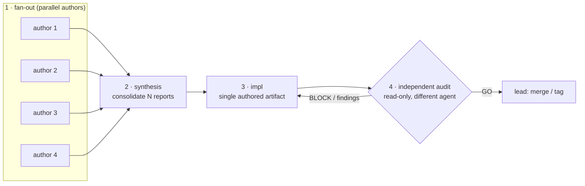

# Agent-Driven Software Development (ADSD)

> A methodology for managing software projects where the bulk of the work
> is done by AI agents under human strategic direction.
>
> **Originally distilled from** (the distillation snapshot): Cobrust project,
> **12-day intensive run (2026-04-30 → 2026-05-12)**, ~278 commits, 48+ ADRs,
> 24+ findings, 2 P0 codegen bugs found via organic stress test, v0.1.0 + v0.1.1
> + v0.1.2 shipped + α Phase F.2 in flight.
>
> **Where it stands now** (the live arc): the origin project did not stop at the
> distillation snapshot — it kept running well past it, and the failure-modes
> catalogue grew with it, from the original F1-F30 to **F1-F71** across three
> later corroboration batches (F31-F40 + F41-F43 + F44-F71; F45a sub-form;
> F52/F57 intentional gaps), plus **9 methodology deltas**
> (`reference/cobrust-f44-f70/methodology-deltas.md`). The most recent of those —
> **dynamic-Workflow orchestration became the default Cobrust dev mode** (Delta 8
> closed experiment → default across a ~11-workflow session), and the **Elegance
> Law** (Delta 9) extended "Drop from Python" to the ecosystem surface. Read the
> numbers in the snapshot blockquote above as a **floor**, not the current total.
> (The origin project's later product milestones live in the separate Cobrust repo
> and are not re-measured here.)
>
> **Status**: first extracted 2026-05-10; live arc back-ported through 2026-05-30.
> Apply as-is or adapt; this is battle-tested but not orthodoxy.

---

## When to invoke this skill

Use ADSD when:

- You're managing a software project where AI agents do most of the
  coding (≥ 70% of LOC produced by agents)
- You want to run **3+ parallel sub-agents** without sediment / drift /
  silent regressions
- You're doing **stateful project management** (multi-week / multi-sprint),
  not one-shot tasks
- The project has external stakeholders (release notes, public roadmap,
  contributors) that need an honest narrative

Do **not** use ADSD for:

- One-shot prompt → answer flows (overkill)
- Pure exploratory R&D (the discipline overhead doesn't pay)
- Solo human-only projects (the role topology assumes ≥ 2 agents)

---

## Mental model in one paragraph

A software project under ADSD is a small organization. Humans set
**strategy** (what to build, why, when). AI agents execute **tactics**
(how to build, code, tests, docs). External agents do **review**
(what's broken, what's missing). All decisions and evidence land
in **versioned documents** (ADRs + findings + snapshots), so future
agents picking up the project at compaction-time-zero can reconstruct
context. The discipline is mostly about **preventing sediment** —
stale facts, unindexed deliverables, "deferred" lists with no
timetable, hand-wave verification claims.

---

## Part 1 — Roles & Topology

ADSD uses a **5-tier role hierarchy** plus an external review track.
Roles map to model size + autonomy budget, not to humans.

### Why P8 became a first-class role

As multi-agent projects grow beyond a single stream of work, P9 is easily overloaded if domain refinement stays informal. Once one lead agent is simultaneously doing milestone decomposition, cross-workstream coordination, domain-boundary design, acceptance ownership, and close-out policing, execution quality falls because task packages arrive underspecified.

The correction is to make **P8 domain ownership explicit** instead of implicit:
- `P9` owns delivery orchestration across workstreams.
- `P8` owns domain-boundary refinement and acceptance inside one workstream.
- `P7` executes against a bounded package rather than improvising architecture.

Treat this as a strong default once a project has multiple active workstreams, non-trivial acceptance boundaries, or a P9 that is starting to absorb both delivery orchestration and domain-detail ownership. If the project is still tiny, one agent can temporarily wear both P9 and P8 hats, but the handoff responsibilities should still be named separately so the split can become explicit later.

### P10 — CTO / Architect (human-led, strategic)

**Responsibility**:
- Define wedge: "why does this project exist?"
- Set 6-month / 1-year / 5-year horizon (write it down, falsifiable)
- Topology decisions: which crates, which agent gets which sprint
- Sign off on irreversible decisions (license, public release, breaking changes)
- Budget approval: token spend, agent count

**NOT responsibility**:
- Writing code (CTO who codes loses strategic altitude)
- Reviewing every PR (delegate to P9)

**Cadence**: ~5% of project time. Strategic reviews ≤ once per major
milestone. Most turns CTO is just merging PRs and unblocking P9.

**Trigger words to enter P10 mode**: "strategic review", "1-year plan",
"why are we doing this", "wedge", "compete with X".

### P9 — Tech Lead (agent-led, tactical)

**Responsibility**:
- Take CTO's strategic anchor → decompose into ≤ 5 sub-tasks
- Sequence workstreams and delivery gates
- Write **Task Prompts** for downstream agents
- Run **Two-phase dispatch SOP** (see Part 2)
- Receive completion reports → verify gates → merge or reject

**Model**: Opus or top-tier sonnet. P9 is reasoning-heavy.

**Cadence**: 1-3 P9 sprints per active milestone. Each sprint 60-180 min
wall-clock.

**Trigger words**: "tech-lead", "拆这个需求", "manage agent team".

### P8 — Domain Expert / Staff Engineer (agent-led, workstream owner)

**Responsibility**:
- Refine one workstream's domain design before coding starts
- Define module and contract boundaries inside that workstream
- Shape acceptance criteria and the close-out checklist
- Package tasks so P7 can execute without changing architecture on the fly
- Review implementation completeness before work returns to P9

**Model**: Opus or top-tier sonnet. P8 is domain-detail heavy rather than milestone-orchestration heavy.

**Cadence**: 1-3 P8 workstreams can sit under one P9. Each P8 sprint is usually 30-120 min of refinement plus close-out review.

**Trigger words**: "domain owner", "staff engineer", "refine this workstream", "shape acceptance", "package implementation".

### P7 — Senior Engineer (agent-led, executor)

**Responsibility**:
- Receive Task Prompt → first action `cd && pwd && git branch`
  (enforce working-dir discipline)
- Read required-reads list before coding (enforce context loading)
- Implement the scoped package defined by P9/P8
- Start with tests or evals whenever the package changes a public behavior,
  contract, or regression boundary
- Run gates locally → report [P7-COMPLETION]

**Model**: Sonnet for mechanical fixes / well-defined tasks; Opus for
complex codegen / novel design.

**Cadence**: 1-4 P7 in parallel under one P9. Each 30-180 min.

**Trigger words**: "P7 mode", "方案驱动", "execute sub-task".

### P0 — Sub-agent (atomic worker)

**Responsibility**: A single Bash command, a single grep, a single test
run. P0s are dispatched by P7 but rarely named explicitly — they're the
inner-loop tools.

### External review agent (read-only)

**Responsibility**:
- Audit current state vs prior commitments (find sediment, stale facts)
- Run **stress-test farms** that the internal team won't think to run
  (Conway's Game of Life in your toy language; LeetCode in your DSL;
  whatever exercises the system from outside)
- Draft strategic plans / dispatch prompts (CTO can sign off in 5 min)
- **Own its own errors** publicly (8th review owned 4-block bug
  hypothesis being wrong; this is essential to keep trust)

**Critical constraint**: external review **must not write to the main
repo**. Only `read` + draft + suggest. This boundary is what makes the
review trustworthy — they can't accidentally damage what they're
reviewing.

**Cadence**: 1 external review per ~10 internal sprints, or when a
milestone closes, or when CTO asks "is something stale".

### Self-applied multi-agent audit (P10 upgrade pattern)

When stakes are high (pre-tag, pre-public-release, pre-major-milestone),
the external review agent should **dispatch its own audit team** rather
than doing single-window review.

**Pattern**:
- 1 external review agent acts as **lead reviewer** (P10 of audit, not project)
- Spawn N parallel audit sub-agents (1 per dimension: Security / Doc-consistency / Public-readiness / Code-quality / Strategic-alignment / etc.)
- Each sub-agent: scoped prompt + read-only constraint + 30-60 min budget + structured `[*-AUDIT-COMPLETION]` report format
- Lead integrates: dedupe findings + classify BLOCK/HIGH/MED/LOW + write synthesis review

**Empirical leverage** (from Cobrust 11th review case study):

| Audit dimension | Single-window review (10 reviews) | 4-agent team audit (1 dispatch) |
|---|---|---|
| Security | 2 SSH cred references | 2 P0 + 8 P1 (codex IP系统) + 3 P2 |
| Doc consistency | 1 (snapshot HEAD stale) | 7 items including 3 propagated errors |
| Public readiness | 0 (out of scope) | 19 items (BLOCK install / namespace / fictional examples) |
| Code quality | 0 (out of scope) | 7 items + 100% SAFETY confirm |
| **Total** | **~3** | **~25** |
| **Wall-clock** | 5 hours sequential | ~50 min parallel |
| **Leverage** | 1× | **~8×** |

**When to use**: pre-major-release. Not every turn — the cost is
3-4× token spend vs single-window. Use when the cost of missing
something is "we ship a broken first impression to public".

**When NOT to use**: in-sprint tactical review (single-window
sufficient), exploratory phase (over-discipline).

### LLM-simulated user persona (the 5th audit dimension)

The 4-dimension internal audit team (Security / Doc-consistency /
Public-readiness / Code-quality) is **all internal lens**. It catches
"is this code sound?" but misses "would a real user understand this?".

**Pattern**: dispatch LLM agents in **persona role** to simulate
first-impression / first-install / first-eval-for-adoption from
distinct user types.

**Cobrust 11th-review experience** (the 4-team audit was good but
incomplete):

| Audit dimension | Captures | Misses |
|---|---|---|
| Internal Security | credentials, unsafe usage | "is this trustworthy to a stranger" |
| Internal Doc | sediment, dangling refs | "does this make sense to first reader" |
| Internal Public-readiness | claims cite-backed, install path exists | "would a real Python dev actually try this?" |
| Internal Code-quality | unwrap / SAFETY / clippy | "would a Rust expert respect this?" |

The 5th dimension **fills these "would a real user..." gaps** by
simulating user roles:

- **Persona A — target user** (Python data scientist for Cobrust;
  React dev for a UI lib; Postgres DBA for a migration tool; etc.).
  First-time visit, install attempt, gut feel, "would I bookmark or
  close tab?".
- **Persona B — skeptic expert** (Rust senior for Cobrust; experienced
  React engineer auditing a UI lib; senior DBA evaluating a migration
  tool). Look for "toy vs serious" tells; technical credibility check.
- **Persona C — evaluator / decision-maker** (OSS adopter; tech lead
  doing build-vs-buy; security review for compliance). Bus factor,
  production-readiness, risk register.

**Persona prompt structure**:
1. Identity + background (years exp, prior burned-by experiences,
   current frustrations driving search)
2. Specific scenario ("you have ~30 min, someone just shared this")
3. Concrete actions to perform (open README first, try install
   mentally, etc.)
4. **Stay-in-character constraint** ("don't break into 'as an AI...'
   mode — you ARE Mei evaluating a tool")
5. Structured report fields aligned to persona's actual decision
   ("would I upvote on HN", "what would I file as first issue",
   "would I PR if I had a free afternoon")

**Why personas catch what internal lenses miss**: an internal
"public-readiness" reviewer asks "are README claims defensible?"
and concludes "yes, claims cite ADR-0039 / 9-14× is benchmarked /
status section is honest". A **Mei persona** asks "would I install
this?" and notices "the install command is `cargo install
cobrust-cli` but the page doesn't tell me what `cargo` is or how
to install Rust — I'm a Python user, this assumes too much."

**When to use**:
- Pre-public-release (audit team should always include persona)
- Any time after a major surface change (README rewrite, new
  user-facing API, install-flow change)
- When existing internal audits return "looks fine" but you have a
  nagging feeling something's off

**When NOT to use**:
- Pure-internal projects (CLI tools used only by your team) — no
  outside perspective matters
- Exploratory phase (premature)
- One-off scripts (overhead disproportionate)

#### Continuous persona testing (the dev-loop variant)

Persona simulation framed as one-shot audit is **the minimum useful
form**. The deeper application:

> **Persona is continuous dev cadence, not one-shot pre-release audit.**
>
> Each sprint completion → re-spawn the same persona(s) → verify fix
> actually closes the gap they reported.

This mirrors fuzz-testing: validation is not a once-and-done event but
a feedback loop tied to each iteration.

**Pattern**:
```
Sprint S landed → fix M1 (Mei's install bug) →
spawn Mei v2 with sprint-S state →
Mei retries install from scratch →
  if PASS: M1 truly closed; new findings?
  if still broken at next layer: file M1.1 → fire next sprint
```

**When to use continuous persona testing**:
- Any sprint that touches user-visible surface (README, CLI flags,
  install flow, public API, error messages)
- After every fix to a persona-found issue (gate before claiming closed)
- During product+research co-evolution mode (see §"Research-product
  co-evolution" pattern)

**Cost**: same per-spawn cost as one-shot audit (~30 min sonnet wall-clock per persona). Justified because the alternative (declaring "fix complete" without re-spawning) is the same F1-class error as declaring schema invariants without CI lint.

### Research-product co-evolution mode

When a project is **simultaneously product and research**, the audit
team and dev cadence should reflect that:

| Sprint output | Product axis | Research axis |
|---|---|---|
| Code | User-facing feature | Methodology data point |
| ADR | Architectural commitment | Decision-pattern artifact for case study |
| Finding | Bug postmortem | Failure-mode catalogue entry |
| Persona test | UX validation | Audit-team-design empirical evidence |

Trade-off framing ("product vs research") is wrong for projects in
this mode. The right framing is **two artifact streams from one
sprint**: each commit ships both user value AND methodology data.

This pattern emerged in Cobrust at Day 11. Initial framing was
"toy / learning experiment". User reframed: "既是研究也是产品"
(it's both research AND product). The implication: persona simulation,
ADR discipline, and audit-team topology aren't research overhead on
top of product work — they ARE the product, in the form of a
verifiable trustworthy translation pipeline. And the product running
real-LLM E2E IS the research evidence that the methodology works.

ADSD case study `cobrust-multi-agent-experience.md` updated with this
reframe.

**Cobrust meta-evidence**: 4-internal-agent audit found 25 issues but
**all technical**. Adding 3 persona agents (Mei / Aleksandr / Sarah)
caught the entire class of "would a real user actually try this?"
gaps that internal audits structurally cannot find — even the
self-named "public-readiness" audit, because it's still
self-assessment not user-simulation.

This is **F1-class learning**: declared coverage ("we audited public
readiness") is not the same as actual coverage ("we tested with
simulated public users"). The naming was misleading; the dimension
was incomplete.

### Deep-source-read (the 8th audit dimension)

The 7 dimensions above (4 internal + 3 persona) are all **lens-driven**
— each agent has a specific perspective and audits through that lens.
The hidden gap: **none of them read source code line-by-line without
a dimensional bias**.

Cobrust 13th-review (claude-desktop external) demonstrated this:
4 parallel sub-agents tasked simply with **deep source-read**
(no dimension assignment) found 33 file:line precision issues including
8 P0 BLOCK that all 7 prior dimensions missed:

- Production API `panic!()` at specific line (`pipeline.rs:529-533`)
- L2 gate functions returning literal strings (`l2_*_summary`)
- Silent test skip via hardcoded macOS path (`/opt/homebrew/bin/python3.11`)
- Untrusted-input vectors (recursion depth, body size, 32-bit overflow)
- Multi-user privacy (umask 0644 on cache files)
- Provenance fraud (`deterministic_id = blake3:0000...0000` in 5 crates)
- 8 cases of constitution declared-but-not-implemented (e.g. `%` not floor mod)

**Why dimension-split and persona missed these**: lens-driven agents
read source through their lens. Security audit greps for keywords;
public-readiness reads README; persona reads from "would I trust this".
**None reads `cranelift_backend.rs:1422` to confirm `BinOp::Mod` lowers
to `srem` (it does, which is wrong for Python `%`).**

Deep-source-read sub-agent prompt template:

```
You are a deep source-read sub-agent. Read-only audit. NO dimensional lens.

Your scope: <files / crate / module>

Read line-by-line. Find:
- Hardcoded values that should be config (silent-fail vectors)
- Function bodies that return literals instead of computed values
  (decorative gates / placeholder data)
- Comments declaring behavior the code doesn't implement
- Cross-file claims (ADR / constitution / README) that don't match
  source reality
- Resource usage without caps (recursion / buffer / allocations)
- Permission / umask / mode that defaults insecurely
- Forward declarations / placeholder values (zero deterministic_id)
- Constitution promises ("X is rejected") not actually enforced in
  the relevant lowering / parser / type-checker stage

Required output: file:line + actual snippet + 1-line description +
recommended fix + verification command.

Time budget: 30-60 min per sub-agent. Run 4 in parallel for full
workspace coverage.
```

**When to use**: pre-tag, pre-major-release, pre-funding-pitch,
pre-customer-demo. Add to the audit team alongside dimension-split
+ persona simulation. Internal + persona + deep-source-read = 8
dimensions total, run in two waves under the 4-parallel cap.

**When NOT to use**: in-sprint review (overkill), prototype phase
(premature), throwaway projects (waste).

**Empirical leverage** (Cobrust):
- Dimension-split team: 25 findings, mostly pattern-level
- Persona team: 17 findings, mostly UX/positioning
- **Deep-source-read team: 33 findings, all file:line precision**

The 33 deep-source findings included 8 P0 BLOCK issues that would
have shipped to v0.1.0 stable tag if not caught. **Coverage by deep-source
was orthogonal to both internal and persona** — adding it to ADSD §1
audit topology is non-optional for high-stakes gates.

### Topology rules

1. **≤ 4-way parallel cap** — beyond 4 concurrent sub-agents, cargo lock
   contention + worktree disk pressure + CTO守闸 capacity all degrade.
   We've measured this empirically; 4 is the sweet spot on a M1 Pro
   16GB.

2. **One CTO** — there is exactly one P10 per project. P10 is a
   bottleneck on purpose; multiple CTOs = strategic incoherence.

3. **External review is plural-OK** — having both review-claude and
   claude-desktop simultaneously is fine; their findings get integrated
   by review-claude as the "primary" reviewer.

---

## Part 2 — Workflow Discipline

### Two-phase dispatch SOP

The single most important pattern in ADSD. Used for any sprint where
a downstream agent will produce code based on a CTO-level decision.

```
Phase 1 — CTO solo (30-60 min):
  • Spike-write the ADR (decision document)
    - Context: what's the situation
    - Options considered: 3 alternatives min
    - Decision: which one + why
    - Done means: falsifiable success criteria
    - Cross-references: prior ADRs, findings
  • If the capability is user-visible or contract-bearing, place the failing
    eval/test skeleton now so the downstream implementation starts from a
    visible proof obligation
  • Commit Phase 1 to main with `docs(adr): land ADR-NNNN — <title> (CTO spike)`

Phase 2 — P9/P8 refinement (30-120 min):
  • P9 sequences the sprint and names the delivery gate
  • P8 defines the workstream package: boundaries, acceptance, required reads,
    and the exact tests/evals that must go green
  • If test-first is part of the contract, the package explicitly tells P7
    what failing proof should exist before implementation starts

Phase 3 — P7 implementation (60-180 min, background):
  • Reads ADR + package + related code
  • Lands tests/evals first when required by the package
  • Implements decision
  • Reports [P7-COMPLETION] with branch + final SHA + gate verdicts
  • P8 checks domain completeness before P9 accepts delivery
  • CTO 守闸: smoke check + cold rebuild + 5-gate + merge --no-ff
```

**Why this staged dispatch works**:
- ADR is a strategic decision. Downstream agents shouldn't invent it.
- P9 and P8 have different jobs; separating delivery orchestration from
  domain-boundary packaging reduces overloaded handoffs.
- A visible failing eval/test before implementation is the cleanest way to
  stop acceptance from drifting during execution.
- If implementation times out or drifts, the ADR and the packaged acceptance
  still preserve the approved intent.
- Avoids the classic failure mode "the executor spent 2 hours implementing a
  scope nobody actually packaged or approved".

**Failure modes**:
- Skip Phase 1 and the sprint can over-scope or under-scope.
- Skip P8 packaging and P7 often improvises architecture under delivery pressure.
- Claim test-first in principle but never dispatch a failing proof, and the rule collapses into aspiration.

### Worktree-per-sprint pattern

Every active sprint runs in its own git worktree, never in the main
checkout:

```bash
git worktree add ../project-name-<sprint-id> -b feature/<sprint-id> main
cd ../project-name-<sprint-id>
```

This:
- Isolates `target/` directories (no cargo build cache pollution)
- Allows 4-way parallel without conflict
- Makes "kill this sprint" cheap (`git worktree remove --force`)
- Forces explicit merge protocol (no accidental commits to main)

Naming convention: `feature/<task-id>-<short-slug>`. Example:
`feature/m11-3-lower-condition-primitive`.

### 5-gate verification

Every PR must pass 5 gates locally before submission, and CI re-runs
them on macOS + Linux:

| Gate | Command | What it catches |
|---|---|---|
| Format | `cargo fmt --all -- --check` | Style drift |
| Lint | `cargo clippy --workspace --all-targets --locked -- -D warnings` | Silent misuse |
| Build | `cargo build --workspace --all-targets --locked` | Compile errors |
| Test | `cargo test --workspace --locked` | Behavior regression |
| Docs | `bash scripts/doc-coverage.sh` | Undocumented public API |

The 5-gate is **non-negotiable**. A PR claiming "I ran tests, it works"
without 5-gate output in PR body is **rejected on principle**.

### Atomic commits

A single commit must contain all related artifacts:
- Code changes
- Tests for the changes
- Doc updates (zh + en + agent track if multi-track)
- ADR if the change crosses ≥ 2 files
- Finding entry update if behavior is observed

This is the anti-sediment guarantee: the commit either fully lands or
fully doesn't. No "I'll write the ADR later" — that's how decisions
get lost.

### Conventional commits + scope tags

```
feat(scope): new feature
fix(scope): bug fix
docs(scope): doc only
refactor(scope): no behavior change
test(scope): test only
chore(scope): tooling / build
```

Required: scope tag identifies which crate / module. Optional but
encouraged: trailer line `Co-Authored-By:` for AI-generated commits
(transparency).

---

## Part 2.5 — Dynamic-Workflow orchestration (the default dev mode for stable-shape work)

> **Status (2026-05-30): promoted from experiment arm to the default dev mode.**
> A single intensive 2026-05-29/30 Cobrust session ran the dispatch loop *almost
> entirely* as dynamic Workflows (**~11 workflows**), and **the last several ran
> fully autonomous** — audit verdict `GO`, zero lead-side finishing, just push +
> CI. Prefer this mode for stable, repeatable-shape work once the six patterns
> below (esp. `robust()` retry-wrap) are encoded; fall back to hand-managed
> dispatch for work that needs frequent mid-run re-scoping. Full empirical close in
> methodology Delta 8; the reusable patterns in
> `reference/workflow-orchestration-patterns.md`.

The two-phase dispatch SOP (Part 2) assumes a **lead agent who hand-manages
each dispatch** — fires sub-agents, polls for completion, synthesizes reports,
gates the audit, decides the merge. That worked for the entire distillation
window. But the dispatch + audit refinements that hardened across the later
corroboration batches (the 9 methodology deltas) are almost all patches for
failure surfaces the **juggling itself** creates:

- stale snapshots while the lead's attention is on another stream (F1-Sediment)
- author/audit *races* — the audit polls, the author finishes after the window,
  the audit reports against a stale snapshot (Delta 1)
- lossy context compaction — raw prose/code crowds out the lead's
  compression-fragile strategic state (Delta 2)
- skipped or forgotten post-author audits and pre-flight checks under sprint
  tempo (Deltas 3, 4)

**Dynamic-Workflow orchestration** (ADSD methodology Delta 8) encodes the
dispatch topology as a **deterministic script** — a Claude Code dynamic
Workflow — so the lead stops juggling. The canonical shape is a four-stage
pipeline:



- **Stage 1 — fan-out**: N parallel authors (respect the ≤ 4-way cap, Part 1)
  each produce a scoped deliverable.
- **Stage 2 — synthesis**: one agent consolidates the N reports into a single
  accurate, deduped picture.
- **Stage 3 — impl**: a single authored artifact built from the synthesis.
- **Stage 4 — independent audit**: read-only, a *different* agent than the impl
  author (Delta 3), verdict GO / GO-WITH-FINDINGS / BLOCK. Findings loop back to
  impl before merge.

The lead keeps only the strategic tier (Delta 2): approve the topology, evaluate
the final audit verdict, decide merge/tag. The script holds the sequencing.

### The socket-resilience caveat (Delta 8, the first real new surface)

The honest result from its **first** real run (Cobrust v0.7.0 back-port,
2026-05-29): the topology held and produced a clean fan-out consolidation plus a
sound impl artifact — but it hit **one gap**. A **transient socket/network failure
mid-agent** (the same infra-failure class as
`F40-stream-watchdog-false-stall-signal`) left the impl agent's work uncommitted
with a skipped format gate, and the downstream audit stage *consumed that
truncated result as if it were a real deliverable* — returning a misleading
`BLOCK` on a non-failure.

> The lead's first read ("the single-shot impl needs a nudge-loop") was the
> **wrong attribution**. Root cause was a socket close, not a reasoning gap. The
> impl work itself was sound.

The sharpened lesson:

- A bare `agent()` whose process dies (socket / 529 / watchdog) returns a
  truncated or errored result. A hand-managing lead re-dispatches a died agent
  *for free*; a deterministic script does **not** — unless you build it in.
- **Refinement: wrap failure-prone stages so a truncated/errored agent result is
  detected and re-dispatched before any downstream stage consumes it**
  (retry-with-backoff on agent error; treat an unparseable/empty result as a
  retry trigger, not a finding). The **impl → audit edge specifically must not
  let a network-killed impl poison the audit**.
- This does not invalidate the topology. It says a production orchestrator needs
  the same transient-failure retry discipline hand-managed dispatch gets
  implicitly — encode it once, in the script.

Two further new surfaces to log (open questions): a **fixed topology cannot
mid-run re-scope** the way a lead can (log cases where the rigid pipeline forced
a worse decomposition); and **the orchestration script is itself authored code**
— subject to Delta 3 independent audit like any other artifact (an un-audited
orchestrator is a new SPOF).

### The empirical close — experiment → default (2026-05-30)

Once `robust()` (the retry-wrap above) was folded into the *first* workflow's
descendants, the follow-on 2026-05-29/30 session ran the dispatch loop almost
entirely as dynamic Workflows (**~11 workflows**), and:

- **The last several ran fully autonomous** — audit verdict `GO`, zero lead-side
  finishing, just push + CI. That is the promotion signal: experiment → default.
- **The audit gate earned its keep.** It caught real issues a less-disciplined flow
  would have shipped: (a) the **socket-truncated impl deliverable** → `BLOCK` (the
  first-run gap, which became `robust()`); (b) a **dogfood overclaim** — the
  methodology's *own* enriched docs asserting uncitable product stats, violating
  **ADSD §4 no-overclaim applied to its own docs** → `GO_WITH_FINDINGS`; (c) a
  **latent false-green bug** — an unresolved dotted-attribute chain that *built and
  ran* with garbage values, caught at the **TEST stage**.
- **The self-improvement chain**: workflow-1's socket death → `robust()` folded
  into every subsequent workflow → **no further socket-truncation failure**; then
  the honest-framing guards (claim-vs-diff + chain-generality honesty — report the
  real git-numstat, never falsely claim "0 mir/codegen"); then the **Elegance Law**
  (Delta 9) folded into every backend/ecosystem audit rubric. Each run's failure
  became the next run's built-in guard.

**When to use**: stable, repeatable-shape work (a back-port, a multi-author
doc-refresh, a batch of same-shape ADRs, an ecosystem-operator phase) — prefer it
as the **default** once the patterns are encoded. **When NOT to use**: work that
needs frequent mid-run re-scoping, or a one-off where writing + auditing the
orchestration script costs more than the hand-managed dispatch would.

See `reference/cobrust-f44-f70/methodology-deltas.md` Delta 8 for the full
empirical write-up, `reference/workflow-orchestration-patterns.md` for the six
reusable patterns, and Delta 9 (same file) for the Elegance Law the chain folds in.

---

## Part 3 — Documentation Discipline

### ADR vs Finding vs Snapshot — the three artifacts

**ADR (Architecture Decision Record)** — A *decision*. Has options +
chosen + consequences. Written before or with implementation.

```yaml
---
doc_kind: adr
adr_id: NNNN
title: "<short title>"
status: proposed | accepted | superseded | deprecated
date: YYYY-MM-DD
last_verified_commit: <SHA>
supersedes: []
superseded_by: []
---

# ADR-NNNN: Title

## Context
## Options considered  (≥ 3)
## Decision
## Consequences
  ### Positive
  ### Negative
  ### Risk
## Cross-references
```

**Finding** — An *observation*. Hypothesis + method + result + conclusion.
Negative results are first-class (constitution §5.2 quote: *"Negative
results are documented under findings/, not hidden"*).

```yaml
---
doc_kind: finding
finding_id: <slug>
last_verified_commit: <SHA>
discovered_by: <agent or person + context>
severity: P0 | P1 | P2 | P3
status: open | closed_by_<sprint> | partial-closed
related: [<other findings>]
---

# Finding: <description>

## Hypothesis
## Method
## Result  (with raw evidence — paste actual command output)
## Conclusion
## Cross-references
```

**Snapshot** — *Compressed current state*. Updated end-of-turn. Source
of truth for future agents loaded post-compaction.

Snapshot is the **canonical state document**. Other top-level docs such as
`README`, operator runbooks, and agent guidance files are projection layers.
When they disagree, snapshot wins until the projections are synchronized.

Schema invariants (use frontmatter to enforce):
```yaml
schema_invariant: |
  Every ADR mentioned in any section must appear in §"ADR roster" table.
  Every finding mentioned in any section must appear in §"Findings ledger".
  Binary verification list appears EXACTLY ONCE under §"main branch state".
  HEAD field reconciles with `git log -1 --format=%H`.
```

These invariants prevent the most common failure mode: "重写新段、忘删旧段"
(write new section, forget to delete old).

### Snapshot-first close-out

For documentation-affecting work, close-out order matters:
1. Update snapshot first.
2. Update every projection document that depends on it.
3. Run the documentation verification surface.
4. Only then claim the work closed.

This turns documentation truthfulness into a deliverable rather than a
best-effort cleanup task. A repo whose README is more current than its
snapshot is upside down.

### Triple-tree doc (optional)

For projects with multi-language audiences:
- `docs/human/zh/` — for human readers (Chinese)
- `docs/human/en/` — for human readers (English)
- `docs/agent/` — for AI agents (dense, schemas, no narrative)

Code change → all three trees update in **same commit**. CI enforces
via `doc-coverage.sh`.

If single-language project, drop to `docs/human/` + `docs/agent/`.

### "Last verified commit" stamping

Every doc with persistent claims has `last_verified_commit: <SHA>`
frontmatter. When the SHA drifts > N commits behind HEAD, the doc is
"stale" and must be re-verified. CI can flag this.

This is how you avoid the "snapshot says X, reality is Y" sediment.

---

## Part 4 — Quality & Verification

### Honest fail acceptance

**Rule**: Negative results are first-class deliverables. Don't hide
them.

If a sprint's done-means is "translate library X with 100% L2.behavior
PASS" and you got 4/5, **ship the partial** and write a finding
explaining the 1 failure.

Counter-example (bad): silently degrading the gate threshold from 0.8x
to 0.5x perf because the actual measurement came in low. The threshold
is a contract; if it fails, log it.

### CLI fail-fast

If your tooling has internal verifier checks (e.g. Cranelift verifier,
type checker, schema validator), **CLI exit-code must reflect failure**.

Counter-example we hit in Cobrust: verifier rejected IR but `cobrust
build` still emit'd a binary, which then ran with wrong output. This is
"silent miscompile" — the worst class of bug because debugging
downstream looks like the user's problem.

Enforce: any verifier `Err` → CLI propagates → exit non-zero.

### Stress-test farms

Spin up **external-user-perspective stress tests** that exercise the
system in ways the internal team won't think to:

- For a compiler: write Conway's Game of Life / LeetCode problems / a
  Brainfuck interpreter in your language
- For a database: hammer it with 10K random queries from a third-party
  fuzzer
- For an API: have an external agent build a toy app on top

These find **organic bugs** that synthetic corpora miss. We found 2 P0
Cobrust codegen bugs (i8/i64 mismatch + while-BinOp==0 miscompile) via
this method in 24 hours. Both bugs would have shipped to 0.1.0-beta
otherwise.

### ≥ 1000 fuzz inputs

Behavior gates accept ≥ 1000 randomized inputs minimum. 100 isn't
enough. 10,000 is overkill for fast iteration; 1,000 is the
empirically-tuned floor.

### Benchmark cite experiment file

Any "X is faster than Y" claim cites the experiment file:

> `cobrust-tomli` parses 10MB TOML at 9.05× CPython tomllib
> ([benchmark](crates/cobrust-tomli/benches/vs_cpython.rs), 5 runs
> medianed).

Without a citable file, the claim is marketing, not engineering. The
README "5-50× faster" we ran into in Cobrust 0.1.0-beta was a
marketing-overreach we had to walk back.

### The Elegance Law (ecosystem/backend surfaces are a clean re-design, not a clone)

When the project wraps a third-party crate or designs an ecosystem / backend
surface, that surface should be a **clean re-design that drops the accumulated
footguns** of the predecessor frameworks it competes with (Flask / FastAPI /
Express / pydantic, …) — **not a mechanical clone** of the wrapped API. This is the
language-level "drop the predecessor's mistakes" discipline extended from the
*core language* to the *ecosystem surface*. (Methodology Delta 9; the origin
project frames it against CLAUDE.md §2.2 "Drop from Python" + §2.5 LLM-first.)

Concretely, prefer:

- **compile-time-typed validation** over runtime-asserted (drop pydantic-style
  runtime-only validation);
- **explicit dependencies** over decorator / dependency-injection magic;
- **`Result`** over exceptions-as-control-flow;
- **typed routes / bodies** over stringly-typed;
- **typed composable config** over option-bag sprawl.

Two operational practices make this a gate, not a slogan:

- **Each ecosystem/backend ADR carries a footgun-ledger** — an explicit list of
  *which specific other-language footgun each surface decision avoids*. The ledger
  is the falsifiable record that the surface is a re-design, not a clone.
- **Each backend/ecosystem workflow's audit scores `elegant + no-legacy-debt`** — a
  rubric dimension asking "did this surface drop the predecessor's footguns, or
  reproduce them?" In the origin project this was folded into every backend/
  ecosystem audit rubric across the dynamic-Workflow self-improvement chain (Delta 8
  close). The same logic that makes the language easier for an LLM to write
  correctly first-try (§2.5) makes a re-designed ecosystem surface easier than a
  cloned one carrying the predecessor's footgun-priors.

See `reference/cobrust-f44-f70/methodology-deltas.md` §"Delta 9" for the full
principle and the footgun-ledger practice.

---

## Part 5 — Strategic Layer

### Staged capability progression

When building agentic products, avoid jumping straight from mockups to
full live operation. A cleaner path is to stage reality in deliberate
cuts, with each cut proving one new class of truth.

One example progression is:

1. **Mocked orchestrator baseline** — contracts, persistence, and UI shells
   can move before real runtime integration exists.
2. **Local read loop** — the product can read and render locally produced run
   state without pretending it owns execution yet.
3. **HTTP transport cutover** — replace mocked reads with a real process
   boundary while keeping the execution model stable.
4. **Live local server loop** — prove the operator can drive the system
   through the actual local service surface.
5. **Local run production loop** — prove the system can produce and then
   observe real local runs end-to-end.

Do not treat this exact sequence as universal law. The reusable lesson is
that transport, runtime, UI, and production semantics should be introduced
in staged cuts with explicit proof obligations, rather than all at once.

### Strategic vs tactical review cadence

| Layer | What it asks | Cadence | Who |
|---|---|---|---|
| Tactical | Is current sprint going right? Is doc stale? | Every turn | P9 / external review |
| Strategic | What's the wedge? 1-year? Who's the user? | Every milestone | P10 / external review |

**Anti-pattern**: only tactical reviews. After 9 tactical reviews
in Cobrust we noticed every review was about codegen edge cases /
sprint dispatch / stale facts. **Zero strategic reviews until #10**.
That's how you wake up 1 year later with a beautiful internal
codebase that no external user has tried.

**Trigger for strategic review**: a milestone closing, or 10+ tactical
reviews since the last strategic one.

### Wedge identification

What is the **single sentence** that says why your project should exist
when alternatives X, Y, Z already do?

For Cobrust the wedge is: *"AI-native compiler that auto-translates
Python libraries into verified Rust implementations, with PyO3 wrappers
so existing Python users get speedups for free."*

Test: can you say it in one sentence? Can you cite competitors and say
how you differ? If no, you don't have a wedge yet — you have an
implementation in search of a customer.

### 6-month / 1-year / 5-year horizon

Bad ADR pattern (Cobrust ADR-0019 originally): "Out of scope —
deferred to Phase F". A list of deferred items with no priority, no
timetable, no success criteria.

Good ADR pattern (Cobrust ADR-0038 fix): each Phase F item has:

| Item | Priority | Trigger condition | Done means | Effort estimate |

Force every "deferred" to have those 4 fields. If you can't fill
"Done means", the item is a fantasy not a plan.

### AI velocity planning (corrected, post-Cobrust empirical)

Initial heuristic (Day 11): "8-day human plan ≈ 2-day AI plan with
4-way parallel". **Even this was 5× too pessimistic** — corrected
by Day 11 empirical sprint timings on Cobrust:

| Sprint type | Real wall-clock with 1 agent | With 4-way parallel |
|---|---|---|
| P7 sonnet sprint (mechanical fix, doc rewrite) | 30-60 min | 30-60 min (independent) |
| P9 opus sprint (codegen / pipeline / ADR) | 2-4 hours | 2-4 hours (per agent) |
| P7 sonnet batch (5-10 atomic fixes) | 1-2 hours | 1-2 hours |

A "33-issue post-tag fix-pack" (8 P0 + 8 P1 + 13 P2 + 4 P3) sounds
like an 8-工作日 sprint. Reality: with 4-way parallel + atomic
batching = **~1 真实 day of wall-clock**, of which ~12-16 hours is
agent-active work spread across 4 parallel agents.

**Sharp heuristic** (replaces vague "AI velocity ≈ 4×"):

> When sprint-planning, restate any "X 工作日" estimate as
> "N atomic commits × ~30 min P7 / ~2 hours P9 each, parallel to ≤ 4".
> Compute wall-clock as **(total_agent_minutes ÷ 4 ÷ 60) hours**.
>
> Result is usually 5-10× faster than the human-day estimate.

**Anti-pattern (failed Day 11 of Cobrust)**: review-claude wrote
this section AND THEN authored a 6-sprint plan estimating "3-5
真实 days". User had to correct: "Agent 开发很快的". Even after
codifying the rule, fell back to human-pace under planning pressure.

**Lesson**: codifying the heuristic isn't enough. Plan-document
templates should force the agent-hour calculation explicitly:

```
Sprint X estimate:
  - Atomic commits: N
  - Per-commit avg: M minutes (sonnet) / K minutes (opus)
  - Total agent-minutes: N × avg
  - Parallel cap: 4
  - Wall-clock: (N × avg ÷ 4) minutes = ___ hours
```

If you didn't fill in the table, you're estimating in human-days.

### Sequential gates that genuinely block parallelism

Even at agent velocity, some sequencing is real:

- ADR Phase 1 spike must merge before P9 Phase 2 dispatches
- Worktree won't merge until 5-gate green
- Cross-run determinism evidence requires elapsed wall-clock for
  vendor model behavior (not parallelizable — measure across days)
- Persona v2 re-spawn must happen AFTER fix is merged (not parallel
  with the fix)

These are real blockers; respect them. Flatten everything else.

---

## Part 6 — Failure Modes (Catalogue)

These are the failure modes we actually hit in Cobrust + their
recovery patterns. Each names a real ADR / finding for evidence.

### F1 — Snapshot sediment (重写忘删)

**Symptom**: snapshot.md or similar central state doc has self-contradictory
sections. New section claims "M11.3 done", old section in same file
claims "M11.2 in flight".

**Recovery**:
1. Stop. Don't dispatch new sprints until snapshot reconciled.
2. Run schema invariant check (every ADR mentioned ⇒ in roster table; etc).
3. Three-way reconcile: `git log` + `ls findings` + `ls adr` against snapshot.
4. Add `schema_invariant` frontmatter so this doesn't recur.

**Evidence**: Cobrust 9th close-out review §🚨, ADR-0038 §"Layer correction".

### F2 — Codegen vs MIR layer divergence

**Symptom**: ADR §Decision says "fix in codegen" but P9 sub-agent
reports the actual fix landed in MIR (one layer up).

**Recovery**:
1. ADR adds §"Layer correction" addendum (don't rewrite §Decision —
   preserve audit trail).
2. Update SOP: future codegen-divergence ADRs default to dump MIR
   first, exclude upper layer before locking implementation map.

**Evidence**: Cobrust ADR-0033 + ADR-0035 both. "2 strikes = systemic
blind spot in spike phase" — promote to runbook.

### F3 — Two bugs one fix (root primitive missed)

**Symptom**: Bug A and Bug B look unrelated (different triggers,
different surface), but both produce wrong values of the **same
type** (e.g. both default to `I8`).

**Recovery**:
1. Hypothesize a shared fallback path / inference pass.
2. Refactor at the **root primitive** layer (e.g. shared
   `lower_condition` helper used by both `if` and `while` heads), not
   patch each surface independently.
3. Document as "two-bugs-one-fix" methodology finding for future use.

**Evidence**: Cobrust ADR-0033 (Option C), finding
`two-bugs-one-fix-option-c-pattern.md`.

### F4 — Quarantine pollution (audit on broken baseline)

**Symptom**: Sprint A produces audit data on a binary that has known
bugs from sprint B. Audit "fail" signals contaminated.

**Recovery**:
1. SendMessage to in-flight audit agents: "your baseline is dirty,
   await codegen fix merge before reporting".
2. Have a written **quarantine SOP** (Cobrust:
   `findings/audit-1-codegen-pollution-quarantine-sop.md`) so this is
   protocol not improvisation.

**Evidence**: Cobrust audit-1 + 4-block bug parallel run.

### F5 — Silent miscompile (verifier rejects but binary still emit)

**Symptom**: Backend verifier returns Err, but tooling continues and
emits artifact. Downstream user sees "wrong output", not "build error".

**Recovery**: Ensure `?` propagation from verifier to CLI exit code.
Add regression test: feed a known-bad IR, assert exit ≠ 0.

**Evidence**: Cobrust commit `78ca779` "P0 CLI hardening".

### F6 — Push permission 403 / namespace assumption

**Symptom**: review agent assumes `org/repo` namespace and `git push`
works. Actually repo is at `Different-Org/repo` and review agent has
read-only access.

**Recovery**:
1. Discover via `git push --dry-run` or by asking CTO directly.
2. All dispatch prompts that say "git push" should be "open PR via
   `gh pr create`".
3. Hooks that fail on 403 should degrade to info-level, not abort.

**Evidence**: Cobrust 10th review post-T1.1 cleanup discovery — actual
namespace `Cobrust-lang/cobrust`, not `cobrust/cobrust`.

### F7 — Strategic blindness (only tactical reviews)

**Symptom**: 9 reviews in a row about codegen edge / sprint dispatch /
stale facts. Zero reviews ask "is this project pointed at the right
problem?".

**Recovery**:
1. Force a strategic review every N tactical reviews (N = 10 in
   Cobrust). Calendar reminder if needed.
2. Strategic review writes 6/12/60-month plan in falsifiable form.
3. Compare current sprint roadmap against plan; identify drift.

**Evidence**: Cobrust 10th review (this skill's birthplace).

---

## Part 7 — Templates & Examples

See `templates/` folder:

- `templates/adr-template.md`
- `templates/finding-template.md`
- `templates/snapshot-template.md`
- `templates/dispatch-prompt-p9.md`
- `templates/dispatch-prompt-p7.md`
- `templates/handoff-cover-letter.md`

See `case-study/` folder for Cobrust experience report:
- `case-study/cobrust-multi-agent-experience.md`

---

## Part 8 — When to bend ADSD

ADSD is a methodology, not a religion. Bend it when:

- **Solo human + 1 agent**: skip role topology; just use ADRs +
  findings.
- **Pure exploration phase**: skip 5-gate; pure REPL-driven exploration
  is OK in the first ~10 commits.
- **Throwaway prototype**: skip ADRs entirely; you're just prototyping.
- **Open-source with external contributors**: add CONTRIBUTING.md +
  CODE_OF_CONDUCT + issue templates beyond what ADSD specs (those are
  community-management, separate concern).

The non-negotiable core:
1. Atomic commits (code + tests + doc as one unit)
2. Honest fail acceptance (negative results published)
3. CLI fail-fast (no silent miscompile)
4. ADR for any cross-file decision
5. Schema-invariant frontmatter on stateful docs

Everything else is adaptable.

---

## Cross-references (within this skill)

### Originals (distilled from the Cobrust run — snapshot + live arc)

- Part 6 Failure-modes catalogue (the original **F1-F30**, version 1.2.7):
  `reference/failure-modes-catalogue.md`
  - Per-era Cobrust corroboration batches (slot = local-ID, SHA-anchored) take
    the catalogue to **F1-F71** (with F45a sub-form; F52/F57 intentional gaps):
    - `reference/cobrust-f31-f39/` — **F31-F40** (10 findings, v0.3.0 run)
    - `reference/cobrust-f41-f43/` — **F41-F43** (3 findings, Phase G/J)
    - `reference/cobrust-f44-f70/` — **F44-F71** (27 findings incl. F45a; F71 =
      wasm-typed-call ABI fuzzer) + 2 cross-cutting pattern docs
      (`cross-compile-target-enablement-pattern.md`,
      `ecosystem-import-chain-pattern.md`) + **`methodology-deltas.md`** — the
      **9 dispatch/audit refinements** from the v0.6.0 → v0.7.0 run + the
      2026-05-29/30 dynamic-Workflow session (Delta 1 all-top-tier sub-agents ·
      Delta 2 dispatcher-as-context-custodian · Delta 3 mandatory post-author audit ·
      Delta 4 lockfile-staging · Delta 5 chain-generality verification · Delta 6
      CI-infra-hardening · Delta 7 honest-signal · Delta 8 dynamic-Workflow
      orchestration, *now the default dev mode* — with its socket-resilience
      refinement, see Part 2.5 · Delta 9 the Elegance Law, see Part 4)
- Dynamic-Workflow orchestration depth:
  `reference/workflow-orchestration-patterns.md` (the six reusable patterns)
- Templates: `templates/*.md`
- Cobrust case study: `case-study/cobrust-multi-agent-experience.md`

### Cross-pollination from Anthropic + OpenAI public guidance (v1.2.0)

These references adopt established industry practices into ADSD discipline, distilled and adapted to ADSD's sub-agent dispatch context. Read in priority order:

- **Evals-first development** (`reference/evals-first-development.md`) — Anthropic's "evals are the moat" claim applied to ADSD. Every public capability gets a falsifiable test corpus before implementation. The 6th gate (eval delta non-regression) closes F20 systemically. **Highest leverage of all v1.2.0 additions.**
- **Context-window strategy** (`reference/context-window-strategy.md`) — Positive practices for long agent sessions, complementing F16 (post-compaction identity drift). Three-tier model: persistent / session-scoped / transient. Bootstrap-from-cold prompt template.
- **Cross-session memory architecture** (`reference/cross-session-memory-architecture.md`) — Four-layer storage model (auto-memory / project artifacts / session scratch / ephemeral) with decision tree for "where does this go?". Codifies ADSD's hard-won memory file discipline.
- **Prompt engineering patterns** (`reference/prompt-engineering-patterns.md`) — Distilled patterns from Anthropic + OpenAI prompt guides: role priming, anti-hallucination guards, structured output, refusal/escalation conditions, ADSD-specific patterns (D-rating, identity hygiene, release-readiness guard).
- **Cost monitoring discipline** (`reference/cost-monitoring-discipline.md`) — Practical patterns for tracking LLM cost per sprint / per release / per project. Cost as a diagnostic signal for loops + drift + scope misestimation. Anthropic prompt caching + OpenAI structured outputs as cost-reduction levers.

These five represent **5 of 12 v1.2.0 gap candidates** identified by review-claude self-audit. Remaining 7 (skills architecture, agent specialization, HITL tree, RCA template, MCP patterns, calibrated confidence, structured-output enforcement) are queued for v1.3.0.

## Origin & lineage

This skill is distilled from the Cobrust project — a Rust-implemented Python
successor with an LLM-driven translation pipeline. Patterns documented here
passed the test of "did we hit this in production and did the fix work?".

**The distillation snapshot (the original 12-day intensive run, 2026-04-30 →
2026-05-12)**: ~278 commits over 12 wall-clock days, 49 ADRs (0001..0048 +
0047a), 27 findings, 2 stress-test farms, a 4-parallel-agent topology
stress-tested at 4-way max. This is the window Parts 1/3/4/5/6 were first
distilled from, and where failure modes F1-F30 were observed.

**The live arc (what the origin project became after the snapshot)**: Cobrust
did **not** stop on 2026-05-12. It kept running well past the distillation
window, and that continued run is the empirical source for the **three
corroboration batches** (F31-F40, F41-F43, F44-F71 — taking the catalogue to
**F1-F71**, with the F45a sub-form and F52/F57 as intentional numbering gaps)
and the **9 methodology deltas** (Delta 1 all-top-tier sub-agents → Delta 8
dynamic-Workflow orchestration, promoted to the default dev mode across a
~11-workflow 2026-05-29/30 session → Delta 9 the Elegance Law). Treat the
snapshot stats above as a **floor**: they describe only the original window, not
the current total. (The origin project's later product milestones — new ecosystem
modules, additional compile targets — live in the separate Cobrust repo and are
not re-measured here.)

Specific Cobrust artifacts that inspired each Part:
- Part 1 Topology: `findings/multi-agent-cobrust-topology.md`
- Part 2 Two-phase dispatch: `feedback_p9_two_phase_dispatch` memory
- Part 2.5 Dynamic-Workflow orchestration: `reference/cobrust-f44-f70/methodology-deltas.md` (Delta 8, v0.7.0 back-port run + 2026-05-29/30 default-mode close) + `reference/workflow-orchestration-patterns.md` (the six reusable patterns)
- Part 3 Snapshot discipline: 8th + 9th close-out reviews
- Part 4 Stress-test farms: Conway-cobrust-toy + Cobrust-leetcode-farm
- Part 5 Wedge: 10th strategic review (`reviews/2026-05-10-...md`)
- Part 6 Failure catalogue: aggregated from 6+ findings; corroborated + extended
  to F71 by the three `reference/cobrust-f31-f39 / -f41-f43 / -f44-f70` batches

If you adopt ADSD, attribute Cobrust as origin. If you improve it,
back-port the improvement here.

— Distilled by review-claude (third-party audit window), 2026-05-10;
  live arc back-ported 2026-05-30
