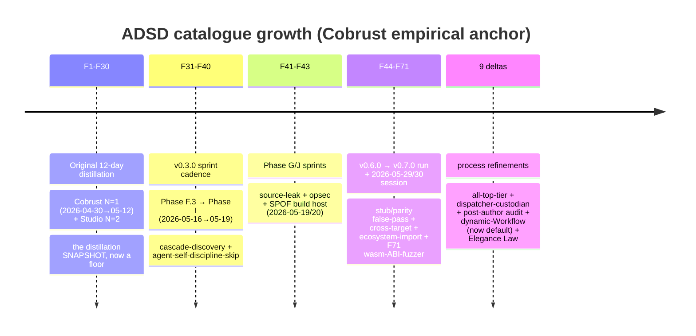
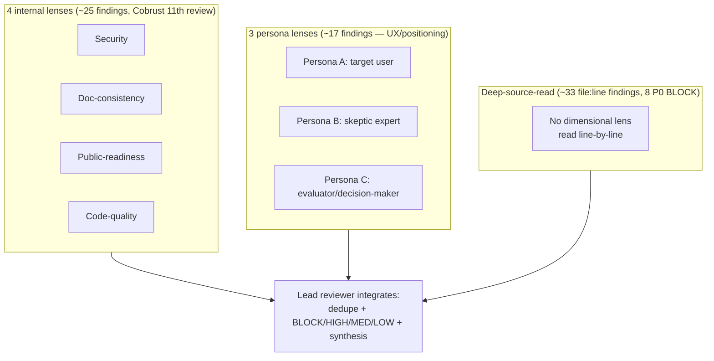

# ADSD — evolution & changelog

> **What this is.** The growth arc of the methodology, one short paragraph per
> era. If you read ADSD a while ago and want to know *what changed since*, start
> here, then jump to the batch dir that interests you. This is **not** a
> re-derivation of the methodology — `SKILL.md` is the current methodology; the
> per-batch `README.md`s and `failure-modes-catalogue.md` are the depth. This doc
> is the index over time.
>
> **Battle-tested, not orthodoxy.** Every era below was forced by something a real
> project actually hit — not a whiteboard. The catalogue grows by corroboration:
> a pattern earns a slot when a downstream run reproduces it with citable commit
> SHAs. Bend any of it when your project's reality disagrees; then file the
> divergence so the next reader inherits it.

---

## At a glance

| Era | Catalogue range | Files / count (on disk) | Cobrust window | Where |
|---|---|---|---|---|
| **Original distillation** | F1–F30 | `failure-modes-catalogue.md` (F1 family ×9 sub-forms + F2–F30) | N=1: 2026-04-30→05-12; Studio N=2: M0–M7 | `reference/failure-modes-catalogue.md` |
| **F31–F40** | F31–F40 | 10 finding files + README | v0.3.0, Phase F.3→I, 2026-05-16→05-19 | `reference/cobrust-f31-f39/` |
| **F41–F43** | F41–F43 | 3 finding files + README | Phase G/J, 2026-05-19/20 | `reference/cobrust-f41-f43/` |
| **F44–F71** | F44–F71 (F45a sub-form; F52/F57 skipped) | 27 finding files + 2 pattern docs + `methodology-deltas.md` + README | v0.6.0→v0.7.0, 2026-05-22→05-29 + 2026-05-29/30 session | `reference/cobrust-f44-f70/` |
| **Methodology deltas** | Deltas 1–9 | `methodology-deltas.md` (+ `reference/workflow-orchestration-patterns.md`) | v0.7.0 run + 2026-05-29/30 session | `reference/cobrust-f44-f70/methodology-deltas.md` |

> The catalogue is **F1–F71** in total, with **F45a** as a systemic-scope sub-form
> and **F52 / F57 deliberately skipped** (gaps in the origin project's local
> numbering — not missing clusters, nothing cross-references them). F1–F30 live in
> the monolithic catalogue; F31+ live in per-era batch dirs, each finding
> SHA-anchored to the Cobrust commit that forced it. (The `cobrust-f44-f70/` dir
> name is kept stable for cross-references even though the batch now extends to F71.)

---

## Era 0 — The original 12-day distillation (F1–F30)

ADSD was first distilled from the **Cobrust** project — a Rust-implemented Python
successor with an LLM-driven translation pipeline — over a **12-day intensive run
(2026-04-30 → 2026-05-12)**: ~278 commits, 49 ADRs (0001..0048 + 0047a), 27
findings, 2 stress-test farms, and a 4-parallel-agent topology stress-tested at
4-way max. This window produced the spine of the methodology: the 5-tier role
topology (P10/P9/P8/P7/P0 + external review), the two-phase dispatch SOP, snapshot-
first documentation discipline, and the **F1 "Sediment Family"** (declaration ≠
enforcement — 9 sub-forms). A second project, **Cobrust Studio** (N=2, a 2-day MVP
through M0–M7), corroborated the family and added F1.3/F1.4 (gate-definition and
README-vs-tag drift), F25–F28 (release-pattern, recursive-enforcement-closure,
continuous-persona, persona-epistemic-risk), and F29/F30 (runner-pool dependency;
projection-docs-outrank-snapshot). **Important framing:** these numbers are the
**distillation snapshot** — they describe *only* the original window and are now a
**floor, not the current total** (Cobrust kept running; see Era 3). *Where:*
`reference/failure-modes-catalogue.md` (F1–F30, version 1.2.7); founding case
studies in `case-study/cobrust-multi-agent-experience.md` (N=1) and
`case-study/cobrust-studio-experience.md` (N=2).

## Era 1 — v0.3.0 sprint cadence (F31–F40)

The first post-distillation batch: **ten** findings (F31–F40) empirically forced by
Cobrust's **v0.3.0** sprint cadence (Phase F.3 Wave 1 → Phase I Wave 3, 2026-05-16
→ 2026-05-19). The recurring theme is **cascade-discovery deficit** — an ADR's
forward-looking frame claiming a capability the *current source* doesn't yet have,
and predicate/type flips whose latent consumers go un-enumerated (F31, F33, F34,
F35 — a bidirectional-unify design that produced a 142-failure cascade until
replaced by one-way coercion). It also surfaced the first **agent-self-discipline**
failures: an agent skipping a rule it had just written because it judged the case
"low-risk" (F36), `file:NNN` anchors drifting >100 lines on high-churn files in 14
days (F37), a TEST corpus's clean-claim going invalid against the post-merge crate
graph (F38), DEV commit subjects preserving original-spec framing after a scope cut
(F39 — the F35-sibling that later became methodology Delta 5), and the 600 s
stream-watchdog **false-stall** signal (F40, later the infra-failure class behind
Delta 8). *Where:* `reference/cobrust-f31-f39/` (10 files + README; SHA index in
the README).

## Era 2 — Phase G/J sprints (F41–F43)

A small, sharp batch of **three** findings from Cobrust Phase G/J (2026-05-19/20),
all about leakage and single points of failure. **F41** — a codegen-internal
monomorphic name (`print_int`, `print_str`, …) leaked into the source-face PRELUDE
during a demo sprint and fossilized as examples piled up against it, directly
violating the LLM-first training-data-overlap principle (LLMs write `print(x)`, not
`print_int(x)`); cleanup took 333 LOC / 133 `.cb` call sites. **F42** — sub-agents
treating operator-memory references (SSH host, IP, GPU SKU) as publishable
grounding embedded opsec-sensitive strings into 31 commit messages + 18 repo files
before a pre-publish audit caught them, forcing a `git filter-repo` rewrite +
force-push. **F43** — routing all full-workspace verification through a single
SSH-gated workstation made a pipeline-halting SPOF: when the host died, sub-agents
retried silently for 8+ hours; resolution was to abandon the host and make **cloud
CI the single authoritative gate** (the parent lesson of methodology Delta 6).
*Where:* `reference/cobrust-f41-f43/` (3 files + README).

## Era 3 — v0.6.0 → v0.7.0 run + the 2026-05-29/30 session (F44–F71) + the 9 methodology deltas

The largest batch and the proof that the distillation snapshot was a floor:
Cobrust did **not** stop on 2026-05-12. It kept running well past the
distillation window (its later product milestones — new ecosystem modules,
additional compile targets — live in the separate Cobrust repo and are not
re-measured here). That continued run forced **27** findings (F44–F71,
with **F45a** a systemic-scope sub-form; **F52/F57** intentionally skipped),
clustering into five families: **CI-as-authoritative-oracle hardening** (F44 stale-
green / false-pass, F51 unlinted opt-in features, F59 external-service-gates-CI, F62
cold-build-only fragilities); the **stub / parity false-pass family** (F45/F45a a
silently-shipped backend stub, F47 type-conditional codegen emitting wrong output,
F50 duplicated-table parity divergence, F53 a curated sweep that omitted the
integration paths a default-flip would traverse — 30+ regressions averted, F56 a
correctness fix landed in only one of two parallel backends); **packaging /
release discipline** (F46 not-installable-on-a-fresh-environment, F48 version-bump-
must-tag, F64 lockfile-staging, F65 committed-example-without-a-paired-smoke-test);
**identity / opsec** (F49 fresh-workspace identity fallback leak, sibling of F42);
and **cross-target enablement + non-deterministic-input** (F54, F55, F58, F60, F61,
F63, F66, F67, F70, and **F71** — *wasm is a free ABI-correctness fuzzer*: a
codegen extern with a native-tolerated sloppy signature (`i64` length arg where the
runtime used `usize` = `i32`-on-wasm32) traps on wasm32's strict typed-call check,
so a wasm cross-smoke audits the whole `__cobrust_*` extern table for free; added by
the 2026-05-29/30 session). Two distilled **pattern docs** sit above the findings
(`cross-compile-target-enablement-pattern.md`, `ecosystem-import-chain-pattern.md`),
and a `methodology-deltas.md` records **9 refinements to ADSD's own process** (see
next section). *Where:* `reference/cobrust-f44-f70/` (27 findings + 2 patterns +
methodology-deltas + README; per-finding SHA anchors + slot-mapping table in the
README).

### The 9 methodology deltas (process, not failure modes)

These say "change how we *run* the multi-agent process", not "the system did X
wrong" — research-product co-evolution distilled from the v0.7.0 run (Deltas 1-7 +
Delta 8's first run) and the follow-on 2026-05-29/30 dynamic-Workflow session
(Delta 8's experiment → default close + Delta 9). Several hardened into the repo's
own `docs/agent/conventions.md`:

1. **All-top-tier sub-agents** — author *and* audit use the top model; the tier
   matrix is retired (forced by a mid-tier correlated-regression cluster: a stale
   version claim, an F49-class identity leak, and an author/audit race in one day).
2. **Dispatcher-as-context-custodian** — the lead offloads raw work by an explicit
   threshold table and keeps only the compression-fragile strategic tier (a
   *context-density* optimization, not a token-cost one).
3. **Mandatory independent post-author audit** — pre-merge, read-only, a *different*
   agent; Tier-1 (this commit) + Tier-2 (periodic project-wide sweep).
4. **Dependency-manifest staging is part of the atomic commit** — the F64
   generalization, demanded explicitly in the dispatch prompt (a missed lockfile
   line fans-out-fails the whole locked-CI cluster).
5. **Chain-generality claims verified against the diff** — the F39/F35-sibling guard
   promoted from reactive finding to a routine per-layer-numstat integration step.
6. **Deterministic-CI / CI-infra-hardening playbook** — concrete hardening for the
   single authoritative gate: disk reclaim (watch its side-effects), concurrency
   cancel-in-progress, FS-visibility retry, SHA-pinned actions/toolchains, and
   `#[ignore]` for external/disk-heavy tests.
7. **Honest-signal discipline** — fix *true-positive* signals by **removal**, never
   mask (the F44 stale-green failure mode in reverse; masking trains the eye to
   treat the gate as noise).
8. **Dynamic-Workflow orchestration (meta) — experiment → default.** The
   deterministic fan-out → synthesis → impl → audit script mode. First recorded as
   an **experiment arm**; the follow-on 2026-05-29/30 session ran the dispatch loop
   almost entirely as dynamic Workflows (**~11 workflows**; the last several **fully
   autonomous** — `GO`, push + CI, zero lead finishing), **promoting it to the
   default dev mode**. Its load-bearing **socket-resilience refinement**: the one new
   surface this mode introduces is *no built-in resilience to transient agent
   failure* — a bare agent whose process dies (socket / 529 / watchdog, the F40
   class) returns a truncated result that a downstream stage consumes as if real.
   The fix is to **retry-wrap** (`robust()`) every failure-prone stage (treat
   empty/unparseable as a retry trigger, not a finding); once folded in, no further
   socket-truncation failure recurred. The audit gate caught real issues across the
   session (a socket-truncated impl → `BLOCK`; a *dogfood overclaim* — the
   methodology's own docs asserting uncitable product stats, ADSD §4 applied to its
   own docs → `GO_WITH_FINDINGS`; a latent false-green dotted-attr bug → TEST-stage
   catch). (Attribution-corrected by human review of the first run's impl transcript,
   2026-05-29 — the first-run gap was a socket close, not a design flaw.) The topology
   itself held; the two standing caveats remain (a fixed topology can't mid-run
   re-scope; the orchestration script is itself audited code). *Where:*
   `reference/cobrust-f44-f70/methodology-deltas.md` §"Delta 8" + the six reusable
   patterns in `reference/workflow-orchestration-patterns.md`.
9. **The Elegance Law (newest).** When wrapping a Rust crate or designing an
   ecosystem/backend surface, the `.cb` surface is a **clean re-design that drops the
   accumulated footguns** of Flask/FastAPI/Express/pydantic — NOT a mechanical clone.
   Extends "Drop from Python" (CLAUDE.md §2.2) from the language core to the
   ecosystem surface, and applies §2.5 LLM-first (write-it-right-first-try) to
   libraries: compile-time-typed validation over runtime-asserted, explicit deps over
   decorator/DI magic, `Result` over exceptions-as-control-flow, typed routes/bodies
   over stringly-typed, typed composable config over option-bag sprawl. Each
   ecosystem ADR carries a **footgun-ledger** (which specific other-language footgun
   each surface decision avoids); each backend/ecosystem workflow's audit scores
   **`elegant + no-legacy-debt`**. *Where:*
   `reference/cobrust-f44-f70/methodology-deltas.md` §"Delta 9".

---

## How the audit topology grew (8 dimensions)

Orthogonal to the catalogue, the **multi-agent audit pattern** grew dimension by
dimension across the Cobrust reviews — each dimension added because the prior set
*structurally* missed a class of issue (each addition is itself an F1-class lesson:
declared coverage ≠ actual coverage). The current topology is **8 dimensions**, run
in two waves under the 4-parallel cap:

- **4 internal** (Security / Doc-consistency / Public-readiness / Code-quality) —
  the original self-audit team; catches "is this code sound?" (~8× leverage vs
  single-window in the Cobrust 11th review).
- **3 persona** (target user / skeptic expert / evaluator) — fills the "would a
  *real user* understand / trust / adopt this?" gaps that internal lenses
  structurally cannot find.
- **Deep-source-read** (the 8th) — no dimensional lens, read source line-by-line;
  in the Cobrust 13th review this found 33 file:line-precision issues including 8 P0
  BLOCK that all 7 prior dimensions missed. Coverage was *orthogonal* to both
  internal and persona, which is why it became non-optional for high-stakes gates.

*Depth:* `SKILL.md` §"Self-applied multi-agent audit", §"LLM-simulated user
persona", §"Deep-source-read (the 8th audit dimension)".

---

## Reading order for a returning agent

1. **This file** — orient on what's new since you last read.
2. **`SKILL.md`** — the current methodology (origin stats there are a *floor*).
3. The **batch dir** for the era you care about (`cobrust-f31-f39/`,
   `cobrust-f41-f43/`, `cobrust-f44-f70/`) — start with its `README.md`.
4. **`cobrust-f44-f70/methodology-deltas.md`** — the 9 process refinements, if you
   run multi-agent dispatch yourself; pair with
   **`workflow-orchestration-patterns.md`** (the six dynamic-Workflow patterns) once
   that mode is your default.
5. **`docs/agent/conventions.md`** — how this repo dogfoods its own discipline
   (several deltas became pre-commit conventions there).

If you adopt ADSD, attribute Cobrust as origin. If you improve it, back-port the
improvement here — add a new era paragraph + a batch dir, SHA-anchored. That is how
this catalogue has grown from F1 to F71, and how it stays honest.
