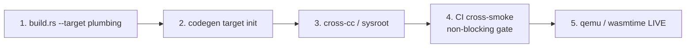

# Pattern: staged cross-compile target-enablement

## When this applies

You have an AOT compiler / toolchain that "should" support a new target because
the underlying backend (LLVM/Cranelift/GCC) already lists the architecture. The
naive expectation is "add a `--target` flag." Reality: enablement is a **staged
pipeline of seams**, and the failures cluster at the *boundaries between your
toolchain and the vendored one*, surfacing only under a **live cross-run**, not a
host-skip-gated unit test.

## The five stages (in dependency order)

| Stage | What you wire | The seam / gotcha that bites | Cobrust evidence |
|---|---|---|---|
| **1. build.rs `--target` plumbing** | thread the triple flag; retarget linker + stdlib-archive path per target; per-import archive selection | linker differs by target (`riscv64-linux-gnu-gcc` / `wasm-ld`); stdlib archive moves to `target/<triple>/<profile>/` | ADR-0075 §5; `cobrust-cli/src/build.rs` |
| **2. codegen target init** | feed the triple to the backend's `Target::from_triple` / TargetMachine | **triple normalization**: the C API does NOT normalize; Rust-convention `riscv64gc` ≠ LLVM `riscv64`; ISA flags must split into `target-features`. "Works in clang, fails through the API." | **F66 / `57ebc7e`** |
| **3. cross-cc / sysroot** | invoke the cross C compiler for the runtime shim | **sysroot absent**: a stock `clang --target=wasm32-wasip1` falls back to host glibc headers and dies on `bits/libc-header-start.h`. The "clang bundles the sysroot" assumption is false for apt-clang. Vendor + SHA-pin a sysroot (wasi-sdk); pass `--sysroot`. | **F70 / `446016c`** |
| **4. CI cross-smoke (non-blocking)** | a CI job: cross-build workspace + a sub-corpus; gate it non-blocking first | **default-feature matrix**: the stdlib's `default = [...]` (native allocator + thread reactor + net stack) doesn't build for a constrained target; use `--no-default-features` and verify the minimal path needs none of them | **F70**; F60 (missing externs) |
| **5. qemu / wasmtime LIVE** | run the emitted binary under an emulator and assert stdout | **test-fixture needs `fn main`**: bare top-level `.cb` lowers to `_cobrust_init_N`, not the entry symbol the C shim references → "undefined `_cobrust_user_main`" that LOOKS like a link-plumbing gap but is a fixture shape bug. Also: emulator binary name mismatch (`qemu-riscv64-static` vs `qemu-riscv64`) | **F67 / `d29470f`** |

## The three load-bearing rules

### Rule 1 — the seams are at the toolchain-API boundary, not your config

The work you *expect* (stage 1) is the cheapest. The work that *bites* is at
stages 2-3: the contract between your code and the vendored toolchain. A backend's
"supported architectures" list is necessary but not sufficient; the **calling
convention into it** (normalization, feature-string split, sysroot, entrypoint
convention) is invisible from your source-level target config. Diagnostic
signature: **"works in the reference driver (clang/llc/gcc), fails through the
library API"** ⇒ the driver is silently doing a canonicalization step the API
isn't. (F66.)

### Rule 2 — only the live cross-run reveals the real gaps; gate it non-blocking

Every Cobrust cross-gap (F66 triple, F67 fixture, F70 sysroot+features) was
**invisible to host-side skip-gated tests** and surfaced only on the live CI
cross-run. So:

- Add the live cross-smoke EARLY, but gate it **non-blocking** first (a `[ci-cross]`
  label or main-push-only) so it doesn't wall the main branch while you iterate.
- Harden the skip-gate to probe the *same* preconditions the build reads (sysroot
  env vars, cross-cc on PATH, emulator on PATH) so a dev host skips cleanly
  instead of failing mid-build.
- When a live cross-run fails, **partition into independent blockers before
  attributing to one cause** (F70 was two: sysroot AND feature-matrix).

### Rule 3 — when all plumbing fix-candidates verify clean, suspect the fixture

Stage 5's classic trap: an undefined-symbol link error that pattern-matches to
"plumbing gap." Cobrust burned a multi-candidate investigation (emit-triple /
link-order / cross-stdlib) all clean before finding the fixture wrote bare
top-level code with no `fn main`. The cheapest disambiguator: **run the toolchain
on a known-good input** (a source that DOES declare `fn main`); if it passes, the
bug is the fixture. Make implicit fixture↔toolchain contracts (required entry
symbol, required header) explicit in a shared helper. (F67.)

## Combined risk surfaces (the cross-cutting checklist)

- **Pointer width**: opaque-handle ABIs (`*mut u8`) are pointer-width-correct in
  Rust; verify no `as i64` casts bake in 64-bit width (riscv32/wasm32 are 32-bit).
- **Host-CPU detection meaningless under cross**: `target-cpu=native` must default
  to `generic-<arch>` for cross builds, not host-resolve. (F58 sibling.)
- **Concurrency runtime**: a thread-based runtime (tokio/mio) has no socket/thread
  syscalls on WASI p1 — either swap to a wasm shim or declare the surface
  unavailable + degrade `spawn` to inline-serial. (F70 deferred item.)
- **Panic ABI**: WASI p1 `proc_exit` works for `process::exit`; the
  `unreachable`-instruction mapping is a `wasm32-unknown-unknown` (browser) concern.
- **Ecosystem availability gate**: network/argv modules should be rejected at
  *typecheck* (`EcosystemUnavailableOnTarget { module, target }`) with a clear
  message, not fail deep in the cross-link. Needs an `available_on: Vec<TargetMatcher>`
  manifest field. (F70 deferred item #3.)

## §2.5 / LLM-first note

Every cross seam should fail with a **fix-shaped** error (§2.5 Direction B). The
opaque `bits/libc-header-start.h file not found` told the agent nothing; the
resolved `resolve_wasi_sysroot` error names the env vars + the install doc + the
glibc-fallback symptom, so the correction signal is in-band. A cross-enablement
sprint that ships raw toolchain stderr forces the next agent to reverse-engineer
the gotcha this playbook already catalogues.

## Cross-references

- F66 (triple normalization, `57ebc7e`), F67 (fixture `fn main`, `d29470f`),
  F70 (sysroot + feature matrix, `446016c`).
- ADR-0075 (RISC-V + WASM target enablement) — the source plan; this pattern is
  its post-hoc seam map.
- Sibling pattern: `ecosystem-import-chain-pattern.md` (the other "where the
  layers are" map, for the import/marshalling axis rather than the target axis).
