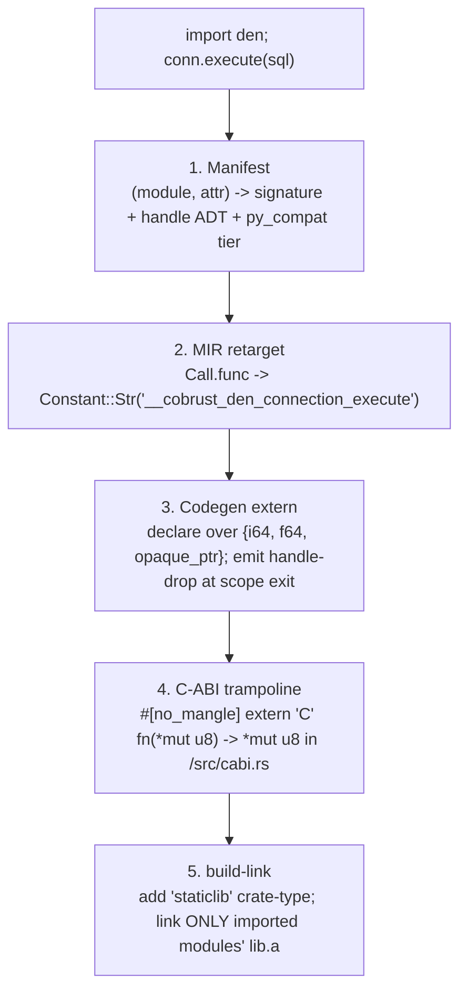

# Pattern: the 5-layer ecosystem-import / FFI marshalling chain

## When this applies

You are wiring a high-level language to call into a foreign runtime ecosystem
(Rust crates, C libs, PyO3-wrapped libraries) via a privileged module namespace
(`import den`, `import coil`, `import pit`). The question every such project faces:
**how do you add the SECOND, THIRD, … Nth library without re-doing the integration
work each time?** The answer is a chain factored so that the per-module cost
collapses to "fill in a manifest row + N codegen externs," with **zero** new
HIR-semantic or MIR-structural code.

## The 5-layer chain (source → linked binary)



| Layer | File (Cobrust) | What a NEW module adds here |
|---|---|---|
| **1. Manifest** | `cobrust-types/src/ecosystem.rs` (a Rust table, not PRELUDE stubs) | one row per fn: `(params:[CbTy], ret:CbTy, py_compat_tier)` + handle-type ADT defs + their drop symbols |
| **2. MIR retarget** | `cobrust-cli/src/build/intrinsics.rs` | usually **0 lines** — the existing ecosystem-arm retargets `(alias, attr)` → `Constant::Str("__cobrust_<mod>_<attr>")` generically |
| **3. Codegen extern** | `cobrust-codegen/src/llvm_backend.rs` `declare_runtime_helpers` | **N lines** — declare the new shim externs; drop-at-scope-exit reuses the Str/List non-Copy path |
| **4. C-ABI trampoline** | NEW `cobrust-<mod>/src/cabi.rs` | the `#[no_mangle] extern "C"` shims; for callbacks, the fixed `extern "C" fn(*mut u8) -> *mut u8` trampoline |
| **5. build-link** | `cobrust-<mod>/Cargo.toml` + `build.rs` | add `"staticlib"` to crate-type; per-import link driven off the resolved-import set |

## The chain-generality property (the payoff)

A correctly factored chain has this measurable invariant:

> **Adding a new value-in/value-out module ⇒ ~0 HIR-semantic lines, 0 MIR-structural
> lines, N codegen-extern lines, 1 manifest block, 1 `cabi.rs`.**

The generic work lives in HIR/MIR *once*; each module is data (a manifest block) +
leaf shims. Cobrust proved this empirically: by the 9th module (dora, commit
`8c11e16`) the diff over `cobrust-mir/` and `cobrust-codegen/` core was
near-zero, and **F68** confirmed the strongest case — a genuinely *new receiver
shape* (`@dora.node`, a module-alias-receiver decorator vs the established
let-bound-handle receiver) landed **HIR-only**, with `git diff --stat` over
`cobrust-mir/` / `cobrust-codegen/` / `cobrust-dora/` = **0/0/0** and **0** new
error-enum variants (the existing free-text `suggestion` field absorbed every new
diagnostic). The decorator desugar's only job was to *synthesize the call the
chain already handled*.

**How to use the property as a gate:** when you add module N+1, predict its blast
radius per-layer up front. If the actual diff touches the "generic" layers
(HIR-semantic, MIR-structural), the chain has sprung a leak — either module N+1 is
genuinely novel (document why) or the factoring regressed. (This is F68's detection
rule applied to the import axis.)

## ID-block allocation discipline (the AdtId rule)

Foreign handle types (`den.Connection`, `pit.App`, `coil.Array`) need nominal
`Ty::Adt` IDs that must **never collide with user `class` ADTs**. User ADTs
allocate `AdtId == DefId`, densely from 0. So reserve a high base and a fixed
per-module block:

```
ECO_ADT_BASE          = 0xE000_0000
den.Connection        = ECO_ADT_BASE          // block 0: 0xE000_0000..0x00FF
den.Cursor            = ECO_ADT_BASE + 1
strike.Response       = ECO_ADT_BASE + 0x100   // block 1: 0xE000_0100..0x01FF
(scale: reserved)                              // block 2: 0xE000_0200..0x02FF (no handles)
molt.DateTime         = ECO_ADT_BASE + 0x300   // block 3
pit.App               = ECO_ADT_BASE + 0x400   // block 4: pit.App/.Request/.Response
hood.RunResult        = ECO_ADT_BASE + 0x500   // block 5
```

Discipline:
- **256-slot block per module** (`0x100` stride), even if the module ships 0 or 1
  handles today (reserve the block; document the reservation inline). This keeps
  IDs stable as a module grows and makes the next module's base obvious.
- The handle's nominal ADT binds to a **drop symbol** (`__cobrust_<mod>_<handle>_drop`)
  and reuses the non-`Copy` drop-scheduled path, giving per-method compile-time
  type safety (§2.5 compile-time-catch) over a generic `Ty::Opaque`.

## Scope-cap discipline (bound the first proof)

Each chain extension ships a deliberately bounded first proof, then generalizes:

- **Handles stay scope-local** in the first proof (no return/store/capture escape)
  so the drop fires exactly once at scope exit via the existing schedule.
  Escape-transfer (move/borrow) is a tracked follow-up. (ADR-0072 Q4.)
- **Callbacks: top-level fn names only** — no closures, no fn-typed-local
  intermediaries; reject each with a fix-suggesting diagnostic. ONE callback ABI
  (`extern "C" fn(*mut u8) -> *mut u8`), ONE trampoline pattern shared by every
  callback-taking module (pit + hood + dora). (ADR-0073 D4/D8.)
- **Return-of-handle is the only allowed scope-escape**; codegen suppresses drop on
  operands feeding `Terminator::Return`. (ADR-0073 D6.)

This is the F68 lesson on the import axis: **ship the load-bearing chain in a
bounded form, defer the ergonomic surface** (decorator sugar, handle escape,
closures) to follow-ups that land atop the proven chain with minimal blast radius.

## Known accepted debt (call it out)

- **Manifest drift** — hand-maintained signatures can desync from the crate's real
  API; generation deferred and accepted (ADR-0072 §5 R4). A new module's manifest
  block is the highest-risk line in the chain *because* it's unverified against the
  crate — pair every manifest addition with the `cabi.rs` shim in the same review.
- **`!Send` handles** — single-threaded foreign handles (`Rc<RefCell<>>`) must not
  cross into spawned tasks; first proofs are single-threaded, mark the constraint.

## Cross-references

- ADR-0072 (import wiring + manifest + AdtId blocks), ADR-0073 (callback
  marshalling + trampoline), ADR-0074 (decorator desugar).
- F68 (`f68-dora-phase1-followups.md`, commit `971d4ce`) — the empirical
  chain-generality confirmation (HIR-only, 0/0/0 lower-layer diff).
- F41 — the cautionary counter-case: a codegen-internal name (`print_int`) leaking
  to the source face. The chain's discipline (manifest = source vocabulary,
  `__cobrust_*` = internal symbol) is exactly what prevents F41-style leakage on
  the ecosystem axis.
- Sibling pattern: `cross-compile-target-enablement-pattern.md` (the target axis).
