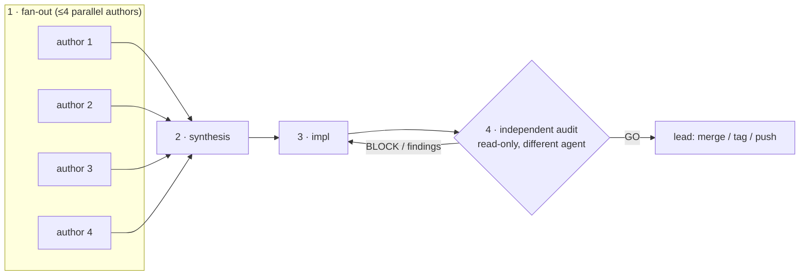

# Dynamic-Workflow orchestration patterns

> **What this is.** SKILL.md §"Part 2.5" introduces dynamic-Workflow orchestration
> as the deterministic alternative to a hand-managing lead, and methodology Delta 8
> records its empirical arc. This doc is the **concrete reusable shape**: the six
> patterns a working orchestration script encodes, plus the honest-framing guards
> and the self-improvement chain that hardened across the session where this became
> the **default Cobrust dev mode**.
>
> **Empirical basis.** A single intensive 2026-05-29/30 Cobrust session ran the
> dispatch loop almost entirely as dynamic Workflows rather than hand-managed
> dispatch — **~11 workflows** across a methodology back-port, a language error-UX
> fix, a docs-enrich, then a product pipeline (ecosystem operators, a new compile
> target, several strategy ADRs, an HTTP-middleware layer, more operators, a
> numerical-library strategy ADR, a linalg phase). **The last several ran fully
> autonomous** — audit verdict `GO`, zero lead-side finishing, just push + CI.
> This is the close-out evidence for Delta 8's "experiment → default" transition.

---

## The canonical four-stage pipeline

Not every workflow uses all four stages (a single-author impl + audit is common),
but the **impl → independent-audit → lead-integrates** tail is the load-bearing
spine. The six patterns below are what make that spine reliable.

---

## Pattern 1 — `robust()`: retry-wrap every failure-prone agent stage

**The problem it solves.** A bare `agent()` whose process dies mid-run (socket
close / 529 / stream-watchdog, the `F40-stream-watchdog-false-stall-signal` class)
returns a **truncated or errored result**. A deterministic script does not notice;
the next stage consumes the garbage as if it were a real deliverable. A
hand-managing lead re-dispatches a died agent *for free* — a script must build that
in. This was Delta 8's first real new surface (a network-killed `impl` poisoned the
downstream audit into a misleading `BLOCK` on a non-failure).

**The pattern.** Wrap each failure-prone stage so a truncated/errored/empty result
is **detected and re-dispatched before any downstream stage consumes it**:

- Retry-with-backoff on agent error.
- Treat an **unparseable or empty result as a retry trigger, not a finding**. (The
  audit must never `BLOCK` on a result the impl agent never actually produced.)
- The **impl → audit edge specifically** must not let a network-killed impl reach
  the auditor.

**Empirical close.** Once `robust()` was folded into the *first* workflow's
descendants, **no further socket-truncation failure recurred** across the rest of
the session — the single highest-value refinement of the run. This is the canonical
case of the self-improvement chain (see below): one run's failure became every
subsequent run's built-in guard.

---

## Pattern 2 — test-first-PAIR-as-script

**The problem it solves.** The two-phase dispatch SOP's "land the failing
eval/test before implementation" (SKILL.md Part 2) degrades into aspiration when a
hand-managing lead is juggling — the failing proof is the thing most often skipped
under tempo.

**The pattern.** Encode the PAIR (test author + impl author) as *script stages*,
so the proof obligation is structural, not discretionary:

- A **TEST stage** authors the failing eval/test for any contract-bearing or
  user-visible change, and runs it to confirm it is red *before* the impl stage
  fires.
- The **impl stage** is dispatched against that red proof; it is "done" only when
  the proof goes green.
- The script holds the ordering, so "test-first" cannot silently collapse into
  "test-eventually."

**Empirical close.** This is how the session's TEST stage caught a **latent
false-green bug** — an unresolved dotted-attribute chain that *built and ran* with
garbage values. A build-and-run-clean signal looked like success; the test stage's
explicit proof obligation is what exposed that the value was wrong. (See the audit
catches in Delta 8.)

---

## Pattern 3 — audit-schema-verdict (structured GO / GO-WITH-FINDINGS / BLOCK)

**The problem it solves.** A free-text audit result is not machine-routable; a
script can't branch the pipeline on prose.

**The pattern.** The independent-audit stage (Delta 3) returns a **structured
verdict** the script branches on:

- `GO` → the lead integrates (merge / tag / push); zero finishing expected.
- `GO_WITH_FINDINGS` → integrate, but apply the listed findings first.
- `BLOCK` → loop back to impl with the blocking reasons; do **not** integrate.

The auditor is read-only, top-tier (Delta 1), and a **different agent than the
impl author** (Delta 3 independence is preserved — encoding it as a script stage
does not weaken it).

**Empirical close — the audit gate earned its keep.** Across the session the
verdict gate caught real issues a less-disciplined flow would have shipped:

- a network-socket-truncated impl deliverable → `BLOCK` (and the lesson became
  Pattern 1 above);
- a **dogfood overclaim** — the methodology's own enriched docs asserting product
  statistics that could not be cited, *violating ADSD §4 no-overclaim applied to
  ITS OWN docs* → `GO_WITH_FINDINGS`;
- the latent false-green dotted-attr bug (caught at the TEST stage, Pattern 2).

The verdict is not ceremony: each value above changed what the script did next.

---

## Pattern 4 — one-workflow-per-working-tree

**The problem it solves.** Concurrent workflows sharing one checkout collide on
`target/`, the index, and uncommitted state — the same contention the
worktree-per-sprint pattern (SKILL.md Part 2) solves for hand-managed dispatch.

**The pattern.** Each workflow runs in its **own git worktree / working tree**,
exactly as a hand-managed sprint would. The orchestration script's "merge" tail
runs in the lead's integration context, not inside a worker tree. This keeps "kill
this workflow" cheap and prevents cross-workflow state bleed.

---

## Pattern 5 — ≤ 4-parallel (the cap still binds)

**The problem it solves.** The ≤ 4-way parallel cap (SKILL.md Part 1, Topology
Rule 1) was measured on hand-managed dispatch — cargo-lock contention + worktree
disk pressure degrade beyond 4. A deterministic script makes it *easy* to fan out
wider, which is a trap.

**The pattern.** The fan-out stage respects the **same ≤ 4 concurrent-author cap**.
The script removing the juggling overhead does not remove the physical-resource
ceiling that motivated the cap; encode the cap in the fan-out, not in the lead's
attention.

---

## Pattern 6 — CTO-integrates-after-verdict (the lead keeps only the strategic tier)

**The problem it solves.** Delta 2 (dispatcher-as-context-custodian) says the lead
must keep only the compression-fragile strategic tier and offload raw work. A
script that hands control *back* to the lead at every stage re-imposes the juggling
the script was meant to remove.

**The pattern.** The script holds the **sequencing**; the lead is re-engaged **only
at the verdict boundary**:

- approve the topology up front,
- evaluate the final audit verdict,
- decide merge / tag / push.

Everything between (fan-out → synthesis → impl → audit-retry loop) is the script's
job. **In the session's last several workflows this reduced lead involvement to
push + CI** — the "fully autonomous after the pattern stabilized" result.

---

## The honest-framing guards (folded in across the run)

Two guards hardened mid-session, both instances of ADSD §4 (no-overclaim) and
Delta 5 (claim-vs-diff) applied to the orchestration itself:

- **claim-vs-diff honesty** — an agent's reported scope must match the actual
  `git diff` / numstat. The dogfood overclaim (Pattern 3) is the cautionary case:
  the methodology's own docs asserted uncitable product stats. The guard: every
  empirical claim a stage emits is defensible against ground truth before a
  downstream stage (or the auditor) trusts it.
- **chain-generality honesty** — an agent must report the **real per-layer
  numstat**, not falsely claim "0 changes to mir/codegen" for a change that
  legitimately touches those layers. This is Delta 5 (chain-generality verified
  against the diff) encoded as a stage-output check rather than a post-hoc
  integration step.

Both guards exist because a deterministic script will *faithfully propagate* a
false claim to every downstream stage unless the claim is ground-truthed at the
stage that emits it.

---

## The self-improvement chain (the methodology improving itself across runs)

The session is itself the evidence that dynamic-Workflow orchestration
**co-evolves with the methodology** — each run's failure became the next run's
built-in guard:

1. **Workflow 1's socket death** → the **`robust()` retry-wrap** (Pattern 1) was
   folded into every subsequent workflow → **no further socket-truncation failure**.
2. Then the **honest-framing guards** (claim-vs-diff + chain-generality, above) were
   folded in after the dogfood-overclaim catch.
3. Then the **ELEGANCE LAW** (methodology Delta 9) was folded into every
   backend/ecosystem audit rubric, so each ecosystem/backend workflow's audit now
   scores `elegant + no-legacy-debt` and each ecosystem ADR carries a
   footgun-ledger.

This is the research-product co-evolution loop (SKILL.md §"Research-product
co-evolution mode") at the orchestration layer: the script that runs the product
work is itself a methodology artifact that the run hardens.

---

## When to use / when not to

**Use** dynamic-Workflow orchestration when the work has a **stable, repeatable
shape** (a back-port, a multi-author doc-refresh, a batch of same-shape ADRs, an
ecosystem-operator phase) where the juggling overhead and its failure surface
dominate — and once the patterns above are encoded, prefer it as the **default**
dev mode (that is what the session demonstrated).

**Do not use** it for work that needs **frequent mid-run re-scoping** (a fixed
topology cannot re-decompose the way a lead can — log cases where the rigid
pipeline forced a worse decomposition), or for a **one-off** where writing +
auditing the orchestration script costs more than a hand-managed dispatch would.

**Remember the two standing caveats** (Delta 8): a fixed topology cannot mid-run
re-scope, and **the orchestration script is itself authored code** — subject to
Delta 3 independent audit like any other artifact (an un-audited orchestrator is a
new SPOF).

## Cross-references

- `SKILL.md` §"Part 2.5 — Dynamic-Workflow orchestration" — the methodology-level
  introduction and the socket-resilience caveat.
- `reference/cobrust-f44-f70/methodology-deltas.md` §"Delta 8" — the full empirical
  write-up and attribution correction; §"Delta 9" — the Elegance Law referenced by
  the self-improvement chain.
- `reference/cobrust-f31-f39/F40-stream-watchdog-false-stall-signal.md` — the
  transient-agent-failure class that motivates Pattern 1's `robust()` wrap.
- SKILL.md Part 1 Topology Rule 1 (≤ 4 parallel), Part 2 worktree-per-sprint +
  two-phase dispatch — the hand-managed disciplines these patterns port into a
  script.
